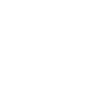

# Heroes & Villains

Battlefront Plus adds more than a dozen new heroes across all factions, each with their own unique abilities, Star Cards, and appearances. From iconic, fan favorite characters to more obscure ones, new heroes come from every corner of the Star Wars canon.

## Heroes

  
  

    <h3 id="ahsoka">
      <strong>Ahsoka Tano</strong>
      
    </h3>
    <a>Ahsoka Tano was the Jedi Padawan of Anakin Skywalker and commander of the famed 501st Legion during the Clone Wars until she lost faith in the Jedi Order. When the tyrannical Empire superceded the Republic, she played a crucial role in forming a network of rebel cells prior to the outbreak of the Galactic Civil War.</a>
    

    <a class="ability-item" data-text="Ahsoka throws one lightsaber forward while keeping the other to protect herself.">
      
      Saber Throw
    </a><a class="ability-item" data-text="Ahsoka closes the distance with a lunge attack.">
      
      Saber Flurry
    </a><a class="ability-item" data-text="Small and agile, Ahsoka sprints forward at high speeds, greatly improving her recharge times as she does so.">
      
      Moral Spirit
    </a>
    

  

 

  
  

    <h3 id="cal">
      <strong>Cal Kestis</strong>
      
    </h3>
    <a>As one of the few Jedi who survived the purge that destroyed the Jedi Order, Cal Kestis lived in seclusion for years until a confrontation with the Inquisitorius compelled him to openly resist the Empire's rule. Hunted across the galaxy by the Empire's Jedi hunters, Kestis embraced his connection to the Force once more.</a>
    

    <a class="ability-item" data-text="Cal uses the Force to freeze enemies in front of him. By charging up this ability, he can extend the reach of this ability.">
      
      Force Stasis
    </a><a class="ability-item" data-text="Cal switches forms to attack with a Double-Bladed lightsaber, increasing his stamina but reducing damage.">
      
      Double-Bladed
    </a><a class="ability-item" data-text="Cal injects himself with a Stim Canister, instantly replenishing a large portion of his health.">
      
      Stim
    </a><a class="ability-item" data-text="Cal recharges his abilities faster in combat. Defeating enemies will have a stronger effect than dealing damage.">
      
      Done Hiding
    </a>
    

  

 

  
  

    <h3 id="rex">
      <strong>Captain Rex</strong>
      
    </h3>
    <a>CT-7567 "Rex" was a veteran Clone Captain of the famed 501st Legion. Throughout a highly successful military career in both the Clone Army and the Rebel Alliance, Rex maintained a great bond with his Jedi leadership and fellow soldiers, making himself a fiercely loyal and strong-willed companion.</a>
    

    <a class="ability-item" data-text="Rex can throw up to three EMP grenades that will explode after a short time, stunning enemies.">
      
      Droid Poppers
    </a><a class="ability-item" data-text="While active, enemies nearby to Rex will have all forms of healing blocked. Rex will additionally have increased sprint speed.">
      
      Unconventional Tactics
    </a><a class="ability-item" data-text="Generation one armor holds up, boosting Rex's health.">
      
      Generation One
    </a>
    

  

 

  
  

    <h3 id="cody">
      <strong>Commander Cody</strong>
      
    </h3>
    <a>CC-2224 "Cody" was a Clone Marshal Commander who commanded the 7th Sky Corps - including its renowned 212th Attack Battalion. His skill as a military strategist and fighter was equally matched by his friendship and loyalty, as Cody maintained a strong bond with his Jedi General Obi-Wan Kenobi and fellow troopers.</a>
    

    <a class="ability-item" data-text="Commander Cody activates an ion field that defuses incoming explosives and jams enemy blasters, as well as slowly damaging them over time.">
      
      Ion Field
    </a><a class="ability-item" data-text="Commander Cody swaps to an ion charged burst fire DC-15 for a limited time.">
      
      Battle Rifle
    </a><a class="ability-item" data-text="Deployable cover that is impervious to damage, but can be destroyed by attacking its central projector.">
      
      Energy Wall
    </a><a class="ability-item" data-text="Commander Cody deploys with 150 bonus health. While standing near allied Reinforcements and Heroes, he will passively regenerate lost health.">
      
      Ghost Company
    </a>
    

  

 

  
  

    <h3 id="mando">
      <strong>Din Djarin</strong>
      
    </h3>
    <a>Din Djarin, also known as "the Mandalorian" or simply "Mando," was a renowned Mandalorian warrior during the era of the New Republic. With his Mandalorian armor, IB-94 blaster pistol, Amban sniper rifle, and beskar helmet, Djarin was both well-equipped and enigmatic.</a>
    

    <a class="ability-item" data-text="Equips a high power disruptor sniper rifle for a short time.">
      
      Amban Phase-Pulse Blaster
    </a><a class="ability-item" data-text="Din Djarin's Helmet displays heat signatures, revealing nearby enemies.">
      
      Thermal Vision
    </a><a class="ability-item" data-text="Din Djarin fires a salvo of guided munitions that seek out nearby enemies.">
      
      Whistling Birds
    </a><a class="ability-item" data-text="When performing a melee attack, he will strike down nearby enemies with the Darksaber.">
      
      Darksaber
    </a>
    

  

 

  
  

    <h3 id="maz">
      <strong>Maz Kanata</strong>
      
    </h3>
    <a>Maz Kanata had resided at her castle for over a thousand years, witnessing the Dark Side take many forms, when the First Order emerged from hiding. The destruction of the Hosnian System and subsequent subjugation of the galaxy prompted the "Pirate Queen" to take a stand against this new threat.</a>
    

    <a class="ability-item" data-text="Maz creates an extra volatile reaction to dash forward with her jetpack, causing burn damage to nearby enemies while it is active.">
      
      Burn Dash
    </a><a class="ability-item" data-text="Enemies dealing damage to Maz will recieve a small amount of damage in return.">
      
      Change in Fortune
    </a><a class="ability-item" data-text="Maz equips an MPL-57 grenade launcher that will increase the projectile's fuse time, blast, and launch speed when the trigger is held.">
      
      Adjustable Fuse
    </a>
    

  

 

  
  

    <h3 id="nein">
      <strong>Nein Nunb</strong>
      
    </h3>
    <a>The Sullustian pilot Nien Nunb excels in harassing the Empire from afar with his Augmented Turret, Rapid Pulse Cannon and for when things get too close to comfort, his DH-17 is always raring to go.</a>
    

    <a class="ability-item" data-text="Nien Nunb deploys a Detonite Charge, wired to blow when enemies enter its proximity.">
      
      Proximity Bomb
    </a><a class="ability-item" data-text="Switch to a modified DLT-20A Pulse Cannon configured for fast charging and high damage.">
      
      Rapid Pulse Cannon
    </a><a class="ability-item" data-text="Deploy a blaster turret fitted with upgraded sensors for quicker lock-on time.">
      
      Augmented Turret
    </a>
    

  

 

  
  

    <h3 id="shriv">
      <strong>Shriv Suurgav</strong>
      
    </h3>
    <a>Shriv Suurgav is Danger Squadron's cynical and sarcastic commander. Beneath his snarky exterior, however, is a genuine care for his comrades and desire to liberate the galaxy of tyranny.</a>
    

    <a class="ability-item" data-text="Shriv throws a modified Bacta Grenade that quickly restores and boosts health to allies, meanwhile enemies are damaged and have healing temporarily blocked.">
      
      Bacta Cocktail
    </a><a class="ability-item" data-text="CA-87 retro-fitted Jawa blaster that has been further modified to produce a powerful short-range shockwave, capable of knocking enemies off their feet.">
      
      Repulsor Cannon
    </a><a class="ability-item" data-text="Shriv equips a set of macrobinoculars. Tagging enemies will disrupt their blasters and mark them for his entire team.">
      
      Remote Sabotage
    </a>
    

  

## Villains

  
  

    <h3 id="cardinal">
      <strong>Captain Cardinal</strong>
      
    </h3>
    <a>Inducted into the First Order as an orphan child from Jakku, Archex was handpicked and personally trained by Brendol Hux, eventually becoming his personal guard. Highly skilled and infinitely loyal, Hux ceremoniously gifted him a personalized set of red armor, for he said it was a color of power, and henceforth called him Cardinal.</a>
    

    <a class="ability-item" data-text="Cardinal's F-11D has increased damage and accuracy. His armor and mobility are reduced">
      
      Finalizer
    </a><a class="ability-item" data-text="Cardinal is immune to crowd control abilities, preventing him from being knocked down or stunned. Additionally, his blaster has improved cooling. His damage and mobility are reduced.">
      
      Steadfast
    </a><a class="ability-item" data-text="Cardinal's mobility is increased, as is the rate of fire on the F-11D. His damage and armor are reduced.">
      
      Absolution
    </a>
    

  

 

  
  

    <h3 id="pyre">
      <strong>Commander Pyre</strong>
      
    </h3>
    <a>Clad in a unique, gold-plated set of stormtrooper armor and a military leader at heart, Commander Pyre showed determination to serve the First Order at all costs and made sure to distinguish himself on the field. </a>
    

    <a class="ability-item" data-text="Commander Pyre plants a device that boosts the health of nearby allies.">
      
      Gold Zone
    </a><a class="ability-item" data-text="Commander Pyre commands nearby allies to withstand all attacks, granting those around him a very high damage reduction for a short time.">
      
      Seize This Moment
    </a><a class="ability-item" data-text="Commander Pyre increases his damage and passively heals nearby allies.">
      
      Thunderer Legion
    </a>
    

  

 

  
  

    <h3 id="dengar">
      <strong>Dengar</strong>
      
    </h3>
    <a>Dengar was a Corellian bounty hunter, fighting in both the Clone Wars and Galactic Civil War. Considered one of the best in the galaxy, he was among the bounty hunters selected by Darth Vader to hunt Han Solo.</a>
    

    <a class="ability-item" data-text="Dengar throws a handful of explosive devices, dealing heavy damage to anyone caught in the radius.">
      
      Explosive Array
    </a><a class="ability-item" data-text="Dengar increases his blaster's rate of fire for a short amount of time.">
      
      Frenzied Blast
    </a><a class="ability-item" data-text="Dengar raises his blaster overhead to bash an enemy into the ground.">
      
      Bashing Skulls
    </a><a class="ability-item" data-text="Dengar has a special trait that brifly grants damage resistance upon deafeating enemies.">
      
      Tough Fighter
    </a>
    

  

 

  
  

    <h3 id="hask">
      <strong>Gideon Hask</strong>
      
    </h3>
    <a>Oprhaned as a child by a Rebel attack, Gideon Hask became zealously loyal to the Galactic Empire, eventually joining the elite Inferno Squadron. After his squadmates defected to the Rebellion during Operation Cinder, Hask maintained his allegiance to the Empire and later its successor state: the First Order.</a>
    

    <a class="ability-item" data-text="Hask reveals enemies within his line of sight to his allies. When revealed, they will have all forms of healing blocked.">
      
      Routing Traitors
    </a><a class="ability-item" data-text="Hask leads the charge with a modified E-11 Blast Cannon, passively boosting nearby allies with dsiruption immunity.">
      
      Blast Cannon
    </a><a class="ability-item" data-text="Hask charges up a volatile power blast that ignites a small flame upon impact.">
      
      Inferno Blast
    </a>
    

  

 

  
  

    <h3 id="greedo">
      <strong>Greedo</strong>
      
    </h3>
    <a>The Rodian bounty hunter Greedo is a skilled marksman utilising his quick reflexes and heightened senses to quickly dispatch targets with his DT-12 blaster pistol and deadly collection of grenades.</a>
    

    <a class="ability-item" data-text="Throws a Thermal Detonator by default. While Confidence Boost is active, a Thermal Imploder is thrown instead.">
      
      Brash Blast
    </a><a class="ability-item" data-text="Greedo boosts his senses, enabling him to detect enemies, even through walls.">
      
      High Senses
    </a><a class="ability-item" data-text="Greedo's DT-12 will deal increased damage, and his Brash Blast will upgrade to a Thermal Imploder and be recharged if in cooldown.">
      
      Confidence Boost
    </a>
    

  

 

  
  

    <h3 id="jango">
      <strong>Jango Fett</strong>
      
    </h3>
    <a>Jango Fett served as the clone template for what would become the Grand Army of the Republic. Thousands of troopers, and his clone son Boba, sharing his face ensured he left behind a legacy that changed the course of galactic history.</a>
    

    <a class="ability-item" data-text="Back mounted jetpack that utilizes burst thrusters to allow Jango to jet over large distances. It is well suited for traversing obstructions and evading danger.">
      
      Jet Boost
    </a><a class="ability-item" data-text="When dealing damage, Jango Fett gains bonus health. Upon getting kills, he is awarded extra Battle Points.">
      
      Collecting Bounties
    </a><a class="ability-item" data-text="Jango briefly activates the flamethrower mounted in his gauntlet, incinerating enemies in front of him.">
      
      Wrist Flamethower
    </a><a class="ability-item" data-text="Press/hold ZOOM to fire a Saberdart that significantly weakens enemies as well as damages them over time.">
      
      Expert Hunter
    </a>
    

  

 

  
  

    <h3 id="trilla">
      <strong>The Second Sister</strong>
      
    </h3>
    <a>The Second Sister, previously Trilla Suduri, was an expert lightsaber duelist and one of the Empire's deadliest Jedi hunters. However, Suduri's strongest asset was her brilliant intellect, being able to anticipate the behavior of her prey.</a>
    

    <a class="ability-item" data-text="The Second Sister saps the life force from enemies in front of her to heal herself. This effect is amplified with a higher number of victims.">
      
      Force Drain
    </a><a class="ability-item" data-text="The Second Sister switches forms to attack with a Double-Bladed lightsaber, increasing her stamina but reducing damage.">
      
      Double-Bladed
    </a><a class="ability-item" data-text="The Second Sister lunges forward with a deadly slash that knocks enemies onto the ground.">
      
      Cunning Slash
    </a>
    

  

