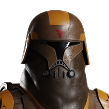

# Reinforcements

## The Clone Wars

### Galactic Republic

  
  

    <h3>
      <strong>Clone Flametrooper</strong>
      
    </h3>
    <a style="cursor: default;">
      
      BT X-42 Heavy Flame Projector
    </a>
    

    <a class="ability-item" data-text="Toggle the BT X-42 into a charge-up, burst-fire explosive projectile launcher for increased range and indirect fire capabilities.">
      
      Therobaric Barrage
    </a>
    <a class="ability-item" data-text="Instantly cool the BT X-42 and recieve bonus health for the duration of the ability.">
      
      Pyrotechnics
    </a>
    <a class="ability-item" data-text="Lay down a trail of fire as you charge forth. Slam into the enemy while charging to knock them down.">
      
      Scorching Charge
    </a>
    

  

### Separatists

## Galactic Civil War

### Rebel Alliance

### Galactic Empire

## The Cold War

### Resistance

### First Order