# Reinforcements

## The Clone Wars

### Galactic Republic

  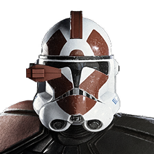
  

    <h3>
      <strong>ARC Trooper</strong>
      
    </h3>
    <a style="cursor: default;">
      
      Dual DC-17
    </a>
    

    <a class="ability-item" data-text="Deploy a device that electrocutes enemies on detonation and pushes them away from the blast area.">
      
      Shock Trap
    </a><a class="ability-item" data-text="Activate your rangefinder to scan the vicinity for enemies.">
      
      Helmet Scanner
    </a><a class="ability-item" data-text="Boosts your sprint speed. Defeating enemies will briefly generate bonus health.">
      
      Shield Rush
    </a>
    

  

 

  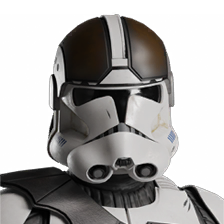
  

    <h3>
      <strong>Combat Engineer</strong>
      
    </h3>
    <a style="cursor: default;">
      
      DP-23 Shotgun
    </a>
    

    <a class="ability-item" data-text="A powerful manually detonated explosive device.">
      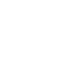
      Detonite Charge
    </a><a class="ability-item" data-text="Unleash a blast of electricity, dealing immense damage to targeted enemies.">
      
      Bolt Caster
    </a><a class="ability-item" data-text="Drop a grenade that supercools the blasters of nearby allies.">
      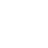
      Supercooling Grenade
    </a>
    

  

 

  
  

    <h3>
      <strong>Clone Flametrooper</strong>
      
    </h3>
    <a style="cursor: default;">
      
      BT X-42 Heavy Flame Projector
    </a>
    

    <a class="ability-item" data-text="Toggle the BT X-42 into a charge-up, burst-fire explosive projectile launcher for increased range and indirect fire capabilities.">
      
      Thermobaric Barrage
    </a><a class="ability-item" data-text="Instantly cool the BT X-42 and recieve bonus health for the duration of the ability.">
      
      Pyrotechnics
    </a><a class="ability-item" data-text="Lay down a trail of fire as you charge forth. Slam into the enemy while charging to knock them down.">
      
      Scorching Charge
    </a>
    

  

 

  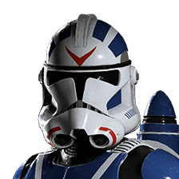
  

    <h3>
      <strong>Clone Jet Trooper</strong>
      
    </h3>
    <a style="cursor: default;">
      
      DC-15A
    </a>
    

    <a class="ability-item" data-text="Advanced jetpack that enables flight while spending fuel. It's hover mode is activated by aiming down sights while in the air.">
      
      Jetpack
    </a><a class="ability-item" data-text="Apply an Ion Charge to your regular ammunition for a short time. Highly effective against vehicles.">
      
      Ion Charge
    </a><a class="ability-item" data-text="Throw a thermal detonator that will stick to surfaces and explode shortly after.">
      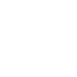
      Sticky Grenade
    </a>
    

  

 

  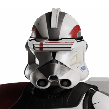
  

    <h3>
      <strong>Clone Sharpshooter</strong>
      
    </h3>
    <a style="cursor: default;">
      
      Firepuncher
    </a>
    

    <a class="ability-item" data-text="Throw an explosive charge that detonates only when shot. If the charge explodes while it is still in the air, its blast will be more powerful.">
      
      Trapshot
    </a><a class="ability-item" data-text="Reconfigures the firepuncher to shoot a deadly beam that must be charged up before firing.">
      
      Beam Rifle
    </a><a class="ability-item" data-text="Fires a flare that will ignite after a second, revealing enemies within a large vicinity to your team. Enemies hidden behind cover from the flare will not be revealed.">
      
      Spotting Flare
    </a>
    

  

 

  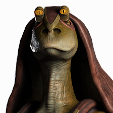
  

    <h3>
      <strong>Gungan Warrior</strong>
      
    </h3>
    <a style="cursor: default;">
      
      Gungan Spear
    </a>
    

    <a class="ability-item" data-text="The Gungan Warrior and nearby allies receive reduced explosive damage, as well as being immune to crowd control abilities, preventing them from being stunned or knocked down.">
      
      Bombad Strength
    </a><a class="ability-item" data-text="The Gungan Warrior and nearby allies will slowly regenerate health for a short time, even when taking damage.">
      
      Will Of The Gods
    </a><a class="ability-item" data-text="Projects a forward energy shield to block incoming blaster fire without hindering mobility.">
      
      Combat Shield
    </a>
    

  

### Separatists

  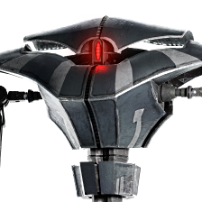
  

    <h3>
      <strong>Aqua Droid</strong>
      
    </h3>
    <a style="cursor: default;">
      
      AQ Laser Cannon
    </a>
    

    <a class="ability-item" data-text="Defeating enemies with the AQ Laser Cannon while Recon is active will reveal their nearby allies to you and your team.">
      
      Recon
    </a><a class="ability-item" data-text="Scans the vicinity to briefly reveal nearby hostiles.">
      
      Sonar Scan
    </a><a class="ability-item" data-text="Rapidly regenerates the Aqua Droid's health.">
      
      Self-Repair
    </a>
    

  

 

  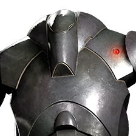
  

    <h3>
      <strong>B2 Super Battle Droid</strong>
      
    </h3>
    <a style="cursor: default;">
      
      Twin Wrist Blaster
    </a>
    

    <a class="ability-item" data-text="High velocity anti-personnel rockets that explode on impact with any object.">
      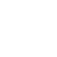
      Wrist Rocket
    </a><a class="ability-item" data-text="Upgrades the B2 Super Battle Droid's armor, but negates natural health regeneration.">
      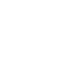
      Superior Chassis
    </a><a class="ability-item" data-text="Reset your ability cooldowns and blaster heat.">
      
      Rearm
    </a>
    

  

 

  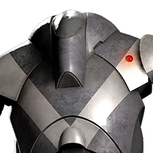
  

    <h3>
      <strong>B2-RP Rocket Droid</strong>
      
    </h3>
    <a style="cursor: default;">
      
      Twin Wrist Blaster
    </a>
    

    <a class="ability-item" data-text="High velocity anti-personnel rockets that explode on impact with any object.">
      
      Wrist Rocket
    </a><a class="ability-item" data-text="Emergency fuel reserves prevent the jetpack from depleting fuel.">
      
      Fuel Reserves
    </a><a class="ability-item" data-text="Reconfigures the wrist blaster to fire multiple blaster bolts at once in a triangular pattern.">
      
      Tri-Shot
    </a><a class="ability-item" data-text="Advanced jetpack that enables flight while spending fuel.">
      
      Jetpack
    </a>
    

  

 

## Galactic Civil War

### Rebel Alliance

### Galactic Empire

## The Cold War

### Resistance

### First Order