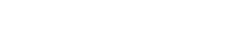

# Troopers

Join the fray with a selection of over a hundred new abilities available to the Assault, Heavy, Officer, and Specialist. Each class has greatly expanded its arsenal of blasters and Star Cards, along with the addition of a sidearm menu to select your secondary weapon, as well as a Ping button to mark points of interest for your team.

## Blasters

### Assault

#### Primary

    <!-- Item Start -->
    

        

            

                <h3>
                    A280C
                </h3>
                
            

            

                <a>
                    Damage: 25-12 
                    Range: 10-60 
                    Firerate: 400 
                    Heat Per Shot: 0.038 
                </a>
                

                    

                        
                        Sharpshooter
                    

                        
                        Escape Artist
                    

                

            

        

    

    <!-- Item End -->
    

        

            

                <h3>
                    DC-15A
                </h3>
                
            

            

                <a>
                    Damage: 26-22 
                    Range: 20-35 
                    Firerate: 350 
                    Heat Per Shot: 0.032 
                </a>
                

                    

                        
                        Seeker Tactics
                    

                        
                        Focused Fire
                    

                

            

        

    

    

        

            

                <h3>
                    E-11
                </h3>
                
            

            

                <a>
                    Damage: 35-15 
                    Range: 10-60 
                    Firerate: 300 
                    Heat Per Shot: 0.055 
                </a>
                

                    

                        
                        Berserker
                    

                        
                        Elite Blaster
                    

                

            

        

    

    

        

            

                <h3>
                    E-5
                </h3>
                
                
Droids have 50% more cooling

            

            

                <a>
                    Damage: 60-50 
                    Range: 30-40 
                    Firerate: 200 
                    Heat Per Shot: 0.1 
                </a>
                

                    

                        
                        Seeker Tactics
                    

                        
                        Bulldog RLR
                    

                

            

        

    

    

        

            

                <h3>
                    F-11D
                </h3>
                
            

            

                <a>
                    Damage: 36-19 
                    Range: 30-60 
                    Firerate: 270 
                    Heat Per Shot: 0.06 
                </a>
                

                    

                        
                        Sharpshooter
                    

                        
                        Explosive Shot
                    

                

            

        

    

    

        

            

                <h3>
                    CA-87
                </h3>
                
            

            

                <a>
                    Damage: 25-10 x 8 
                    Range: 15-40 
                    Firerate: 75 
                    Heat Per Shot: 0.045 
                </a>
                

                    

                        
                        Light Shot
                    

                        
                        Crouch Control
                    

                

            

        

    

    

        

            

                <h3>
                    DH-17R
                </h3>
                
            

            

                <a>
                    Damage: 36-25 
                    Range: 18-30 
                    Firerate: 360 
                    Heat Per Shot: 0.062 
                </a>
                

                    

                        
                        Explosive Shot
                    

                        
                        Elite Blaster
                    

                

            

        

    

    

        

            

                <h3>
                    EE-3
                </h3>
                
            

            

                <a>
                    Damage: 31-18 
                    Range: 10-60 
                    Firerate: 800 x 3 - 115 
                    Heat Per Shot: 0.038 
                </a>
                

                    

                        
                        Seeker Tactics
                    

                        
                        Sugi
                    

                

            

        

    

    

        

            

                <h3>
                    EE-4
                </h3>
                
            

            

                <a>
                    Damage: 22-14 x 3 
                    Range: 9-36 
                    Firerate: 600 x 2 - 115 
                    Heat Per Shot: 0.08 
                </a>
                

                    

                        
                        Light Shot
                    

                        
                        Ion Shot
                    

                

            

        

    

    

        

            

                <h3>
                    GALAAR-15
                </h3>
                
            

            

                <a>
                    Damage: 43-30 
                    Range: 12-30 
                    Firerate: 380 
                    Heat Per Shot: 0.1 
                </a>
                

                    

                        
                        Berserker
                    

                        
                        Light Shot
                    

                

            

        

    

    

        

            

                <h3>
                    ST-W48
                </h3>
                
            

            

                <a>
                    Damage: 21-10 
                    Range: 15-35 
                    Firerate: 620 
                    Heat Per Shot: 0.026 
                </a>
                

                    

                        
                        Berserker
                    

                        
                        Seeker Tactics
                    

                

            

        

    

    

        

            

                <h3>
                    T-12
                </h3>
                
            

            

                <a>
                    Damage: 38-7 
                    Range: 7-18 
                    Firerate: 300 
                    Heat Per Shot: 0.66 
                </a>
                

                    

                        
                        Slug
                    

                        
                        Both Barrels
                    

                

            

        

    

    

        

            

                <h3>
                    VT-33D
                </h3>
                
                
Fires at least 3 blasts per trigger pull

            

            

                <a>
                    Damage: 22-19 
                    Range: 10-30 
                    Firerate: 600 
                    Heat Per Shot: 0.048 
                </a>
                

                    

                        
                        Gunslinger
                    

                        
                        Escape Artist
                    

                

            

        

    

    

        

            

                <h3>
                    Zersium Rifle
                </h3>
                
                
Randomizes stats on trigger pull

            

            

                <a>
                    Damage: 30-27 | 40-30 | 70-40 
                    Range: 30-40 | 20-30 | 10-20 
                    Firerate: 320 
                    Heat Per Shot: 0.05 x 0.9 | 1 | 1.1 
                </a>
                

                    

                        
                        Gunslinger
                    

                        
                        Escape Artist
                    

                

            

        

    

#### Secondary

    <!-- Item Start -->
    

        

            

                <h3>
                    DC-17
                </h3>
                
            

            

                <a>
                    Damage: 42-27 
                    Range: 25-40 
                    Firerate: 270 
                    Heat Per Shot: 0.08 
                </a>
            

        

    

    <!-- Item End -->
    

        

            

                <h3>
                    DH-17
                </h3>
                
            

            

                <a>
                    Damage: 25-5 
                    Range: 25-40 
                    Firerate: 450 
                    Heat Per Shot: 0.04 
                </a>
            

        

    

    

        

            

                <h3>
                    Glie-44
                </h3>
                
            

            

                <a>
                    Damage: 40-32 
                    Range: 30-45 
                    Firerate: 220 
                    Heat Per Shot: 0.09 
                </a>
            

        

    

    

        

            

                <h3>
                    RG-4D
                </h3>
                
            

            

                <a>
                    Damage: 28-14 
                    Range: 15-45 
                    Firerate: 500 
                    Heat Per Shot: 0.05 
                </a>
            

        

    

    

        

            

                <h3>
                    SE-14r
                </h3>
                
            

            

                <a>
                    Damage: 34-23 
                    Range: 20-40 
                    Firerate: 300 
                    Heat Per Shot: 0.05 
                </a>
            

        

    

    

        

            

                <h3>
                    SE-44C
                </h3>
                
            

            

                <a>
                    Damage: 31-20 
                    Range: 15-30 
                    Firerate: 300 
                    Heat Per Shot: 0.06 
                </a>
            

        

    

### Heavy

#### Primary

    <!-- Item Start -->
    

        

            

                <h3>
                    DC-15
                </h3>
                
            

            

                <a>
                    Damage: 31-28 
                    Range: 30-50 
                    Firerate: 315 
                    Heat Per Shot: 0.04 
                </a>
                

                    

                        
                        Berserker
                    

                        
                        Elite Blaster
                    

                

            

        

    

    <!-- Item End -->
    

        

            

                <h3>
                    DLT-19
                </h3>
                
            

            

                <a>
                    Damage: 17-13 
                    Range: 15-50 
                    Firerate: 700 
                    Heat Per Shot: 0.025 
                </a>
                

                    

                        
                        Light Shot
                    

                        
                        Escape Artist
                    

                

            

        

    

    

        

            

                <h3>
                    E-5C
                </h3>
                
            

            

                <a>
                    Damage: 14-8 
                    Range: 15-40 
                    Firerate: 800 
                    Heat Per Shot: 0.01 
                </a>
                

                    

                        
                        Heavy Handed
                    

                        
                        Focused Fire
                    

                

            

        

    

    

        

            

                <h3>
                    M-45
                </h3>
                
                
Ionized blaster bolts

            

            

                <a>
                    Damage: 16-13 
                    Range: 20-40 
                    Firerate: 500 
                    Heat Per Shot: 0.014 
                </a>
                

                    

                        
                        Heavy Handed
                    

                        
                        Stabilizer
                    

                

            

        

    

    

        

            

                <h3>
                    RT-97C
                </h3>
                
            

            

                <a>
                    Damage: 17-14 
                    Range: 25-55 
                    Firerate: 600 
                    Heat Per Shot: 0.03125 
                </a>
                

                    

                        
                        Explosive Shot
                    

                        
                        Seeker Tactics
                    

                

            

        

    

    

        

            

                <h3>
                    Baragwin Repeater
                </h3>
                
                
Accuracy tightens during burst

            

            

                <a>
                    Damage: 9-6 
                    Range: 20-64 
                    Firerate: 2700 x 10 - 100 
                    Heat Per Shot: 0.021 
                </a>
                

                    

                        
                        Ion Shot
                    

                        
                        Stabilizer
                    

                

            

        

    

    

        

            

                <h3>
                    DC-12U
                </h3>
                
                
Fires 2 parallel blaster bolts at once

            

            

                <a>
                    Damage: 10-7 x 2 (+3) 
                    Range: 12-60 
                    Firerate: 540 
                    Heat Per Shot: 0.05 
                </a>
                

                    

                        
                        Flashlight
                    

                        
                        Sharpshooter
                    

                

            

        

    

    

        

            

                <h3>
                    DP-23
                </h3>
                
            

            

                <a>
                    Damage: 17-6 x 8 
                    Range: 6-30 
                    Firerate: 120 
                    Heat Per Shot: 0.225 
                </a>
                

                    

                        
                        Ion Shot
                    

                        
                        Choke
                    

                

            

        

    

    

        

            

                <h3>
                    E-22
                </h3>
                
                
Fires 2 parallel blaster bolts at once

            

            

                <a>
                    Damage: 30-22 x 2 
                    Range: 15-40 
                    Firerate: 200 
                    Heat Per Shot: 0.11 
                </a>
                

                    

                        
                        Seeker Tactics
                    

                        
                        Gunslinger
                    

                

            

        

    

    

        

            

                <h3>
                    G125
                </h3>
                
            

            

                <a>
                    Damage: 40-15 
                    Range: 20-40 
                    Firerate: 250 
                    Heat Per Shot: 0.04 
                </a>
                

                    

                        
                        Secondary Fire
                    

                        
                        Burst Mode
                    

                

            

        

    

    

        

            

                <h3>
                    Sonic Blaster
                </h3>
                
            

            

                <a>
                    Damage: 49-30 | 20 
                    Range: 20-40 | 1-5 
                    Firerate: 90 
                    Heat Per Shot: 0.17 
                </a>
                

                    

                        
                        Light Shot
                    

                        
                        Accelerated Sphere
                    

                

            

        

    

    

        

            

                <h3>
                    T-7 Disruptor Rifle
                </h3>
                
                
Charges to 3 power levels at 0.14275 power per second

            

            

                <a>
                    Damage: 115 | 150 | 335 
                    Radius: 1-5 | 1.25 - 7.5 | 1.5 - 9 
                    Firerate: 80 
                    Heat Per Shot: 3.0 
                </a>
                

                    

                        
                        Heavy Handed
                    

                        
                        Charge Hack
                    

                

            

        

    

    

        

            

                <h3>
                    V-6D
                </h3>
                
                
Zoom-in charges up projectile launch speed

            

            

                <a>
                    Damage: 80 
                    Radius: 0.75-5 
                    Firerate: 80 
                    Heat Per Shot: 0.034 
                </a>
                

                    

                        
                        Charge Hack
                    

                        
                        Pulse Barrage
                    

                

            

        

    

#### Secondary

    <!-- Item Start -->
    

        

            

                <h3>
                    DC-17
                </h3>
                
            

            

                <a>
                    Damage: 42-27 
                    Range: 25-40 
                    Firerate: 270 
                    Heat Per Shot: 0.08 
                </a>
            

        

    

    <!-- Item End -->
    

        

            

                <h3>
                    DH-17
                </h3>
                
            

            

                <a>
                    Damage: 25-5 
                    Range: 25-40 
                    Firerate: 450 
                    Heat Per Shot: 0.04 
                </a>
            

        

    

    

        

            

                <h3>
                    Glie-44
                </h3>
                
            

            

                <a>
                    Damage: 40-32 
                    Range: 30-45 
                    Firerate: 220 
                    Heat Per Shot: 0.09 
                </a>
            

        

    

    

        

            

                <h3>
                    RG-4D
                </h3>
                
            

            

                <a>
                    Damage: 28-14 
                    Range: 15-45 
                    Firerate: 500 
                    Heat Per Shot: 0.05 
                </a>
            

        

    

    

        

            

                <h3>
                    SE-14r
                </h3>
                
            

            

                <a>
                    Damage: 34-23 
                    Range: 20-40 
                    Firerate: 300 
                    Heat Per Shot: 0.05 
                </a>
            

        

    

    

        

            

                <h3>
                    SE-44C
                </h3>
                
            

            

                <a>
                    Damage: 31-20 
                    Range: 15-30 
                    Firerate: 300 
                    Heat Per Shot: 0.06 
                </a>
            

        

    

### Officer

#### Primary

    <!-- Item Start -->
    

        

            

                <h3>
                    DC-17
                </h3>
                
            

            

                <a>
                    Damage: 42-27 
                    Range: 25-40 
                    Firerate: 270 
                    Heat Per Shot: 0.08 
                </a>
                

                    

                        
                        Gunslinger
                    

                        
                        Escape Artist
                    

                

            

        

    

    <!-- Item End -->
    

        

            

                <h3>
                    DH-17
                </h3>
                
            

            

                <a>
                    Damage: 25-5 
                    Range: 25-40 
                    Firerate: 450 
                    Heat Per Shot: 0.04 
                </a>
                

                    

                        
                        Ion Shot
                    

                        
                        Seeker Tactics
                    

                

            

        

    

    

        

            

                <h3>
                    Glie-44
                </h3>
                
            

            

                <a>
                    Damage: 40-32 
                    Range: 30-45 
                    Firerate: 220 
                    Heat Per Shot: 0.09 
                </a>
                

                    

                        
                        Sharpshooter
                    

                        
                        Multi-Shot Reconfiguration
                    

                

            

        

    

    

        

            

                <h3>
                    RG-4D
                </h3>
                
            

            

                <a>
                    Damage: 28-14 
                    Range: 15-45 
                    Firerate: 500 
                    Heat Per Shot: 0.05 
                </a>
                

                    

                        
                        Berserker
                    

                        
                        Sharpshooter
                    

                

            

        

    

    

        

            

                <h3>
                    RK-3
                </h3>
                
            

            

                <a>
                    Damage: 34-23 
                    Range: 20-40 
                    Firerate: 300 
                    Heat Per Shot: 0.05 
                </a>
                

                    

                        
                        Light Shot
                    

                        
                        Precision Blaster
                    

                

            

        

    

    

        

            

                <h3>
                    BG-38
                </h3>
                
            

            

                <a>
                    Damage: 51-12 
                    Range: 20-40 
                    Firerate: 280 
                    Heat Per Shot: 0.05 
                </a>
                

                    

                        
                        Light Shot
                    

                        
                        Focused Fire
                    

                

            

        

    

    

        

            

                <h3>
                    DC-15s
                </h3>
                
                
Rapidly cools with no delay

            

            

                <a>
                    Damage: 33-20 
                    Range: 30-60 
                    Firerate: 270 
                    Heat Per Shot: 0.0194 
                </a>
                

                    

                        
                        Power Cell
                    

                        
                        Multi-Shot Reconfiguration
                    

                

            

        

    

    

        

            

                <h3>
                    DC-17S
                </h3>
                
                
Hides user from radar while active

            

            

                <a>
                    Damage: 32-21 
                    Range: 25-40 
                    Firerate: 360 
                    Heat Per Shot: 0.075 
                </a>
                

                    

                        
                        Gunslinger
                    

                        
                        Elite Blaster
                    

                

            

        

    

    

        

            

                <h3>
                    E-22
                </h3>
                
            

            

                <a>
                    Damage: 25-20 
                    Range: 10-30 
                    Firerate: 700 x 3 - 145 
                    Heat Per Shot: 0.03 
                </a>
                

                    

                        
                        Sharpshooter
                    

                        
                        Precision Blaster
                    

                

            

        

    

    

        

            

                <h3>
                    G125
                </h3>
                
            

            

                <a>
                    Damage: 40-15 
                    Range: 20-40 
                    Firerate: 250 
                    Heat Per Shot: 0.04 
                </a>
                

                    

                        
                        Secondary Fire
                    

                        
                        Burst Mode
                    

                

            

        

    

    

        

            

                <h3>
                    Sonic Blaster
                </h3>
                
            

            

                <a>
                    Damage: 49-30 | 20 
                    Range: 20-40 | 1-5 
                    Firerate: 90 
                    Heat Per Shot: 0.17 
                </a>
                

                    

                        
                        Light Shot
                    

                        
                        Accelerated Sphere
                    

                

            

        

    

    

        

            

                <h3>
                    T-7 Disruptor Rifle
                </h3>
                
                
Charges to 3 power levels at 0.14275 power per second

            

            

                <a>
                    Damage: 115 | 150 | 335 
                    Radius: 1-5 | 1.25 - 7.5 | 1.5 - 9 
                    Firerate: 80 
                    Heat Per Shot: 3.0 
                </a>
                

                    

                        
                        Heavy Handed
                    

                        
                        Charge Hack
                    

                

            

        

    

    

        

            

                <h3>
                    V-6D
                </h3>
                
                
Zoom-in charges up projectile launch speed

            

            

                <a>
                    Damage: 80 
                    Radius: 0.75-5 
                    Firerate: 80 
                    Heat Per Shot: 0.034 
                </a>
                

                    

                        
                        Charge Hack
                    

                        
                        Pulse Barrage
                    

                

            

        

    

#### Secondary

    <!-- Item Start -->
    

        

            

                <h3>
                    Tactical Binoculars
                </h3>
                
            

            
Equipped with dual-zoom capabilities and can quickly ping multiple locations for allies at a time. These macrobinoculars best serve officers communicating information to increase tactical awareness.

        

    

    <!-- Item End -->
    

        

            

                <h3>
                    Command Binoculars
                </h3>
                
            

            
Ping a location that will reduce incoming damage to allies in close proximity to the marker. These macrobinoculars belong to the officer who carefully directs their team to strategic points to get them through the battle.

        

    

    

        

            

                <h3>
                    Scrambler Binoculars
                </h3>
                
            

            
Ping a location that will scramble radars and negate the effects of Gonk Droids and Medical Droids in close proximity to the marker. These macrobinoculars pair well with an officer seeking to throw off the enemy.

        

    

### Specialist

#### Primary

    <!-- Item Start -->
    

        

            

                <h3>
                    DC-15
                </h3>
                
            

            

                <a>
                    Damage: 31-28 
                    Range: 30-50 
                    Firerate: 315 
                    Heat Per Shot: 0.04 
                </a>
                

                    

                        
                        Berserker
                    

                        
                        Elite Blaster
                    

                

            

        

    

    <!-- Item End -->
    

        

            

                <h3>
                    DLT-19
                </h3>
                
            

            

                <a>
                    Damage: 17-13 
                    Range: 15-50 
                    Firerate: 700 
                    Heat Per Shot: 0.025 
                </a>
                

                    

                        
                        Light Shot
                    

                        
                        Escape Artist
                    

                

            

        

    

    

        

            

                <h3>
                    E-5C
                </h3>
                
            

            

                <a>
                    Damage: 14-8 
                    Range: 15-40 
                    Firerate: 800 
                    Heat Per Shot: 0.01 
                </a>
                

                    

                        
                        Heavy Handed
                    

                        
                        Focused Fire
                    

                

            

        

    

    

        

            

                <h3>
                    M-45
                </h3>
                
                
Ionized blaster bolts

            

            

                <a>
                    Damage: 16-13 
                    Range: 20-40 
                    Firerate: 500 
                    Heat Per Shot: 0.014 
                </a>
                

                    

                        
                        Heavy Handed
                    

                        
                        Stabilizer
                    

                

            

        

    

    

        

            

                <h3>
                    RT-97C
                </h3>
                
            

            

                <a>
                    Damage: 17-14 
                    Range: 25-55 
                    Firerate: 600 
                    Heat Per Shot: 0.03125 
                </a>
                

                    

                        
                        Explosive Shot
                    

                        
                        Seeker Tactics
                    

                

            

        

    

    

        

            

                <h3>
                    Baragwin Repeater
                </h3>
                
                
Accuracy tightens during burst

            

            

                <a>
                    Damage: 9-6 
                    Range: 20-64 
                    Firerate: 2700 x 10 - 100 
                    Heat Per Shot: 0.021 
                </a>
                

                    

                        
                        Ion Shot
                    

                        
                        Stabilizer
                    

                

            

        

    

    

        

            

                <h3>
                    DC-12U
                </h3>
                
                
Fires 2 parallel blaster bolts at once

            

            

                <a>
                    Damage: 10-7 x 2 (+3) 
                    Range: 12-60 
                    Firerate: 540 
                    Heat Per Shot: 0.05 
                </a>
                

                    

                        
                        Flashlight
                    

                        
                        Sharpshooter
                    

                

            

        

    

    

        

            

                <h3>
                    DP-23
                </h3>
                
            

            

                <a>
                    Damage: 17-6 x 8 
                    Range: 6-30 
                    Firerate: 120 
                    Heat Per Shot: 0.225 
                </a>
                

                    

                        
                        Ion Shot
                    

                        
                        Choke
                    

                

            

        

    

    

        

            

                <h3>
                    E-22
                </h3>
                
                
Fires 2 parallel blaster bolts at once

            

            

                <a>
                    Damage: 30-22 x 2 
                    Range: 15-40 
                    Firerate: 200 
                    Heat Per Shot: 0.11 
                </a>
                

                    

                        
                        Seeker Tactics
                    

                        
                        Gunslinger
                    

                

            

        

    

    

        

            

                <h3>
                    G125
                </h3>
                
            

            

                <a>
                    Damage: 40-15 
                    Range: 20-40 
                    Firerate: 250 
                    Heat Per Shot: 0.04 
                </a>
                

                    

                        
                        Secondary Fire
                    

                        
                        Burst Mode
                    

                

            

        

    

    

        

            

                <h3>
                    Sonic Blaster
                </h3>
                
            

            

                <a>
                    Damage: 49-30 | 20 
                    Range: 20-40 | 1-5 
                    Firerate: 90 
                    Heat Per Shot: 0.17 
                </a>
                

                    

                        
                        Light Shot
                    

                        
                        Accelerated Sphere
                    

                

            

        

    

    

        

            

                <h3>
                    T-7 Disruptor Rifle
                </h3>
                
                
Charges to 3 power levels at 0.14275 power per second

            

            

                <a>
                    Damage: 115 | 150 | 335 
                    Radius: 1-5 | 1.25 - 7.5 | 1.5 - 9 
                    Firerate: 80 
                    Heat Per Shot: 3.0 
                </a>
                

                    

                        
                        Heavy Handed
                    

                        
                        Charge Hack
                    

                

            

        

    

    

        

            

                <h3>
                    V-6D
                </h3>
                
                
Zoom-in charges up projectile launch speed

            

            

                <a>
                    Damage: 80 
                    Radius: 0.75-5 
                    Firerate: 80 
                    Heat Per Shot: 0.034 
                </a>
                

                    

                        
                        Charge Hack
                    

                        
                        Pulse Barrage
                    

                

            

        

    

#### Secondary

    <!-- Item Start -->
    

        

            

                <h3>
                    DC-17
                </h3>
                
            

            

                <a>
                    Damage: 42-27 
                    Range: 25-40 
                    Firerate: 270 
                    Heat Per Shot: 0.08 
                </a>
            

        

    

    <!-- Item End -->
    

        

            

                <h3>
                    DH-17
                </h3>
                
            

            

                <a>
                    Damage: 25-5 
                    Range: 25-40 
                    Firerate: 450 
                    Heat Per Shot: 0.04 
                </a>
            

        

    

    

        

            

                <h3>
                    Glie-44
                </h3>
                
            

            

                <a>
                    Damage: 40-32 
                    Range: 30-45 
                    Firerate: 220 
                    Heat Per Shot: 0.09 
                </a>
            

        

    

    

        

            

                <h3>
                    RG-4D
                </h3>
                
            

            

                <a>
                    Damage: 28-14 
                    Range: 15-45 
                    Firerate: 500 
                    Heat Per Shot: 0.05 
                </a>
            

        

    

    

        

            

                <h3>
                    SE-14r
                </h3>
                
            

            

                <a>
                    Damage: 34-23 
                    Range: 20-40 
                    Firerate: 300 
                    Heat Per Shot: 0.05 
                </a>
            

        

    

    

        

            

                <h3>
                    SE-44C
                </h3>
                
            

            

                <a>
                    Damage: 31-20 
                    Range: 15-30 
                    Firerate: 300 
                    Heat Per Shot: 0.06 
                </a>
            

        

    

## Attachments

<strong>Berserker:</strong> Increases damage while hip-firing, but decreases damage while aiming.

<strong>Burst Mode:</strong> Enables a burst mode with each pull of the trigger.

<strong>Charge Hack:</strong> Alters weapon charge-up at the cost of lower potential.

<strong>Dual Zoom:</strong> Macroscope that can toggle between two magnification levels while zooming.

<strong>Elite Blaster:</strong> Increases damage and reconfigures the weapon to fire in bursts, with distinct purple blaster bolts.

<strong>Escape Artist:</strong> Increases movement speed, but reduces zoom magnification.

<strong>Explosive Shot:</strong> Unstable plasma that explodes on impact, dispersing the bolt damage across a small area. Due to its volatile nature, the blaster builds heat significantly faster.

<strong>Flashlight:</strong> Barrel mounted light source that reveals enemies while zooming.

<strong>Focused Fire:</strong> Improves recoil at the cost of worse sprint time recovery.

<strong>Gunslinger:</strong> Improves sprint time recovery, but increases recoil.

<strong>Heavy Handed:</strong> Improves heat drop delay and rate, but reduces movement speed.

<strong>Ion Shot:</strong> Ionized bolts that increase damage against turrets, vehicles, and shields, but reduced damage against infantry, special units, and heroes.

<strong>Light Shot:</strong> Improves cooling at the cost of damage.

<strong>Multi-Shot Configuration:</strong> While firing from the hip, the blaster is configured to fire multiple projectiles at once with reduced damage. Reduces zoom magnification.

<strong>Precision Blaster:</strong> Increases range and projectile speed, with distinct purple trails, but disables active cooldown.

<strong>Secondary Fire:</strong> Enable a secondary fire that charges up a powerful shot while aiming.

<strong>Improved Zoom:</strong> Scope with increased magnification.

<strong>Seeker Tactics:</strong> Increases movement speed while aiming, but reduces blaster bolt speed.

<strong>Sharpshooter:</strong> Increases damage while aiming, but decreases damage while hip-firing.

<strong>Stabilizer:</strong> The blaster has terrible accuracy when first fired, but quickly settles into a tight firing pattern.

### Unique Attachments

<strong>Crouch Control:</strong> Modifies the CA-87 to condense all its blaster bolts while crouched, but decreases its rate of fire.

<strong>Power Cell:</strong> Reduces the blaster's cooling speed to upgrade its damage.

<strong>Choke:</strong> Tightens the shock blaster's spread, but worsens recoil.

<strong>Cooling Cell:</strong> Enables supercooling of the blaster at the cost of heat build-up.

<strong>Sugi:</strong> Outfits the EE-3 with similar settings used by the bounty hunter Sugi, making it semi-automatic with blue blaster bolts.

<strong>Extended Life:</strong> Increases the live time of the Firepuncher's projectile, but reduces its speed.

<strong>Fuze:</strong> Creates an explosion when the Firepuncher projectile's life ends, but reduces its active time.

<strong>Second Chance:</strong> Trades some of the HF-94's power and range for the ability to fire a second shot without overheating.

<strong>Accelerated Sphere:</strong> Expends a portion of the sonic sphere's blast damage to increase its travel speed.

<strong>Both Barrels:</strong> Fire from both barrels simultaneously.

<strong>Slug:</strong> Fire a single slug for improved accuracy and range. Additionally enables the scope and increases zoom.

<strong>Ranger Conversion:</strong> Converted blaster pack inverts blaster damage drop-off and reduces rate of fire.

<strong>Pulse Barrage:</strong> Charges up a rapid burst that fires all projectiles.

<strong>Triple Take:</strong> Further modifies the Valken-38x to fire a third blaster bolt, but reduces its cooling power.

<strong>Reconfiguration Scope:</strong> While aiming down sights, the Valken-38x will reconfigure to fire its blaster bolts vertically parallel. Additionally, the scope magnification is increased.

### Sidearm Replacers

<strong>A180 Pistol:</strong> Pistol configuration of the A180 suited for close range.

<strong>A180 Rifle:</strong> Rifle configuration of the A180 suited for medium range.

<strong>Bulldog RLR:</strong> Anti-personnel rocket launcher utilizing the frame assembly of the E-5 blaster rifle.

<strong>Microgrenades:</strong> Equips the Relby V-10 with a microgrenade launcher.
