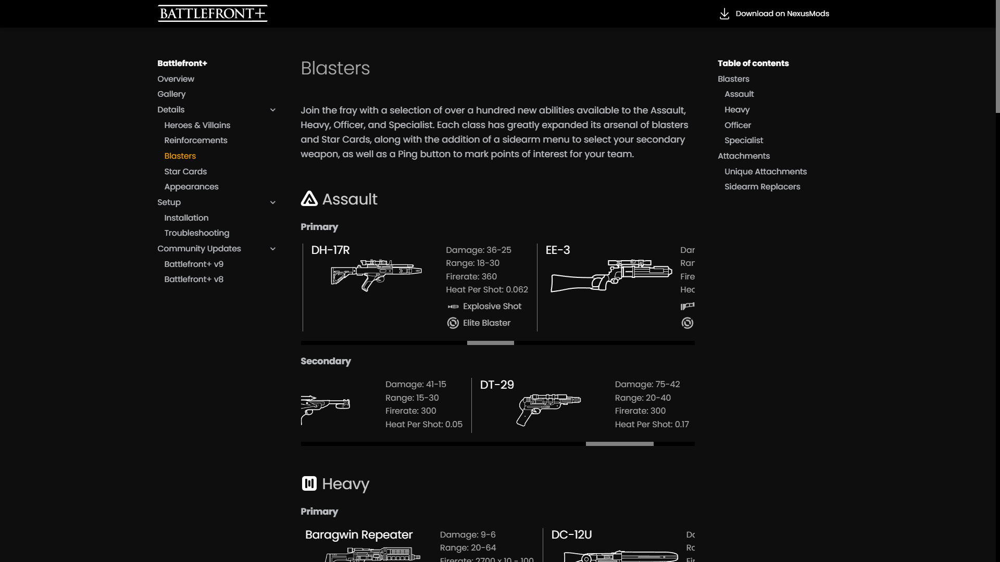
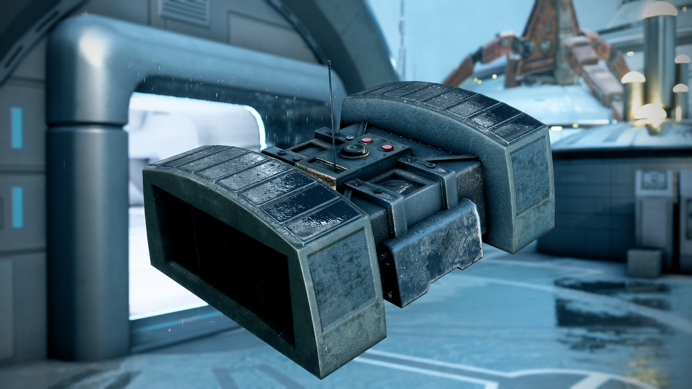
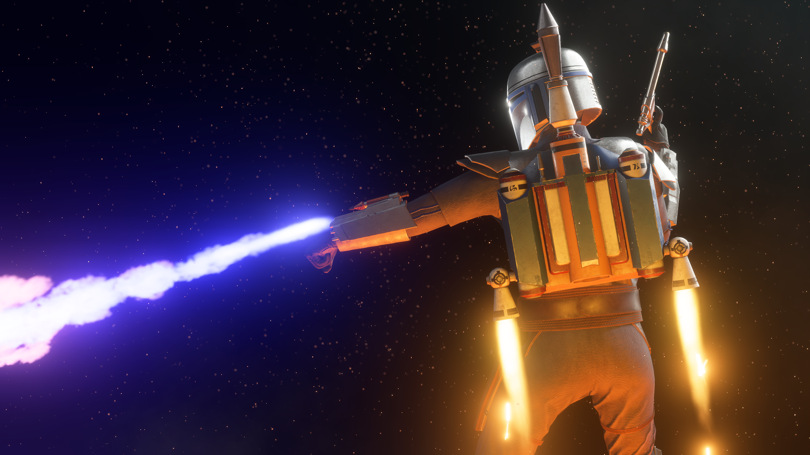
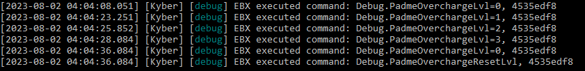

# Battlefront+ v10

{ .round-corners }

Welcome everyone to another update for Battlefront+ and to the project's official website! As usual, we've been hard at work on the latest batch of content, but as classes began again, life got busy, and the mod tools got some very exciting developments, we decided to reshape our plans.  
Battlefront+ V9 will be focusing almost entirely on quality of life features and balance changes, with some small pieces of new content, as you'll soon discover. The majority of content originally intended for this update is instead being pushed to Battlefront+ V10, which will now be our largest release by far.

### New Website

- From here on out, [battlefront.plus](https://battlefront.plus){ target="_blank" } will be the place to browse through all of the project's content, check out weapon stats, and view Community Updates. Additionally, tutorials and guides are hosted on the site, making this a centralized place for information and support.   

### Frosty 1.0.6.3 and KyberBrowser

- Starting with V9, Battlefront+ will require Frosty Mod Manager 1.0.6.3 or later. This version significantly speeds up moddata generation, making it quicker than ever to launch your game with mods. It additionally enables us to utilize certain assets that significantly improve optimization of the mods.

[Frosty Mod Manager](https://github.com/CadeEvs/FrostyToolsuite/releases/latest/download/FrostyModManager.zip){ .md-button }

- For playing on Kyber, or even patching your invisibility issues, we highly recommend switching to the custom KyberBrowser. This brings all of Kyber V1's functions into one application, thus removing the need to utilize your browser to join and host servers. The KyberBrowser also includes a feature for automatically installing the initfs fix, which is essential for playing Battlefront Plus and has long been a source of trouble for new players.

[KyberBrowser](https://github.com/Dyvinia/KyberBrowser/releases/latest){ .md-button target="_blank" }

### Blasters

Two new blasters are making their way to the troopers with this update.

- Assault

    

    - [Zersium Rifle](../../details/blasters/#assault): *Exceptionally rare antique blaster rifle, unreliable due to its age. Its stats will randomize with each trigger pull.*
        - Attachments: Gunslinger & Escape Artist

- Officer 
    
    
    
    - [BG-38](../../details/blasters/#officer): *Basic, medium power blaster pistol wielded by smugglers operating from Batuu.*
        - Attachments: Light Shot & Focused Fire

### Reinforcements

{ .round-corners }

The opportunity has been taken to give some of our oldest added Reinforcements another look.

- Blast From the Past
    - The Clone Engineer's standard DETONITE CHARGE has been replaced with the DETPACK, based on the original device from Battlefront II (2005). Its radius is more powerful and can be manually detonated while it is in the air.

- Honorably Discharged
    - Whenever the Honor Guard is nearby to friendly heroes, the HONORABLE DISCHARGE ability will increase its radius.

- Let the Wookiee Win
    - As the Wookiee Warrior sustains damage, the radius of SLAM will continue to increase up to a maximum. Activating the ability will use up this boost.

- Shocking Twist
    - Whenever the Shock Trooper is nearby to friendly heroes, the DISRUPTION ability will grant him supercooling.

- The Gunslinger
    - The Nikto Smuggler's Dual DT-29 blaster pistols are now semi-automatic and have a very slight zoom-in. The POWER SHOT ability has been replaced with DUAL SHOT, which will temporarily toggle the firing of both pistols at once.

### Appearances

{ .round-corners }

- Cal Kestis
    - Purple Lightsaber: Scrapper appearance with purple-bladed sabers.

- Count Dooku
    - Duelist: Default appearance without cape.

- Luke Skywalker
    - Duel: Luke's default 2015 appearance.

- Jango Fett
    - Z-6 Jetpack: Jango’s original jetpack model, which was destroyed on Kamino during his duel with Kenobi.

### Release

V10 FINAL SUMMARY.

### Patch Notes

- **Troopers**
    - Appearances
        - Separatists
            - Added Factory appearance to Heavy, Officer, and Specialist.
            - Added Marine appearance to the Assault.
            - Added Shuttle Pilot appearance to the Assault
            - Added Rocketeer appearance to the Heavy.
            - Added Engineer appearance to the Officer.
            - Added Field Commander appearance to the Officer.
            - Added AAT Driver appearance to the Officer
            - Added Kaller appearance to the Officer
            - Added Assassin appearance to the Specialist.
            - Added Speeder Pilot appearance to the Specialist
            - Added Security appearance to the Assault, Heavy, and Officer.
            - Added Weapons Factory appearance to the Assault, Heavy, Officer, and Specialist.
            - Added Citadel Security appearance to the Assault, Heavy, Officer, and Specialist.
            - Added Bedlam Raider appearance to the Assault, Heavy, Officer, and Specialist.

        - Galactic Empire
            - Added Mudtrooper appearance to the Assault, Heavy, Officer, and Specialist.
            - Added Security Trooper appearance to the Assault, Heavy, Officer, and Specialist.
            - Added Navy Trooper appearance to the Officer.
            - In Ewok Hunt, Imperial survivor appearances will be randomized between Stormtroopers and Scout Troopers.
            
        - First Order
            - Added Snowtrooper appearance to the Heavy, Officer, and Specialist.
            - Significantly improved backend optimization for appearance options. 

    - Blasters
        - New Assault blaster: Neo-Crusader Rifle
        - New Officer blaster: Q2.
        - New Officer blaster: TG-446
            - Sidearm available to the Heavy
        - New Officer blaster: WESTAR-35.
            - Sidearm available to the Assault.
        - New Heavy blaster: DF-95.
        - 773 Firepuncher
            - Increased the size of the blaster model to be more lore accurate.
        - Bowcaster
            - Added effects while charging up.
        - Cycler Rifle
            - Scopeless, canted aiming when dual-zoom is not equipped.
        - DP-23
            - Reduced damage.
            - Increased projectiles per shot from 8 to 9.
            - Slightly altered spread.
        - DC-17
            - Increased start damage.
        - DC-17S
            - Fixed an issue with the stealth properties not working as intended.
        - DL-44
            - Increased end damage.
        - Glie-44
            - Increased damage.
            - Reduced start drop-off range.
            - Reduced rate of fire.
            - Increased recoil.
        - HF-94
            - Increased start drop-off and end drop-off range. Second Chance modification is not affected by this change.
            - Increased cooling minigame blue space.
            - Added UI element upon successful hits to improve visual feedback for the heat reset function.
        - RT-97C
            - Increased damage.
        - Sonic Blaster
            - Adjusted the scale and position of the mesh to better fit the character animations and screen.
            - Added an emissive element to the mesh.
            - Removed scope overlay from zoom-in.
            - Improved cooling.
            - Replaced crosshair.
        - SE-14r
            - Fixed lack of supercooling availability.
        - T-12
            - Altered spread pattern.
            - Increased cooldown speed.
            - Removed supercooling availability.
            - SLUG Attachment
                - Reduced start damage.
                - Increased end damage.
                - Increased start drop-off range.
        - T-21
            - Reduced end damage.
            - Reduced start drop-off range and increased end drop-off range.
        - T-7 Disruptor Rifle
            - Increased recoil.
            - Fixed alignment issues with the charge up effects.
        - V-6D
            - Replaced crosshair.
        - Zersium Rifle
            - Fixed an issue with the Gunslinger modification causing the blaster to fire in 2-round bursts.
    - Sidearms
        - New Assault sidearm blaster: WESTAR-35
        - New Heavy sidearm blaster: TG-446
        - Fixed an issue with several pistols having their recoil be affected by the Focused Fire and Gunslinger attachments when equipped to the player’s primary weapon.
    - Star Cards
        - INSTIGATOR
            - Fixed an issue with the ability unintentionally boosting some sidearms.
            - Added start, end, and success sounds.
            - Added effect while the ability is active.
            - Added UI element while active to improve visual feedback.
        - QUICKDRAW
            - Increased bonus damage.
            - Reduced the delay before bonus damage can be applied to the same enemy again.
            - Added success sounds.
        - RADIO
            - Fixed an issue with the lack of animation when deploying the gadget.
        - ROCKET LAUNCHER
            - Recharge time is reset on death.
            - Recharge time is increased.
            - The projectile is affected by gravity.
            - Replaced crosshair.
        - STIM SHOT
            - No longer free-fires a projectile. While the gadget is in-hand, a friendly player within range and line of sight is targeted, then boosted upon firing.
            - Removed the self-heal function.
            - Awards Battle Points when successfully used.
            - Recharge time is decreased.
            - Added effect to players affected by the healing component.
        - THERMAL IMPLODER
            - Recharge time is reset on death.
            - Recharge time is increased.
            - The projectile is thrown at a reduced speed.

- **Reinforcements**
    - B2-RP
        - WRIST BLASTER
            - Increased end damage.
        - WRIST ROCKET
            - The projectile is affected by gravity.
            - Replaced crosshair.
    - B2 Super Battle Droid
        - TWIN WRIST-BLASTER
            - Reduced start damage.
            - Reduced start drop-off range.
            - Increased heat capacity.
            - Fixed lack of controller rumble while firing from the alternate barrel.
        - WRIST ROCKET
            - The projectile is affected by gravity.
            - Replaced crosshair.
            - Added Gold appearance.
    - BX Commando Droid
        - E-5
            - Increased start damage.
    - Clone Engineer
        - DP-23
            - Reduced start and end damage.
            - Increased projectiles per shot from 8 to 9.
            - Slightly altered spread.
    - Combat MagnaGuard
        - Increased max health.
        - Increased delay before health regeneration.
    - Clone Commando
        - Added Sniper appearance.
    - Clone Flametrooper
        - Added a short flame effect during the character select animation.
    - Clone Jet Trooper
        - Added Commander appearance, featuring a single-thruster jetpack.
    - Clone Sharpshooter
        - Added Legacy appearance, based on an alternate concept in the style of the 501st.
    - Ewok Hunter
        - Fixed an issue with invisible faces.
        - Significantly improved optimization for appearance options.
    - Gungan Warrior
        - GUNGAN SPEAR
        - Fixed an issue regarding the attack effects only appearing to the client.
        - COMBAT SHIELD
            - Replaced effects.
        - Added unique voicelines.
    - Honor Guard
        - BACTA GRENADE
            - Explodes on impact.
    - Imperial Jumptrooper
        - Restored Legacy appearance.
        - Star Tours appearance boasts the classic Imperial jetpack from 2015.
    - MagnaGuard Protector
        - Increased max health regeneration.
        - Increased health regeneration speed.
        - ELECTROSTAFF
            - Increased base damage.
            - Fixed an issue regarding the attack effects only appearing to the client.
        - DROID RAGE
            - Increased bonus damage.
            - Added effects while active.
        - SYSTEM COOLING
            - Added effects while active.
        - COMBAT ACCELERATION
            - Added effects while active.
    - Purge Trooper Commander
        - Added unique voicelines.
    - Rebel Pilot
        - BLURRG-1120
            - Reduced end damage.
            - Reduced heat capacity.
            - Increased rate of fire.
        - PROTON LAUNCHER
            - Increased recharge time.
        - Added Blue Squadron Pilot appearances.
        - Added Y-Wing Pilot appearances.
    - Rebel Rocket-Jumper
        - ROCKET LAUNCHER
            - The projectile is affected by gravity.
            - Replaced crosshair.
    - Resistance Rocket-Jumper
        - CONCUSSION DART
            - Replaced crosshair.
    - Riot Control Trooper
        - Added Executioner appearance.
    - Royal Guard
        - T-21
            - Stats rebalanced to match the standard T-21 of the Heavy.
        - ROYAL PRESENCE
            - Moved to the Left Ability category.
            - Reduced bonus health from ability.
            - Reduced damage resistance from ability.
            - Added start animation.
        - OVERLOAD replaces BURST MODE.
            - Activates a three-round burst mode while preventing blaster heat build-up and slowing down player movement considerably.
            - Moved to the Middle Ability category.
            - Added start and end sounds.
        - EMPEROR’S WILL
            - Moved to the Right Ability category.
            - Added start animation.
    - Shock Trooper
        - BACTA GRENADE
            - Explodes on impact.
    - Stormtrooper Commander
        - Added pouch asset to the appearance.
        - Added Snowtrooper appearance.
        - Default appearance named Stormtrooper.
    - Viper Probe Droid
        - PROBE DROID BLASTER
            - Increased end damage.
            - Increased end drop-off range.
        - SELF-DESTRUCT
            - Increased blast damage.
            - Increased blast radius.
        - SCANNER BEACON
            - Fixed an issue with the orbital strike warning appearing red to allies and blue to enemies.
            - Animated appearance with a rotating head.
        - Added Aratech 11-3K appearance.
        - Default appearance named Arakyd Probot.
    - Wookiee Warrior
        - BOWCASTER
            - Added overheat functionality.
            - Added effects while charging up.

- **Vehicles**
    - LAAT
        - Added to Kamino on Supremacy.
    - U-Wing
        - Fixed an issue with the firing sound playing the Bo-Rifle sound.

- **Heroes**
    - Added Padme’ Amidala to the Galactic Republic.
        - ELG-3A: Simple, yet elegant, and powerful hold-out pistol that has long served its queen.
        - OVERCHARGE: Padmé temporarily upgrades her ELG-3A's power level. Within a moment of Overcharge's activation, reactivate the ability, up to an additional two times, to reset the upgrade duration and increase the power level for even more damage.
        - ROYAL RESOLVE: Padmé grants herself and nearby allies increased recharge speed and unlimited blaster cooling.
        - R2-D2: Summon R2-D2 to support allies with improved capture point speed, radar scan, smoke grenades, and shock attacks. Padmé interacts with objectives faster while R2-D2 is deployed.
        - Appearances:
            - Arena
            - Ripped
    - Added Nightsister Merrin to the Rebel alliance.
        - MERRIN’S SPEAR: Magick dagger that transforms into a spear.
        - FIREBALL: Merrin conjures an explosive fireball of Magick, hurling it towards an enemy for high damage. The projectile upgrades with each level of Merrin's Power Meter and resets it upon use.
        - MAGICK ROOTS: Merrin uses her Magick to root a target in place, along with any enemies in their immediate vicinity. As her Power Meter builds, affected enemies will also be inflicted with increasing damage.
        - TELEPORTATION: Merrin teleports forward, briefly avoiding every form of attack and disappearing from the radar before rematerializing. While in this state, she cannot heal.
        - POWER: Whenever Merrin strikes an enemy with her spear or inflicts them with Magick Roots, her Power Meter will gradually fill, improving her abilities.
        - Appearances:
            - Survivor
            - Nightsister
            - Witch
    - Added Asajj Ventress to the Separatists.
        - ASAJJ VENTRESS’ LIGHTSABERS: Dancing twin blades with curved hilts.
        - STARBLADES: Ventress throws a projectile that damages enemies on impact and will ricochet off surfaces.
        - VANISH: Ventress cloaks herself in Magick Ichor, becoming invisible. Perform a lightsaber attack while cloaked to execute a Vanish Strike, dealing extra damage and revealing Ventress.
        - FORCE GRASP: Ventress lifts an enemy into the air, leaving them open to attack.
        - Appearances:
            - Sith Assassin
            - Apprentice
            - Legacy
    - Added Zam Wesell to the Separatists.
        - ZAM WESELL’S KISTEER 1284: Slug-thrower rifle that charges up while aiming.
        - CONCUSSION MINE: Zam deploys a proximity mine that pushes back and dazes enemies.
        - DISGUISE: Zam equips her KYD-21 sidearm as she disguises herself as the enemy, disappears from radar, and conceals the health bars of herself and all of those around her.
        - SABOTAGE: Zam marks an enemy to disrupt their weapons and abilities.
    - Added Dagan Gera to the Galactic Empire.
        - DAGAN GERA’S LIGHTSABER: An old and intricate hilt, now reunited with its master after centuries.
        - FORCE ORBS: Dagan summons a volley of orbs that slowly seek out enemies ahead of them.
        - FORCE ILLUSION: Dagan switches to a dual wield saber stance and conjures a powerful Force Illusion to daze and confuse nearby enemies. In this stance, he can deflect blaster bolts and has increased attack stamina, but reduced defense.
        - FORCE BOMB: Dagan plants an orb of Force energy into the ground, which will unleash devastating damage after a moment.
        - Appearances:
            - Fallen Knight
            - Awakening
    - Added Grand Admiral Thrawn to the Galactic Empire.
        - GRAND ADMIRAL THRAWN’S RK-3: The typical sidearm of high-ranking Imperial officers, reconfigured to fire in rapid bursts.
        - KNOW THE ENEMY: Thrawn turns the enemy's strategy against them, marking his attackers and inflicting them with weakness, an effect which strengthens as he withstands their assault. Enduring enough attacks will inflict greater weakness on all enemies within a large radius and inhibit their abilities.
        - DIRECT COMMAND: Thrawn and his nearby allies receive healing and damage resistance. The strength of these effects is increased, to a maximum, with the number of players affected.
        - CHIMAERA STRIKE: Equip a pair of macrobinoculars to call in a bombardment from Thrawn's personal Star Destroyer when outdoors. Mark an area indoors that will spot nearby enemies and inhibit their ability to capture zones, with success rewarding Thrawn with a recharge speed bonus.
        - Appearances:
            - Grand Admiral
            - Combat Armor
    - Ahsoka Tano
        - Fixed autoplayers not attacking with her lightsabers.
        - Added unique voicelines.
    - Boba Fett
        - Added Pursuit appearance.
        - Added Prototype appearance.
    - Cal Kestis
        - Rebalanced stamina values between Single-Saber and Double-Saber stances.
        - DOUBLE-SABER
            - Fixed an issue with the ability icon not highlighting properly while active.
        - REFORGED Star Card
            - Increased bonus damage.
            - Removed the small delay between hitting an enemy and the bonus damage triggering.
            - Added unique voicelines.
        - Added an animated BD-1 with a rotating head to all appearances.
        - Added Survivor appearance.
        - Added Poncho appearance.
        - Added Inquisitor appearance.
        - Added green saber color appearance options.
        - Renamed all original appearance options to Scrapper.
    - Chewbacca
        - Added C-3PO appearance, featuring voicelines and a dynamic arm and head.
        - Added Life Day appearance.
    - Commander Cody
        - Added Imperial appearance.
    - Darth Maul
        - Added Hardened Warrior appearance.
        - Mandalore appearance now features the correct lightsaber hilt.
    - Darth Vader
        - Added Archive appearance.
    - Dengar
        - FRENZY CONFIGURATION
            - Added camera zoom-in while active.
        - BASHING SKULLS
            - Added damage reduction while active.
            - Added sounds to the swinging of the blaster during the ability.
        - Added unique voicelines.
    - Din Djarin
        - GRAPPLE STRIKE replaces THERMAL VISION.
            - Din Djarin fires his grappling hook at an enemy, rapidly pulling himself to them with an attack that knocks them to the ground.
        - EXTENSION CORD Star Card replaces EVASION.
            - Din Djarin can target enemies further away with GRAPPLE STRIKE.
        - AMBAN PHASE-PULSE BLASTER
            - Moved to the Middle Ability category.
            - Updated projectile trail effects.
        - WHISTLING BIRDS
            - Improved projectile tracking to be more consistent.
            - Increased number of projectiles.
            - Increased rate of fire.
            - Decreased damage against heroes.
            - Projectile fire direction is angled slightly forward.
            - Updated effects.
        - PHALANX Star Card
            - Damage resistance triggers sooner.
            - Damage resistance increased.
            - Added unique voicelines.
    - Emperor Palpatine
        - Added to the Age of the Republic era.
        - Added Sith Lord appearance.
    - Han Solo
        - Added Mudtrooper appearance.
    - Finn
        - Added Crait appearance.
    - Gideon Hask
        - Locked to Age of Resistance.
        - Fixed an issue with the extra damage from Lingering Embers Star Card persisting far longer than intended.
        - Removed Inferno Squad appearance.
        - Added unique voicelines.
    - Leia Organa
        - Added Bespin Escape appearance.
    - Luke Skywalker
        - Added Bespin appearance.
        - Added Training Helmet appearance.
    - Nien Nunb
        - BUDDY TURRET Star Card
            - Reduced recharge time penalty to the AUGMENTED TURRET.
    - Obi-Wan Kenobi
        - Added Supercommando appearance.
        - Added Mandalore appearance.
    - Second Sister
        - Rebalanced stamina values between Single Saber and Double Saber stances.
        - DOUBLE-SABER
            - Fixed an issue with the ability icon not highlighting properly while active.
        - PERFECTED TECHNIQUE Star Card
            - Increased bonus damage.
            - Removed the small delay between hitting an enemy and the bonus damage triggering.
        - Added unique voicelines.
        - Changed the character select animation and victory pose.
    - Shriv Suurgav
        - Added unique voicelines.

{ .round-corners }  