# Battlefront+ Age of Heroes

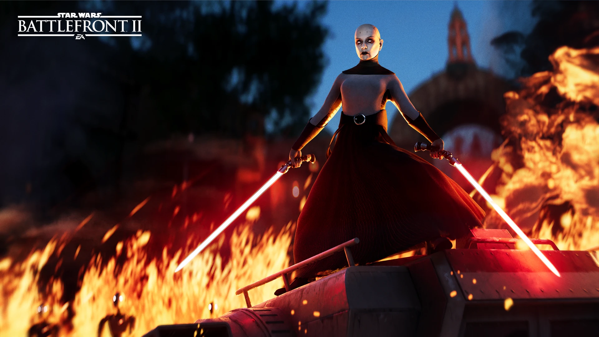{ .round-corners }

Welcome everyone back to another Community Update for Battlefront Plus! We know it’s been a very long time since the last content drop, but we’ve been hard at work on a major update, with even greater things to come soon, as well as collaborating with the Kyber Team to mark an incredible release. For that, we figured it would be fitting for this very special release to be the first with a proper name: Age of Heroes!

____
<h3 id="kyber-v2"><strong>KYBER V2, INSTANT ACTION, AND INSTALLATION</strong></h3> 

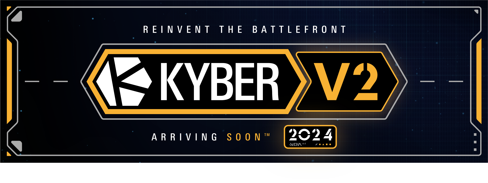{ .round-corners }

Kyber V2 has released at long last, offering a suite of new and improved features with dedicated 24/7 servers, built-in mod browser with hands-free installation, and a deeper level of immersion with features like proximity voice chat & stats tracking.

Frosty Mod Manager is no longer supported. Going forward, Battlefront Plus will be launched exclusively through Kyber v2's built-in mod browser for its quick and easy installation. Battlefront Plus will now also support Kyber private servers and Instant Action with a single version, allowing players to freely swap between online and offline play whenever they choose, just as it is in vanilla.

____

<h3 id="weather"><strong>DAYTIME AND WEATHER VARIANTS</strong></h3> 

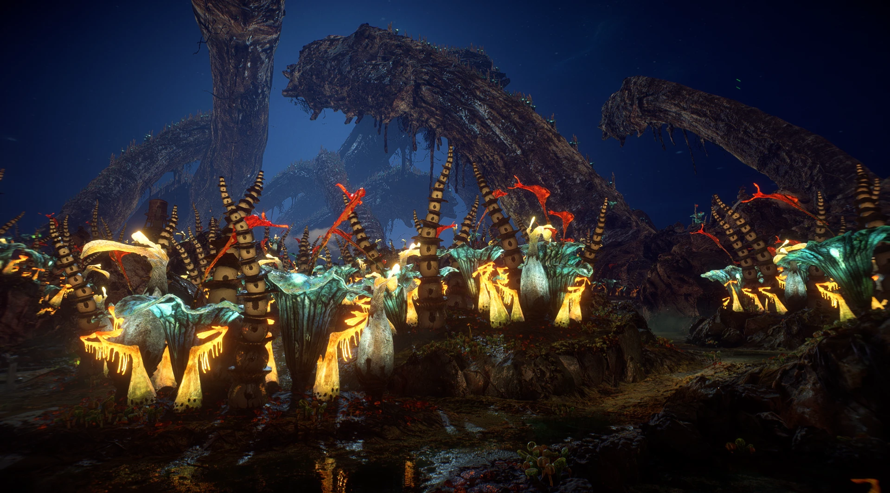{ .round-corners }

Many of the existing maps have new daytime and weather variants. Bask in the glowing beauty of Felucia at night, brace for irritation in Jakku's sandstorm, battle under the cloud cover over Kashyyyk just like in *Revenge of the Sith*, and so much more.

<h3><strong>Ajan Kloss</strong></h3>

- Added Foggy variant.

<h3><strong>Crait</strong></h3> 

- Added Sunset variant.
- Added Snow variant.

<h3><strong>Felucia</strong></h3>

- Added Night variant.

<h3><strong>Kamino</strong></h3> 

- Added Day variant.
- Added Night variant.

<h3><strong>Kashyyyk</strong></h3> 

- Added Foggy variant.
- Added Night variant to Supremacy.

<h3><strong>Hoth</strong></h3> 

- Added Night variant.

<h3><strong>Jakku</strong></h3>  

- Added Sunset variant to Supremacy.
- Added Sandstorm variant.

<h3><strong>Naboo</strong></h3> 

- Added Day variant to Supremacy.
- Added Sunset variant to Supremacy.
- Added Night variant to Supremacy.

<h3><strong>Starkiller Base</strong></h3>

- Added Night variant.

____

<h3 id="blasters"><strong>BLASTERS</strong></h3> 

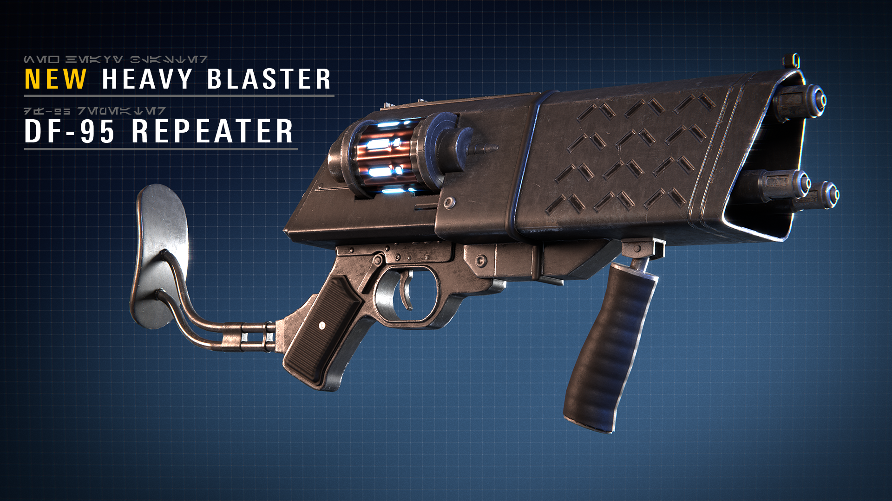{ .round-corners }

As is tradition with each Battlefront+ update, the trooper arsenal has been expanded with a variety of new weapons.

<h3><strong>Assault</strong></h3> 

[Neo-Crusader Rifle](../../details/blasters/#assault): *High-powered marksman blaster that is as ancient and durable as its people.*

 Seeker Tactics  Night Vision

____

<h3><strong>Heavy</strong></h3> 

[DF-95](../../details/blasters/#heavy): *Multi-functional blaster that alternates between a slow tri-shot while firing from the hip and a repeater mode while zoomed in.*

 Seeker Tactics  Escape Artist

____

<h3><strong>Officer</strong></h3> 
    
[Q2](../../details/blasters/#officer): *Snub-barreled hold-out pistol with an unmatched rate of fire.*

 Light Shot  Focused Fire

[TG-446](../../details/blasters/#officer): *Double-barreled quickdraw blaster.*

 Scatterblast  Gunslinger
    
[WESTAR-35](../../details/blasters/#officer): *The favored blaster pistol of a Mandalorian warrior.*

 Burst Fire  Ion Shot

____

<h3 id="appearances"><strong>APPEARANCES</strong></h3> 

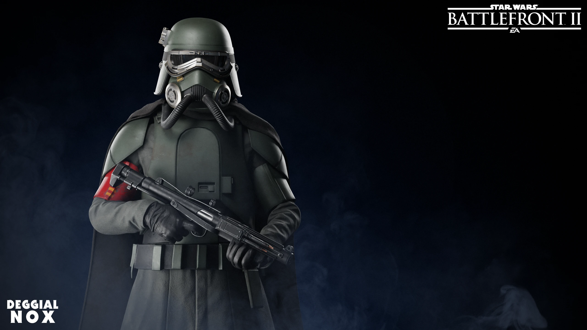{ .round-corners }

More appearances have been added than ever before, expanding upon Troopers, Reinforcements, and Heroes alike.

<h3><strong>Galactic Republic</strong></h3>

**Clone Jet Trooper** 

- COMMANDER - Equipped with a different model of jetpack featuring only one thruster, as well as a visor.

**Clone Sharpshooter** 

- LEGACY - 501st inspired blue markings based on an alternate concept from the *Revenge of the Sith* video game.

**Clone Commando** 

- SNIPER - Additional gear for Commandos specializing in two types of range: up close and personal and "Hello, you're dead."

____

<h3><strong>Separatist Alliance</strong></h3> 

**Troopers**

- BEDLAM RAIDER 
- CITADEL SECURITY 
- WEAPONS FACTORY 
- INFANTRY
- SECURITY 
- MARINE 
- SHUTTLE PILOT 
- DEMOLITIONS 
- ROCKETEER 
- AAT DRIVER 
- ENGINEER 
- FIELD COMMANDER 
- ASSASSIN 
- SPEEDER PILOT 

____

<h3><strong>Rebel Alliance</strong></h3> 

**Rebel Pilot** 

- BLUE SQUADRON - Blue jumpsuit with alternate markings.
- Y-WING PILOT - Tan jumpsuit with a different helmet.

____

<h3><strong>Galactic Empire</strong></h3> 

**Troopers**

- ARMY SECURITY 
- MUDTROOPER 
- STORMTROOPER COMMANDER 
- NAVY TROOPER   

**Imperial Jumptrooper** 

- STAR TOURS - Skytrooper equipped with the classic jetpack from *Battlefront 2015*.

**Viper Probe Droid** 

- ARATECH 11-3K - Probe droid mounted with a massive anti-personnel cannon, as featured in *Solo: A Star Wars Story* and *Jedi Survivor*.

____

<h3><strong>First Order</strong></h3> 

**Troopers** 

- SNOWTROOPER

**Riot Control Trooper** 

- EXECUTIONER

**Stormtrooper Commander** 

- SNOWTROOPER

____

<h3><strong>Heroes</strong></h3>

**Cal Kestis**

- PONCHO - Cal’s favorite accessory from *Jedi Fallen Order*.
- SURVIVOR - Cal’s default appearance from *Jedi Survivor*.
- INQUISITOR - Cal’s vision of himself as a fallen Jedi from *Jedi Fallen Order*.

**Chewbacca**

- C-3PO - The most talkative protocol droid, still in the middle of being put back together, strapped into a net during a hasty escape. 3PO will rotate his arm and head, as well as speak during abilities.
- LIFE DAY - Sacred robes from a traditional Wookiee celebration.

**Commander Cody**

- IMPERIAL - Cody’s grayed-out markings from *The Bad Batch*.
**Han Solo**

- MUDTROOPER - Han’s armor, unhelmeted, from his time on Mimban in *Solo*.

**Finn**

- CRAIT - Finn’s appearance on Crait, after leaving his jacket behind, from *The Last Jedi*.

**Leia Organa**

- BESPIN ESCAPE - Leia’s appearance while escaping Cloud City in *The Empire Strikes Back*.

**Luke Skywalker**

- BESPIN - Luke’s appearance while infiltrating Cloud City and battling Darth Vader in *The Empire Strikes Back*.
- TRAINING HELMET - Helmet with a lowered blast shield to prevent Luke from seeing, as part of the beginning of his Jedi training in *A New Hope*.

**Obi-Wan Kenobi**

- SUPERCOMMANDO - Obi-Wan’s disguise taken from one of Maul’s Mandalorian warriors during *The Clone Wars*.
- MANDALORE - Unhelmeted version of Obi-Wan’s Mandalorian disguise during *The Clone Wars*.

____

<h3><strong>Villains</strong></h3> 

**Boba Fett**

- PURSUIT - Boba Fett’s appearance from *The Empire Strikes Back* and *Jedi Survivor*.
- PROTOTYPE - Conceptual, all-white appearance for Boba Fett’s debut.

**Darth Maul**

- HARDENED WARRIOR - Bare-chested appearance from Maul before he lost his legs.

**Darth Vader**

- ARCHIVE - Damaged and burning appearance from *Jedi Survivor*.

**Emperor Palpatine**

- SITH LORD - Palpatine’s robes from *The Clone Wars* and *Revenge of the Sith*.

**General Grievous**

- RUTHLESS - Blued armor with red lightsabers, based on the "Mirror Match" appearance from the *Revenge of the Sith* video game.

____

<h3 id="heroes"><strong>HEROES</strong></h3> 
Battlefront+ Age of Heroes introduces the most heroes added yet, bringing in some of the community's most desired characters and at long last fulfilling two promises of our own.

#### **BE DIFFERENT**  SERGEANT HUNTER

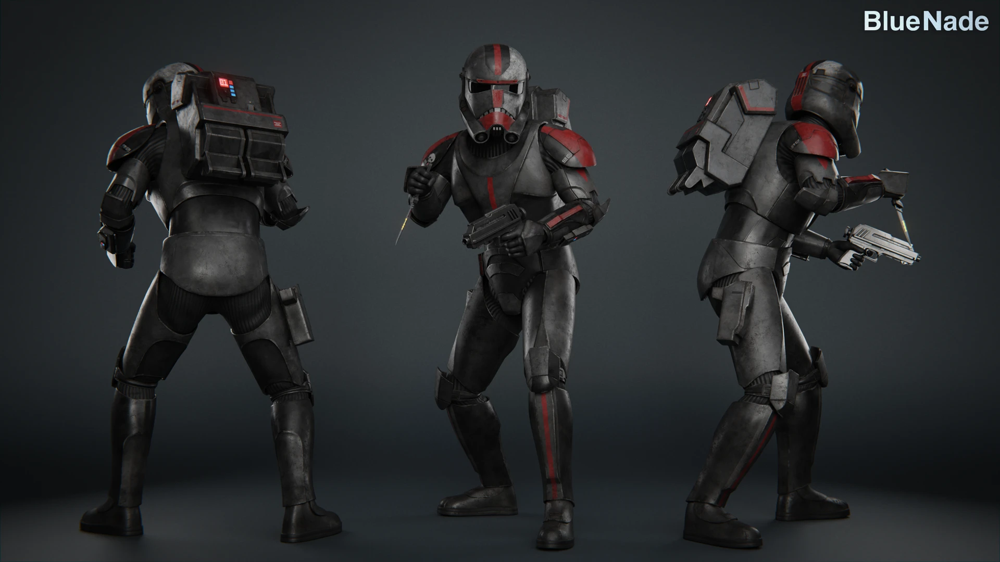{ .round-corners }

Sergeant Hunter of Clone Force 99, also known as the "Bad Batch," brings his unique skills to the fight against the Droid Army. Gifted with  **ENHANCED SENSES** by genetic mutations, Hunter is an expert tracker who is constantly able to see enemy footsteps.

With a **DC-17** in one hand and his  **VIBRO-KNIFE** in the other, Hunter is well-equipped for eliminating hostiles in close quarters combat.

Setting his blaster to 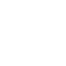 **STUN MODE** enables Hunter to create openings and punish carelessly aggressive combatants. The first two hits on an opponent will stagger them and the third will knock them to the ground with increased damage, leaving them vulnerable to attack.

To close the distance and remain in the fight, Hunter's  **COMBAT PROWESS** can be used to boost his health, increase his sprint speed, and make him immune to crowd control abilities.

- Star Cards:
    - PREDATOR - In addition to his  **VIBRO-KNIFE** dealing more damage, Hunter will disappear from enemy radar whenever he defeats an enemy in melee combat.
    - NOTHING BUT TROUBLE - While evading, Hunter has increased damage resistance.
    - RUSH THEM HEAD ON -  **COMBAT PROWESS** grants additional bonus health and lasts slightly longer.
    - WASN'T GONNA HURT YA - Hunter's  **STUN MODE** builds less heat when fired.
    - WE DO WHAT WE DO - Hunter's health regeneration is faster and starts sooner.

____

#### **BE NEGOTIABLE**  PADMÉ AMIDALA

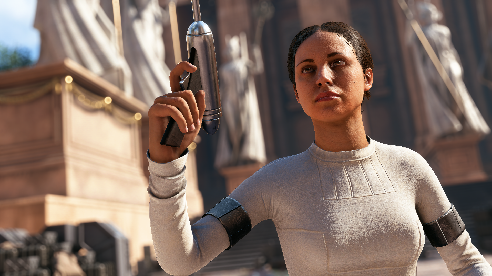{ .round-corners }

Unyielding in the fight for a better galaxy, Padmé Amidala joins the Battlefront at last. Her **ELG-3A** hold-out blaster packs a punch, but when Padmé uses  **OVERCHARGE** she temporarily upgrades the pistol's power level. Each consecutive activation, up to three times, will increase the blaster’s damage, before returning to normal when the timer ends. 

Padmé's  **ROYAL RESOLVE** grants herself and nearby allies increased ability recharge speed and unlimited blaster cooling. 

Lastly, Padmé calls  **R2-D2** into action to assist her team with improved capture point speed, radar scan, smoke grenades, and shock attacks. So long as R2 is deployed, Padmé can also use interactable objectives faster wherever she is.

- Star Cards:
    - POWER EFFICIENCY -  **R2-D2**  has a shorter recharge time.
    - AGGRESSIVE NEGOTIATIONS - When defeating enemies with  **OVERCHARGE**, Padmé temporarily takes reduced damage based on her blaster's power level.
    - UNWAVERING - Padmé has increased maximum health regeneration.
    - INSPIRATIONAL - Increases the radius of  **ROYAL RESOLVE**.
    - A PATH TO FOLLOW - If Padmé is within 20 meters of three friendly units, her nearby allies will receive a small amount of health regeneration.

- Appearances:
    - ARENA - Padmé’s outfit during her mission with Anakin Skywalker to rescue Obi-Wan Kenobi on Geonosis.
    - RIPPED - Padmé’s outfit on Geonosis, torn by a Nexu attacking her in the Petranaki Arena.

____

#### **BE ADAPTABLE**  NIGHTSISTER MERRIN

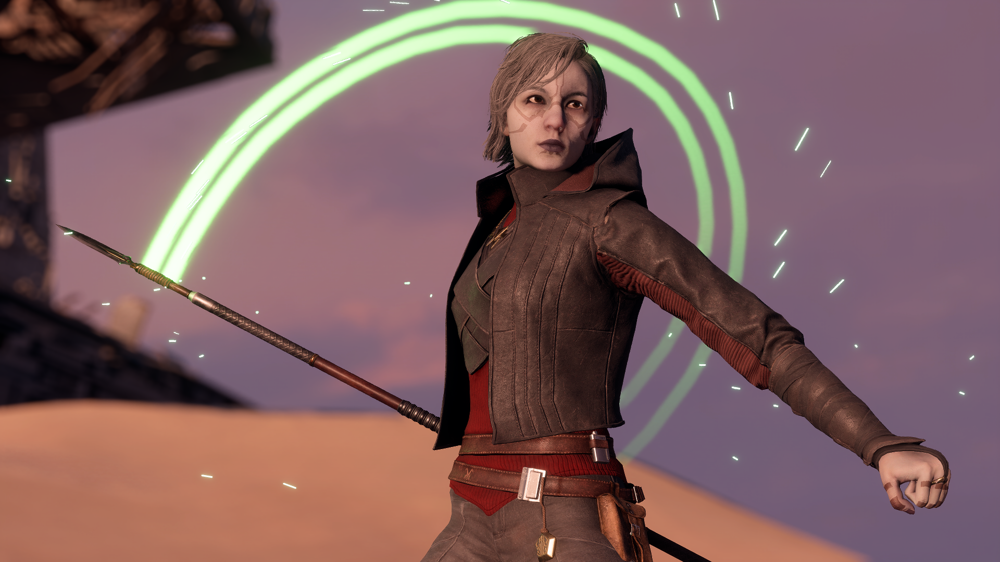{ .round-corners }

Joining the fight against the Empire is Nightsister Merrin. As one of the last living members of her people, she has mastered the arts of wielding Magick and taken to using her abilities to help those in need across the galaxy. 

Merrin’s kit emphasizes balanced decision-making and staying on the move, which is made most evident by her  **POWER METER**. Attacking enemies will fill up a special meter to indicate Merrin's power level, up to a maximum of five, improving her abilities.

**MERRIN’S SPEAR**, with its distinctive green trails of flowing Magick, is her primary weapon for dispatching enemies. 

With her  **MAGICK ROOTS** ability, Merrin locks down a targeted opponent, as well as any others within the immediate vicinity. With each level of her  **POWER METER**, the damage inflicted is increased.

To obliterate ranged enemies, Merrin may to cast her  **FIREBALL**, fully consuming her  **POWER METER** for a destructive impact based on the level reached.

An effective method for closing distance and causing chaos is  **TELEPORTATION**, which has Merrin momentarily disappear in a dash forward, making her immune to all forms of attack, and rematerializing a moment later.

- Star Cards:
    - FROM THE SHADOWS - Merrin has one extra  **TELEPORTATION**, but each use decrements her Power Meter.
    - SURVIVORS, WE ADAPT - While Merrin's  **POWER METER** is at max level, her spear does significantly increased damage.
    - MIGHT OF DATHOMIR - The initial targeting range of  **MAGICK ROOTS** is increased.
    - STRIKE NOW - Merrin's  **FIREBALL** has improved recharge time and staggers enemies on direct impact.
    - LEND ME STRENGTH - Merrin's health regeneration is faster and starts sooner.

- Appearances:
    - SURVIVOR - Merrin’s outfit throughout *Jedi Survivor*.
    - NIGHTSISTER - The traditional robes of Merrin’s people on Dathomir, as seen throughout *Jedi Fallen Order*.
    - WITCH - Merrin's traditional robes outfitted with a hood and cape.

____

#### **BE CUNNING**  ASAJJ VENTRESS

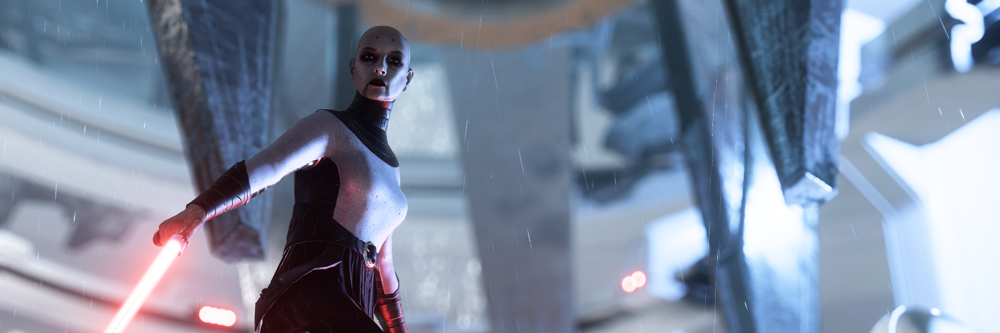{ .round-corners }

First announced almost two years ago, Asajj Ventress has been one of our most anticipated heroes, and we’re happy to announce that she will finally be joining the Separatists as their first new lightsaber hero, wielding her iconic **DUAL LIGHTSABERS**.

In taking inspiration from her kit from the original Battlefront II (2005), Ventress' final ability is her  **STARBLADES**, which will throw a projectile that deflects off surfaces and damages enemies on impact.

Ventress’ signature ability draws on her Nightsister roots, as  **VANISH** will cloak her in Magick Ichor, turning her completely invisible. When attacking from this state, she will reveal herself with a devastating critical strike. 

With her  **FORCE GRASP** ability, Ventress can suspend an enemy in the air for several seconds, leaving them vulnerable to attack.

- Star Cards:
    - EXTRA STARBLADES - Ventress throws three projectiles at once when using her  **STARBLADES**, but the ability can only be used once before needing to recharge.
    - SITH ASSASSIN - When Ventress attacks an enemy from behind with her lightsabers, her abilities receive bonus recharge speed for a short period.
    - SISTER OF THE NIGHT - Performing a  **VANISH STRIKE** will inflict even more damage and reveal the positions of nearby enemies upon defeating an opponent.
    - SUSPENSEFUL GRIP -  **FORCE GRASP** has one extra use.
    - TALZIN'S PROTECTION - Asajj Ventress has increased maximum health regeneration.

- Appearances:
    - ASSASSIN - Ventress’ apparel during her final days of service to Count Dooku.
    - LEGACY - Ghastly white eyes based on Ventress’ original appearance in the *Clone Wars 2003* micro-series.

____

#### **BE PROFESSIONAL**  ZAM WESELL

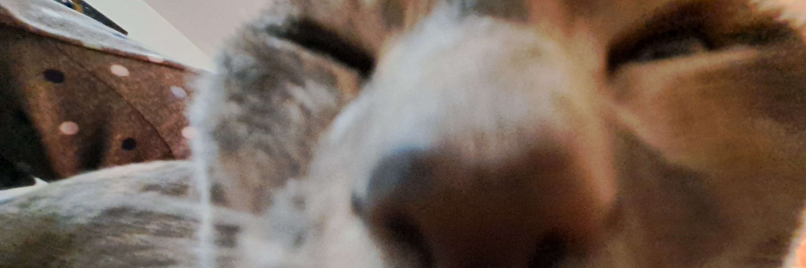{ .round-corners }

The bounty hunter Zam Wesell, also announced two years ago, arrives to the battlefront under the employment of the Separatist Alliance. 

Armed with a **KISTEER-1284** sniper rifle, Zam is capable of eliminating targets at extreme ranges. While scoped in, the damage of the projectile increases, as does the range of her  **SABOTAGE** ability, which will disrupt a single target's blaster and inhibit their abilities. 

To guard an objective or pathway, Zam can deploy a  **CONCUSSION MINE** up to three times, which will knock down and daze affected enemies. 

For her signature ability,  **DISGUISE**, Zam equips her KYD-21 sidearm and utilizes her natural skills as a changeling to go undercover as the enemy. If her cover is blown, the sidearm is highly effective in close-quarters, but expert spy tactics may allow her to disappear into enemy groups and disrupt their operations.

- Star Cards:
    - PUSHING YOUR LUCK - For every enemy Zam defeats while  **DISGUISE** is active it will extend its duration.
    - UNMISTAKEN - The recharge time on  **CONCUSSION MINES** is reduced.
    - SUBTLE SOLUTIONS -  **SABOTAGE** has one extra use.
    - JUST A JOB - Each headshot kill will reward Zam with health regeneration.
    - COUNTER-SNIPING - Enemies dealing damage to Zam will be temporarily marked for easier retaliation.

____

#### **BE SUPERIOR**  DAGAN GERA

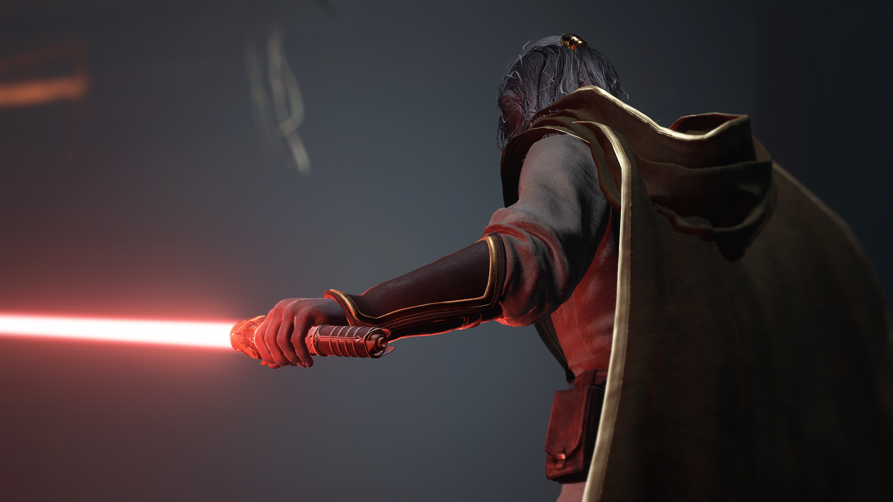{ .round-corners }

The fourth hero to be added from the Jedi series is Dagan Gera, joining the Separatists and the Galactic Empire. A renowned and ambitious Jedi Knight of the High Republic, Dagan’s obsession turned him to the Dark Side, costing him a limb and hundreds of years in stasis. Released from his hold, Dagan came into conflict with the Jedi survivor Cal Kestis. 

Despite missing his right arm, he continued to display mastery in wielding a **LIGHTSABER** and the Force. With  **FORCE ILLUSION** active, Dagan will daze and confuse nearby enemies while switching to a more aggressive dual-wield stance with better attack stamina and lower defense. 

By planting a  **FORCE BOMB** into the ground, he ensures that his vicinity will be empty of enemies, one way or another. 

Lastly, with his  **FORCE ORBS** ability, Dagan summons a volley of projectiles that slowly seek out enemies ahead.

- Star Cards:
    - CAN'T HIDE FROM ME - The radius of  **ILLUSION** will not decay for a short delay.
    - FORSAKEN - For every enemy damaged by  **FORCE ORBS**, Dagan replenishes health.
    - BECKONING -  **FORCE BOMB** will be more powerful if it is used while ILLUSION is active.
    - MEAGER - Dagan Gera has increased maximum health, but the delay before health regeneration is also increased.
    - SEVER THE PAST - For a brief duration after any of his abilities end, Dagan Gera will deal extra damage with his lightsaber attacks, but will also take more damage himself.

- Appearances:
    - FALLEN KNIGHT - Dagan Gera’s High Republic Jedi robes with his crimson red saber.
    - AWAKENING - Released from centuries in stasis, Dagan bled the crystal in his lightsaber.
    - OBSESSION - High Republic Jedi robes with Dagan’s saber emitting a yellow blade.
    - RETURN - Fresh out of the Bacta Tank, as Dagan ignited the yellow blade of his saber.

____

#### **BE BRILLIANT**  GRAND ADMIRAL THRAWN

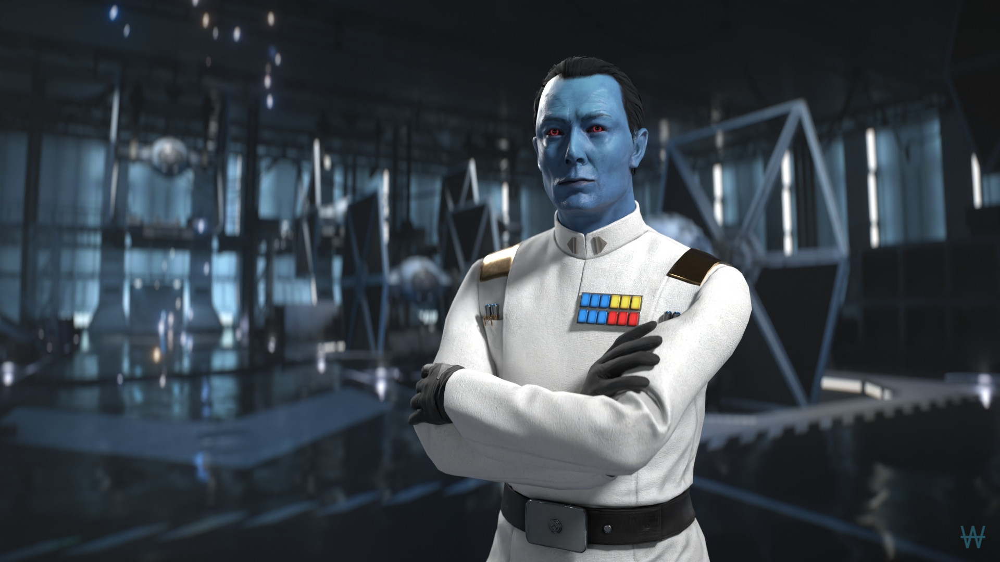{ .round-corners }

Grand Admiral Thrawn personally deploys to the battlefront to orchestrate the battle, guarding himself a two-round burst **RK-3**. 

As a military mastermind of legend, it was an important challenge to emphasize Thrawn's role as a exceptional tactician.  **KNOW THE ENEMY** serves to turn the opponent's strategies against themselves, revealing Thrawn's attackers to his entire team and inflicting them with weakness, an effect which strengthens as he withstands their assault. Enduring enough attacks will inflict greater weakness on all enemies within a massive radius and inhibit their abilities. 

Thrawn can support himself and nearby allies with  **DIRECT COMMAND**, granting healing and damage resistance that improves, to a maximum, based on how many units are affected. 

To utterly devastate and demoralize the enemy, Thrawn can mark an area with macrobinoculars to call in a  **CHIMAERA STRIKE** - an orbital bombardment from his personal Star Destroyer. Alternatively, if the marked area is indoors, nearby enemies will be spotted and blocked from capturing zones, with success rewarding Thrawn with a recharge bonus.

- Star Cards:
    - PIECE BY PIECE - The minimum time between attacks to charge up  **KNOW THE ENEMY** is reduced.
    - STRATEGIC MASTERY - The radius of  **DIRECT COMMAND** increases while the ability is active.
    - TEST THEIR METTLE -  **CHIMAERA STRIKE** recharges faster.
    - MOMENTARY SETBACK - Thrawn's health regeneration is faster and begins sooner.
    - ASCENDANT - Thrawn captures objectives twice as fast and has increased maximum health.

- Appearances:
    - GRAND ADMIRAL - Thrawn's distinctive white uniform, decorated with golden epaulets.
    - COMBAT ARMOR - Protective gear worn over Thrawn's uniform when he personally oversaw ground battles.

____

#### **UPDATING EXISTING HEROES**
With the addition of the new heroes, we've also taken the time to revisit some of the existing ones.

The Mandalorian Din Djarin receives a new  **GRAPPLE STRIKE** ability, replacing his old  **THERMAL VISION** ability. When activated, he fires his grappling hook at an enemy, rapidly pulling himself to them with an attack that knocks them to the ground. To go with this, his **EVASION** Star Card has been replaced with **EXTENSION CORD**, which will extend the targeting range of his  **GRAPPLE STRIKE**.

Palpatine has been added to the hero roster for the Separatist Alliance, making him available to the Dark Side in the *Age of the Republic*. This will fit perfectly with his new SITH LORD appearance!

In the interest of keeping the eras distinct from each other, Gideon Hask has been restricted to the *Age of Resistance*, with Grand Admiral Thrawn taking his place in the *Age of Rebellion*. To that end, Hask's INFERNO SQUAD appearance has been removed as well. 

____

<h3 id="future"><strong>RELEASE AND THE FUTURE</strong></h3> 

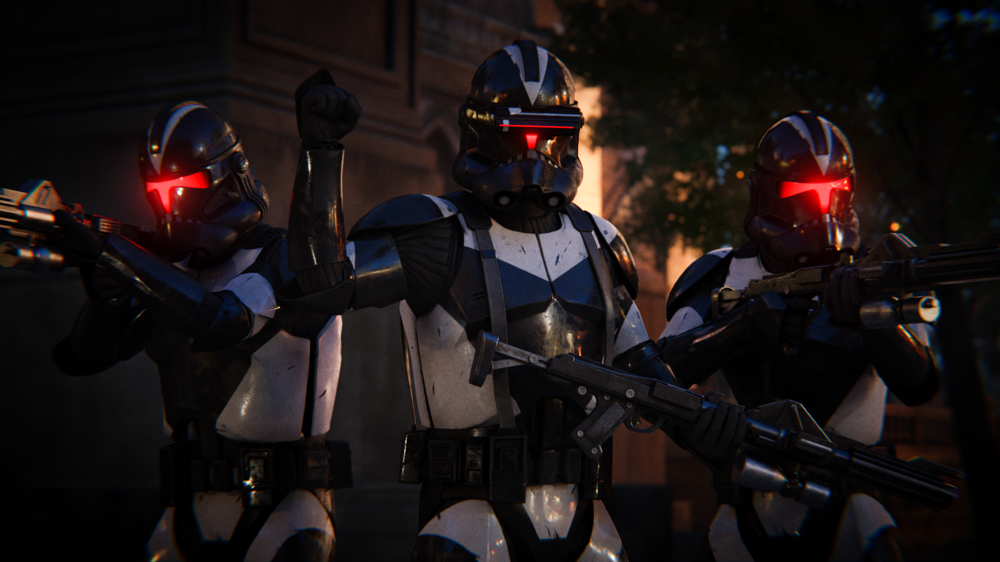{ .round-corners } 

In 2020, DICE concluded their support for Battlefront II with the Battle of Scarif update. We've come a long way since then and with the **Age of Heroes** update, we've realized our vision for Battlefront+ is far from complete. In the months to come, Battlefront+ will be going farther than ever, as we take our first steps into the realm of new maps and gamemodes, alongside the usual assortment of additional weapons, appearances, and characters.

This is a new dawn for Battlefront II. To all who've stuck with us these past couple years, to the new and returning players, thank you very much and we'll see you on the Battlefront.

And for old time's sake...

***Punch it.***

___

<h3 id="patch-notes"><strong>PATCH NOTES</strong></h3> 

- **Installation**
    - Kyber V2 mod launcher made the exclusive way to play Battlefront Plus. Frosty Mod Manager is no longer supported.
    - Unified the Private Servers and Instant Action versions of Battlefront Plus.

**General Changes**
    - Fixed issues across the board with custom equipment for Troopers, Reinforcements, and Heroes not playing proper sounds for damaging or defeating enemies.
    - Fixed issues across the board with custom blasters for Troopers, Reinforcements, and Heroes not deflecting the correct blaster bolt color.
    - Added effects to enemies actively taking damage from burning affectors (i.e. flamethrowers).

- **Troopers**
    - Appearances
        - Separatists
            - Added Security appearance to the Assault, Heavy, and Officer.
            - Added Weapons Factory appearance to the Assault, Heavy, Officer, and Specialist.
            - Added Citadel Security appearance to the Assault, Heavy, Officer, and Specialist.
            - Added Bedlam Raider appearance to the Assault, Heavy, Officer, and Specialist.
            - Added Infantry appearance to Heavy, Officer, and Specialist.
            - Added Marine appearance to the Assault.
            - Added Shuttle Pilot appearance to the Assault
            - Added Demolitions appearances to the Heavy.
            - Added Rocketeer appearance to the Heavy.
            - Added Engineer appearance to the Officer.
            - Added Field Commander appearance to the Officer.
            - Added AAT Driver appearance to the Officer
            - Added Kaller appearance to the Officer
            - Added Assassin appearance to the Specialist.
            - Added Speeder Pilot appearance to the Specialist

        - Galactic Empire
            - Added Mudtrooper appearance to the Assault, Heavy, Officer, and Specialist.
            - Added Security Trooper appearance to the Assault, Heavy, Officer, and Specialist.
            - Added Stormtrooper Commander appearance to the Assault, Heavy, and Officer.
            - Added Navy Trooper appearance to the Officer.
            - In Ewok Hunt, Imperial survivor appearances will be randomized between Stormtroopers and Scout Troopers.
            
        - First Order
            - Added Snowtrooper appearance to the Heavy, Officer, and Specialist.
            - Significantly improved backend optimization for appearance options. 

    - Blasters
        - New Assault blaster: Neo-Crusader Rifle
        - New Officer blaster: Q2.
        - New Officer blaster: TG-446
            - Sidearm available to the Heavy
        - New Officer blaster: WESTAR-35.
            - Sidearm available to the Assault.
        - New Heavy blaster: DF-95.
        - 773 Firepuncher
            - Increased the size of the blaster model to be more lore accurate.
        - Bowcaster
            - Added effects while charging up.
        - Cycler Rifle
            - Scopeless, canted aiming when dual-zoom is not equipped.
        - DP-23
            - Reduced damage.
            - Increased projectiles per shot from 8 to 9.
            - Slightly altered spread.
        - DC-17
            - Increased start damage.
        - DC-17S
            - Fixed an issue with the stealth properties not working as intended.
        - DL-44
            - Increased end damage.
        - Glie-44
            - Increased damage.
            - Reduced start drop-off range.
            - Reduced rate of fire.
            - Increased recoil.
        - HF-94
            - Increased start drop-off and end drop-off range. Second Chance modification is not affected by this change.
            - Increased cooling minigame blue space.
            - Added UI element upon successful hits to improve visual feedback for the heat reset function.
        - RT-97C
            - Increased damage.
        - Sonic Blaster
            - Adjusted the scale and position of the mesh to better fit the character animations and screen.
            - Added an emissive element to the mesh.
            - Removed scope overlay from zoom-in.
            - Improved cooling.
            - Replaced crosshair.
        - SE-14r
            - Fixed lack of supercooling availability.
        - T-12
            - Altered spread pattern.
            - Increased cooldown speed.
            - Removed supercooling availability.
            - SLUG Attachment
                - Reduced start damage.
                - Increased end damage.
                - Increased start drop-off range.
        - T-21
            - Reduced end damage.
            - Reduced start drop-off range and increased end drop-off range.
        - T-7 Disruptor Rifle
            - Increased recoil.
            - Fixed alignment issues with the charge up effects.
        - V-6D
            - Replaced crosshair.
        - Zersium Rifle
            - Fixed an issue with the Gunslinger modification causing the blaster to fire in 2-round bursts.
    - Sidearms
        - New Assault sidearm blaster: WESTAR-35
        - New Heavy sidearm blaster: TG-446
        - Fixed an issue with several pistols having their recoil be affected by the Focused Fire and Gunslinger attachments when equipped to the player’s primary weapon.
    - Abilities and Star Cards
        - INSTIGATOR
            - Fixed an issue with the ability unintentionally boosting some sidearms.
            - Added start, end, and success sounds.
            - Added effect while the ability is active.
            - Added UI element while active to improve visual feedback.
        - QUICKDRAW
            - Increased bonus damage.
            - Reduced the delay before bonus damage can be applied to the same enemy again.
            - Added success sounds.
        - RADIO
            - Fixed an issue with the lack of animation when deploying the gadget.
        - ROCKET LAUNCHER
            - Recharge time is reset on death.
            - Recharge time is increased.
            - The projectile is affected by gravity.
            - Replaced crosshair.
        - STIM SHOT
            - No longer free-fires a projectile. While the gadget is in-hand, a friendly player within range and line of sight is targeted, then boosted upon firing.
            - Removed the self-heal function.
            - Awards Battle Points when successfully used.
            - Recharge time is decreased.
            - Added effect to players affected by the healing component.
        - THERMAL IMPLODER
            - Recharge time is reset on death.
            - Recharge time is increased.
            - The projectile is thrown at a reduced speed.
        - VANGUARD
            - Altered spread pattern. 

- **Reinforcements**
    - B2-RP
        - WRIST BLASTER
            - Increased end damage.
        - WRIST ROCKET
            - The projectile is affected by gravity.
            - Replaced crosshair.
    - B2 Super Battle Droid
        - TWIN WRIST-BLASTER
            - Reduced start damage.
            - Reduced start drop-off range.
            - Increased heat capacity.
            - Fixed lack of controller rumble while firing from the alternate barrel.
        - WRIST ROCKET
            - The projectile is affected by gravity.
            - Replaced crosshair.
            - Added Gold appearance.
    - BX Commando Droid
        - E-5
            - Increased start damage.
    - Combat Engineer
        - DP-23
            - Reduced start and end damage.
            - Increased projectiles per shot from 8 to 9.
            - Slightly altered spread.
        - DETPACK
            - Increased blast radius.
            - Increased throw speed.
    - Combat MagnaGuard
        - Increased max health.
        - Increased delay before health regeneration.
        - BULLDOG RLR
            - Replaced crosshair.
        - E-60R HOMING LAUNCHER
            - Replaced crosshair.
        - PROBE TURRET
            - Adjusted model position to better match the hitbox.
    - Clone Commando
        - Added Sniper appearance.
    - Clone Flametrooper
        - Added effects to character selection.
    - Clone Jet Trooper
        - Added Commander appearance, featuring a single-thruster jetpack.
    - Clone Sharpshooter
        - Added Legacy appearance, based on an alternate concept in the style of the 501st.
    - Ewok Hunter
        - Fixed an issue with invisible faces.
        - Significantly improved optimization for appearance options.
    - Gungan Warrior
        - GUNGAN SPEAR
            - Fixed an issue regarding the attack effects only appearing to the client.
        - COMBAT SHIELD
            - Replaced effects.
        - Added unique voicelines.
    - Honor Guard
        - BACTA GRENADE
            - Explodes on impact.
        - Fixed lack of movement sounds.
    - Imperial Jumptrooper
        - Restored Legacy appearance.
        - Star Tours appearance boasts the classic Imperial jetpack from 2015.
    - MagnaGuard Protector
        - Increased max health regeneration.
        - Increased health regeneration speed.
        - ELECTROSTAFF
            - Increased base damage.
            - Fixed an issue regarding the attack effects only appearing to the client.
        - DROID RAGE
            - Increased bonus damage.
            - Added effects while active.
        - SYSTEM COOLING
            - Added effects while active.
        - COMBAT ACCELERATION
            - Added effects while active.
    - Purge Trooper Commander
        - Added unique voicelines.
    - Rebel Pilot
        - BLURRG-1120
            - Reduced end damage.
            - Reduced heat capacity.
            - Increased rate of fire.
        - PROTON LAUNCHER
            - Increased recharge time.
        - Added Blue Squadron Pilot appearances.
        - Added Y-Wing Pilot appearances.
    - Rebel Rocket-Jumper
        - ROCKET LAUNCHER
            - The projectile is affected by gravity.
            - Replaced crosshair.
    - Republic Gunner
        - ANTI-INFANTRY MODE
            - Increased supercooling minigame size.
    - Resistance Rocket-Jumper
        - CONCUSSION DART
            - Replaced crosshair.
    - Riot Control Trooper
        - Added Executioner appearance.
    - Royal Guard
        - T-21
            - Stats rebalanced to match the standard T-21 of the Heavy.
        - ROYAL PRESENCE
            - Moved to the Left Ability category.
            - Reduced bonus health from ability.
            - Reduced damage resistance from ability.
            - Added start animation.
        - OVERLOAD replaces BURST MODE.
            - Activates a three-round burst mode while preventing blaster heat build-up and slowing down player movement considerably.
            - Moved to the Middle Ability category.
            - Added start and end sounds.
        - EMPEROR’S WILL
            - Moved to the Right Ability category.
            - Added start animation.
    - Shock Trooper
        - BACTA GRENADE
            - Explodes on impact.
    - Stormtrooper Commander
        - Added pouch asset to the appearance.
        - Added Snowtrooper appearance.
        - Default appearance named Stormtrooper.
    - Viper Probe Droid
        - PROBE DROID BLASTER
            - Increased end damage.
            - Increased end drop-off range.
        - SELF-DESTRUCT
            - Increased blast damage.
            - Increased blast radius.
        - SCANNER BEACON
            - Fixed an issue with the orbital strike warning appearing red to allies and blue to enemies.
            - Animated appearance with a rotating head.
        - Added Aratech 11-3K appearance.
        - Default appearance named Arakyd Probot.
    - Wookiee Warrior
        -Locked to Age of Rebellion, except on Kashyyyk in Age of the Republic.
        - BOWCASTER
            - Added overheat functionality.
            - Added effects while charging up.

- **Vehicles**
    - U-Wing
        - Fixed an issue with the firing sound playing the Bo-Rifle sound.

- **Heroes**
    - Added Padme’ Amidala to the Galactic Republic.
        - ELG-3A: Simple, yet elegant, and powerful hold-out pistol that has long served its queen.
        - OVERCHARGE: Padmé temporarily upgrades her ELG-3A's power level. Within a moment of Overcharge's activation, reactivate the ability, up to an additional two times, to reset the upgrade duration and increase the power level for even more damage.
        - ROYAL RESOLVE: Padmé grants herself and nearby allies increased recharge speed and unlimited blaster cooling.
        - R2-D2: Summon R2-D2 to support allies with improved capture point speed, radar scan, smoke grenades, and shock attacks. Padmé interacts with objectives faster while R2-D2 is deployed.
        - Star Cards:
            - POWER EFFICIENCY - **R2-D2**  has a shorter recharge time.
            - AGGRESSIVE NEGOTIATIONS - When defeating enemies with **OVERCHARGE**, Padmé temporarily takes reduced damage based on her blaster's power level.
            - UNWAVERING - Padmé has increased maximum health regeneration.
            - INSPIRATIONAL - Increases the radius of **ROYAL RESOLVE**.
            - A PATH TO FOLLOW - If Padmé is within 20 meters of three friendly units, her nearby allies will receive a small amount of health regeneration.
        - Appearances:
            - ARENA - Padmé’s outfit during her mission with Anakin Skywalker to rescue Obi-Wan Kenobi on Geonosis.
            - RIPPED - Padmé’s outfit on Geonosis, torn by a Nexu attacking her in the Petranaki Arena.
    - Added Nightsister Merrin to the Rebel alliance.
        - MERRIN’S SPEAR: Magick dagger that transforms into a spear.
        - FIREBALL: Merrin conjures an explosive fireball of Magick, hurling it towards an enemy for high damage. The projectile upgrades with each level of Merrin's Power Meter and resets it upon use.
        - MAGICK ROOTS: Merrin uses her Magick to root a target in place, along with any enemies in their immediate vicinity. As her Power Meter builds, affected enemies will also be inflicted with increasing damage.
        - TELEPORTATION: Merrin teleports forward, briefly avoiding every form of attack and disappearing from the radar before rematerializing. While in this state, she cannot heal.
        - POWER: Whenever Merrin strikes an enemy with her spear or inflicts them with Magick Roots, her Power Meter will gradually fill, improving her abilities.
        - Star Cards:
            - FROM THE SHADOWS - Merrin has one extra **TELEPORTATION**, but each use decrements her Power Meter.
            - SURVIVORS, WE ADAPT - While Merrin's **POWER METER** is at max level, her spear does significantly increased damage.
            - MIGHT OF DATHOMIR - The initial targeting range of **MAGICK ROOTS** is increased.
            - STRIKE NOW - Merrin's **FIREBALL** has improved recharge time and staggers enemies on direct impact.
            - LEND ME STRENGTH - Merrin's health regeneration is faster and starts sooner.
        - Appearances:
            - SURVIVOR - Merrin’s outfit throughout Jedi Survivor.
            - NIGHTSISTER - The traditional robes of Merrin’s people on Dathomir, as seen throughout Jedi Fallen Order.
            - WITCH - The traditional robes outfitted with a hood and cape.
    - Added Asajj Ventress to the Separatists.
        - ASAJJ VENTRESS’ LIGHTSABERS: Dancing twin blades with curved hilts.
        - STARBLADES: Ventress throws a projectile that damages enemies on impact and will ricochet off surfaces.
        - VANISH: Ventress cloaks herself in Magick Ichor, becoming invisible. Perform a lightsaber attack while cloaked to execute a Vanish Strike, dealing extra damage and revealing Ventress.
        - FORCE GRASP: Ventress lifts an enemy into the air, leaving them open to attack.
        - Star Cards:
            - EXTRA STARBLADES - Ventress throws three projectiles at once when using her **STARBLADES**, but the ability can only be used once before needing to recharge.
            - SITH ASSASSIN - When Ventress attacks an enemy from behind with her lightsabers, her abilities receive bonus recharge speed for a short period.
            - SISTER OF THE NIGHT - Performing a **VANISH STRIKE** will inflict even more damage and reveal the positions of nearby enemies upon defeating an opponent.
            - SUSPENSEFUL GRIP - **FORCE GRASP** has one extra use.
            - TALZIN'S PROTECTION - Asajj Ventress has increased maximum health regeneration.
        - Appearances:
            - ASSASSIN - Ventress’ apparel during her final days of service to Count Dooku.
            - LEGACY - Ghastly white eyes based on Ventress’ original appearance in the Clone Wars 2003 micro-series.
    - Added Zam Wesell to the Separatists.
        - ZAM WESELL’S KISTEER 1284: Slug-thrower rifle that charges up while aiming.
        - CONCUSSION MINE: Zam deploys a proximity mine that pushes back and dazes enemies.
        - DISGUISE: Zam equips her KYD-21 sidearm as she disguises herself as the enemy, disappears from radar, and conceals the health bars of herself and all of those around her.
        - SABOTAGE: Zam marks an enemy to disrupt their weapons and abilities.
        - Star Cards:
            - PUSHING YOUR LUCK - For every enemy Zam defeats while **DISGUISE** is active it will extend its duration.
            - UNMISTAKEN - The recharge time on **CONCUSSION MINES** is reduced.
            - SUBTLE SOLUTIONS - **SABOTAGE** has one extra use.
            - JUST A JOB - Each headshot kill will reward Zam with health regeneration.
            - COUNTER-SNIPING - Enemies dealing damage to Zam will be temporarily marked for easier retaliation.
            - Added Dagan Gera to the Galactic Empire.
        - DAGAN GERA’S LIGHTSABER: An old and intricate hilt, now reunited with its master after centuries.
        - FORCE ORBS: Dagan summons a volley of orbs that slowly seek out enemies ahead of them.
        - FORCE ILLUSION: Dagan switches to a dual wield saber stance and conjures a powerful Force Illusion to daze and confuse nearby enemies. In this stance, he can deflect blaster bolts and has increased attack stamina, but reduced defense.
        - FORCE BOMB: Dagan plants an orb of Force energy into the ground, which will unleash devastating damage after a moment.
        - Star Cards:
            - CAN'T HIDE FROM ME - The radius of **ILLUSION** will not decay for a short delay.
            - FORSAKEN - For every enemy damaged by **FORCE ORBS**, Dagan replenishes health.
            - BECKONING - **FORCE BOMB** will be more powerful if it is used while ILLUSION is active.
            - MEAGER - Dagan Gera has increased maximum health, but the delay before health regeneration is also increased.
            - SEVER THE PAST - For a brief duration after any of his abilities end, Dagan Gera will deal extra damage with his lightsaber attacks, but will also take more damage himself.
        - Appearances:
            - FALLEN KNIGHT - Dagan Gera’s High Republic Jedi robes with his crimson red saber.
            - AWAKENING - Released from centuries in stasis, Dagan bled the crystal in his lightsaber.
            - OBSESSION - High Republic Jedi robes with Dagan’s yellow saber.
            - RETURN - Fresh out of the Bacta Tank, Dagan ignited the yellow blade of his saber.
    - Added Grand Admiral Thrawn to the Galactic Empire.
        - GRAND ADMIRAL THRAWN’S RK-3: The typical sidearm of high-ranking Imperial officers, reconfigured to fire in rapid bursts.
        - KNOW THE ENEMY: Thrawn turns the enemy's strategy against them, marking his attackers and inflicting them with weakness, an effect which strengthens as he withstands their assault. Enduring enough attacks will inflict greater weakness on all enemies within a large radius and inhibit their abilities.
        - DIRECT COMMAND: Thrawn and his nearby allies receive healing and damage resistance. The strength of these effects is increased, to a maximum, with the number of players affected.
        - CHIMAERA STRIKE: Equip a pair of macrobinoculars to call in a bombardment from Thrawn's personal Star Destroyer when outdoors. Mark an area indoors that will spot nearby enemies and inhibit their ability to capture zones, with success rewarding Thrawn with a recharge speed bonus.
        - Star Cards:
            - PIECE BY PIECE - The minimum time between attacks to charge up **KNOW THE ENEMY** is reduced.
            - STRATEGIC MASTERY - The radius of **DIRECT COMMAND** increases while the ability is active.
            - TEST THEIR METTLE - **CHIMAERA STRIKE** recharges faster.
            - MOMENTARY SETBACK - Thrawn's health regeneration is faster and begins sooner.
            - ASCENDANT - Thrawn captures objectives twice as fast and has increased maximum health.
        - Appearances:
            - GRAND ADMIRAL
            - COMBAT ARMOR
    - Ahsoka Tano
        - Fixed autoplayers not attacking with her lightsabers.
        - Added unique voicelines.
    - Boba Fett
        - Added Pursuit appearance.
        - Added Prototype appearance.
    - Cal Kestis
        - Rebalanced stamina values between Single-Saber and Double-Saber stances.
        - DOUBLE-SABER
            - Fixed an issue with the ability icon not highlighting properly while active.
        - REFORGED Star Card
            - Increased bonus damage.
            - Removed the small delay between hitting an enemy and the bonus damage triggering.
            - Added unique voicelines.
        - Added an animated BD-1 with a rotating head to all appearances.
        - Added Survivor appearance.
        - Added Poncho appearance.
        - Added Inquisitor appearance.
        - Added green saber color appearance options.
        - Renamed all original appearance options to Scrapper.
        - Added unique voicelines.
    - Chewbacca
        - Added C-3PO appearance, featuring voicelines and a dynamic arm and head.
        - Added Life Day appearance.
    - Commander Cody
        - Added Imperial appearance.
    - Darth Maul
        - Added Hardened Warrior appearance.
        - Mandalore appearance now features the correct lightsaber hilt.
    - Darth Vader
        - Added Archive appearance.
    - Dengar
        - FRENZY CONFIGURATION
            - Added camera zoom-in while active.
        - BASHING SKULLS
            - Added damage reduction while active.
            - Added sounds to the swinging of the blaster during the ability.
        - JOB-READY Star Card
            - Fixed the extra health being applied even when the Star Card is not equipped.
        - Added unique voicelines.
    - Din Djarin
        - GRAPPLE STRIKE replaces THERMAL VISION.
            - Din Djarin fires his grappling hook at an enemy, rapidly pulling himself to them with an attack that knocks them to the ground.
        - EXTENSION CORD Star Card replaces EVASION.
            - Din Djarin can target enemies further away with GRAPPLE STRIKE.
        - AMBAN PHASE-PULSE BLASTER
            - Moved to the Middle Ability category.
            - Updated projectile trail effects.
        - WHISTLING BIRDS
            - Improved projectile tracking to be more consistent.
            - Increased number of projectiles.
            - Increased rate of fire.
            - Decreased damage against heroes.
            - Projectile fire direction is angled slightly forward.
            - Updated effects.
        - PHALANX Star Card
            - Damage resistance triggers sooner.
            - Damage resistance increased.
        - Added unique voicelines.
    - Emperor Palpatine
        - Added to the Age of the Republic era.
        - Added Sith Lord appearance.
    - Han Solo
        - Added Mudtrooper appearance.
    - Finn
        - Added Crait appearance.
    - Gideon Hask
        - Locked to Age of Resistance.
        - LINGERING EMBERS Star Card
            - Fixed an issue with the burning damage persisting far longer than intended.
        - Removed Inferno Squad appearance.
        - Added unique voicelines.
    - Greedo
        - Fixed an issue with Trooper Rodians sharing the same head as Greedo.
    - Jango Fett
        - Added unique voicelines.
    - Leia Organa
        - Added Bespin Escape appearance.
    - Luke Skywalker
        - Added Bespin appearance.
        - Added Training Helmet appearance.
    - Maz Kanata
        - Added unique voicelines.
    - Nien Nunb
        - BUDDY TURRET Star Card
            - Reduced recharge time penalty to the AUGMENTED TURRET.
    - Obi-Wan Kenobi
        - Added Supercommando appearance.
        - Added Mandalore appearance.
    - Second Sister
        - Rebalanced stamina values between Single Saber and Double Saber stances.
        - DOUBLE-SABER
            - Fixed an issue with the ability icon not highlighting properly while active.
        - PERFECTED TECHNIQUE Star Card
            - Increased bonus damage.
            - Removed the small delay between hitting an enemy and the bonus damage triggering.
        - Added unique voicelines.
        - Changed the character select animation and victory pose.
    - Shriv Suurgav
        - Added unique voicelines.

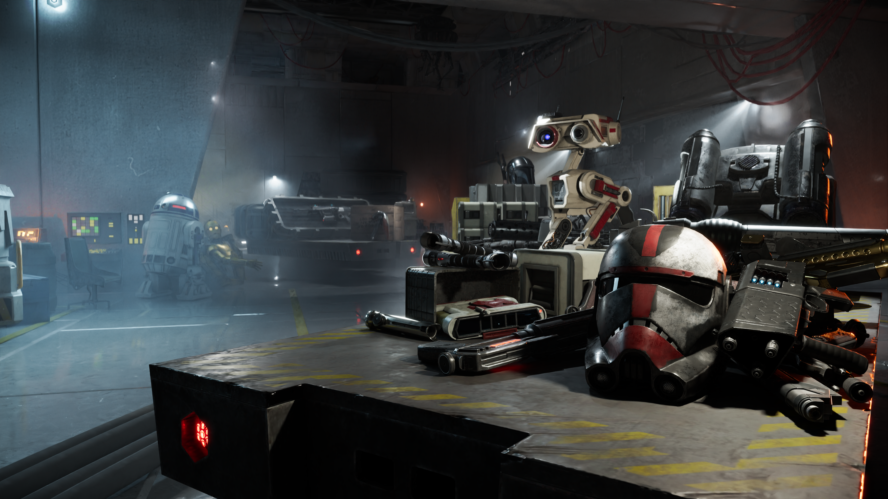{ .round-corners } 