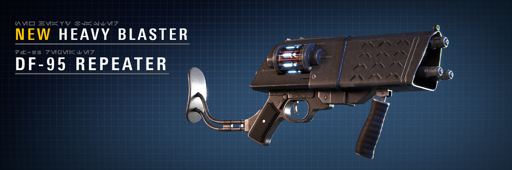
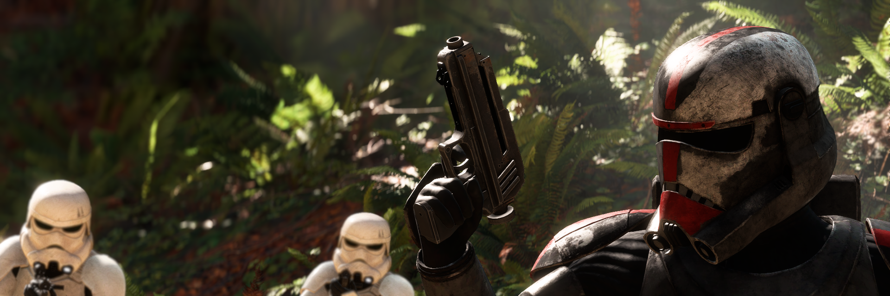
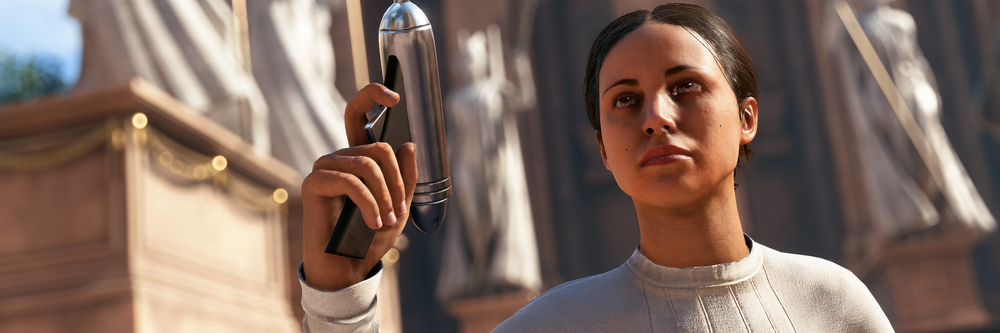
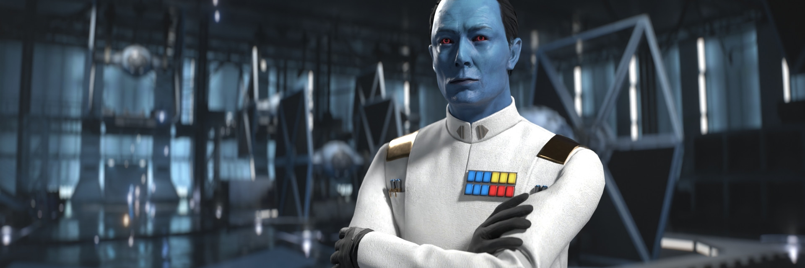
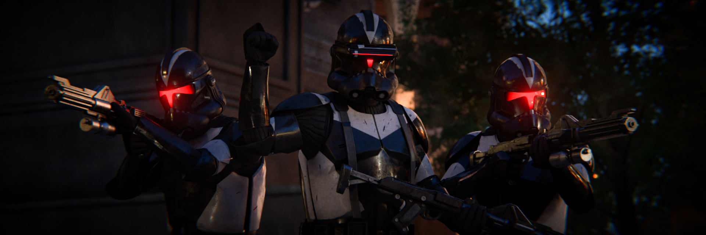

# Battlefront+ v10

{ .round-corners }

Hello there, welcome back to another Community Update for Battlefront Plus! We know it’s been a very long time since the last content drop (over a year), but we’ve been hard at work on our grandest update yet, with even greater things to come down the road, not to mention our collaboration with the Kyber Team to mark an incredible release.

____
<h3 id="kyber-v2"><strong> KYBER V2, INSTANT ACTION, AND INSTALLATION</strong></h3> 

{ .round-corners }

Kyber V2 has released at long last, offering a suite of new and improved features with dedicated 24/7 servers, built-in mod browser with hands-free installation, and a deeper level of immersion with features like proximity voice chat & stats tracking.

Frosty Mod Manager is no longer supported. Going forward, Battlefront Plus will be launched exclusively through Kyber v2's built-in mod browser for its quick and easy installation. Battlefront Plus will now also support Kyber private servers and Instant Action with a single version, allowing players to freely swap between online and offline play whenever they choose, just as it is in vanilla.

____

<h3 id="weather"><strong> DAYTIME AND WEATHER VARIANTS</strong></h3> 

  <video class="round-corners" autoplay muted loop playsinline disablePictureInPicture>
    <source src="../../assets/videos/commup_zaddmospheric_preview_wide.mp4" type="video/mp4">
  </video>

Many of the base game maps have been given new daytime and weather variants. Bask in the beauty of glowing flora during a  Felucian night , brace for irritation in  Jakku's sandstorm, battle under  Kashyyyk's cloud cover just like in *Revenge of the Sith*, and so much more. 

To that end, many of the game's existing daytime and weather variants that were absent from Supremacy have now been added, such as  Naboo during the afternoon.

____

<h3 id="blasters"><strong><strong> BLASTERS AND STAR CARDS</strong></h3> 

{ .round-corners }

As is tradition with each Battlefront+ update, the trooper arsenal has been expanded with a variety of new weapons.

<h3><strong>Assault</strong></h3> 

[Neo-Crusader Rifle](../../details/blasters/#assault): *High-powered marksman blaster that is as ancient and durable as its people.*

 Seeker Tactics  Night Vision 

[Smart Mortar](../../details/starcards/#assault): *Deployable automated mortar which detects medium range enemies to fire unguided explosive munitions at.*

____

<h3><strong>Heavy</strong></h3> 

[ABR-2 Zato Rifle](../../details/blasters/#heavy): *Slow but powerful three-round bursts from a simple yet elegant weapon.*

 Berserker  Critical Shot

[DF-95](../../details/blasters/#heavy): *Multi-functional blaster that alternates between a slow tri-shot while firing from the hip and a repeater mode while zoomed in.*

 Seeker Tactics  Escape Artist

____

<h3><strong>Officer</strong></h3> 
    
[Q2](../../details/blasters/#officer): *Snub-barreled hold-out pistol with an unmatched rate of fire.*

 Light Shot  Focused Fire

[TG-446](../../details/blasters/#officer): *Double-barreled quickdraw blaster.*

 Improved Zoom  Gunslinger
    
[WESTAR-35](../../details/blasters/#officer): *Consistent, accurate, and packing a decent punch - everything expected of a Mandalorian weapon.*

 Burst Fire  Ion Shot

____

<h3><strong>Specialist</strong></h3> 

[PK-23](../../details/blasters/#specialist): *High rate of fire meets pinpoint accuracy, but it has the lowest blaster power in its class.*

 Burst Mode  Critical Shot

____

<h3 id="appearances"><strong><strong><strong> APPEARANCES</strong></h3> 

  <video class="round-corners" autoplay muted loop playsinline disablePictureInPicture>
    <source src="../../assets/videos/commup_appearances_preview_wide.mp4" type="video/mp4">
  </video>

More appearances, new and nostalgic, have been added than ever before, expanding greatly upon the options for Troopers, Reinforcements, and Heroes. 

<h3><strong>Galactic Republic</strong></h3>

  <!-- Item Start -->
  

    
    

      

        <h3><strong>Kamino Security</strong></h3>
        

      

    

    

  

  <!-- Item End -->
  

    
    

      

        <h3><strong>41st Elite Corps</strong></h3>
        

      

    

    

  

  

    
    

      

        <h3><strong>Captain</strong></h3>
        

      

    

    

  

  

    
    

      

        <h3><strong>Commander</strong></h3>
        

      

    

    

  

  

    
    

      

        <h3><strong>Lieutenant</strong></h3>
        

      

    

    

  

  

    
    

      

        <h3><strong>Sergeant</strong></h3>
        

      

    

    

  

  

    
    

      

        <h3><strong>104th Battalion</strong></h3>
        

      

    

    

  

  

    
    

      

        <h3><strong>Bomb Squad</strong></h3>
        

      

    

    

  

  

    
    

      

        <h3><strong>Horn Company</strong></h3>
        

      

    

    

  

  

    
    

      

        <h3><strong>Outer Rim Garrison</strong></h3>
        

      

    

    

  

  

    
    

      

        <h3><strong>Rancor Battalion</strong></h3>
        

      

    

    

  

  

    
    

      

        <h3><strong>Riot Trooper</strong></h3>
        

      

    

    

  

  

    
    

      

        <h3><strong>Scout Trooper</strong></h3>
        

      

    

    

  

  

    
    

      

        <h3><strong>332nd Company</strong></h3>
        
Clone Jet Trooper

      

    

    

  

  

    
    

      

        <h3><strong>Commander</strong></h3>
        
Clone Jet Trooper

      

    

    

  

  

    
    

      

        <h3><strong>Legacy</strong></h3>
        
Clone Sharpshooter

      

    

    

  

  

    
    

      

        <h3><strong>Night Ops</strong></h3>
        
Clone Commando

      

    

    

  

  

    
    

      

        <h3><strong>Royal Guard</strong></h3>
        
Clone Commando

      

    

    

  

  

    
    

      

        <h3><strong>Sniper</strong></h3>
        
Clone Commando

      

    

    

  

____

<h3><strong>Separatist Alliance</strong></h3>

  <!-- Item Start -->
  

    
    

      

        <h3><strong>Bedlam Raider</strong></h3>
        

      

    

    

  

  <!-- Item End -->
  

    
    

      

        <h3><strong>Citadel</strong></h3>
        

      

    

    

  

  

    
    

      

        <h3><strong>Weapons Factory</strong></h3>
        

      

    

    

  

  

    
    

      

        <h3><strong>Security</strong></h3>
        

      

    

    

  

  

    
    

      

        <h3><strong>Marine</strong></h3>
        

      

    

    

  

  

    
    

      

        <h3><strong>Shuttle Pilot</strong></h3>
        

      

    

    

  

  

    
    

      

        <h3><strong>Demolitions</strong></h3>
        

      

    

    

  

  

    
    

      

        <h3><strong>Rocketeer</strong></h3>
        

      

    

    

  

  

    
    

      

        <h3><strong>AAT Driver</strong></h3>
        

      

    

    

  

  

    
    

      

        <h3><strong>Engineer</strong></h3>
        

      

    

    

  

  

    
    

      

        <h3><strong>Field Commander</strong></h3>
        

      

    

    

  

  

    
    

      

        <h3><strong>Assassin</strong></h3>
        

      

    

    

  

  

    
    

      

        <h3><strong>Speeder Pilot</strong></h3>
        

      

    

    

  

  

    
    

      

        <h3><strong>Gold</strong></h3>
        
B2 Super Battle Droid

      

    

    

  

____

<h3><strong>Rebel Alliance</strong></h3> 

<!-- Item Start -->
  

    
    

      

        <h3><strong>Blue Squadron</strong></h3>
        
Rebel Pilot

      

    

    

  

  <!-- Item End -->
  

    
    

      

        <h3><strong>Y-Wing Pilot</strong></h3>
        
Rebel Pilot

      

    

    

  

____

<h3><strong>Galactic Empire</strong></h3>

<!-- Item Start -->
  

    
    

      

        <h3><strong>Army Security</strong></h3>
        

      

    

    

  

  <!-- Item End -->
  

    
    

      

        <h3><strong>Mudtrooper</strong></h3>
        

      

    

    

  

  

    
    

      

        <h3><strong>Stormtrooper Commander</strong></h3>
        

      

    

    

  

  

    
    

      

        <h3><strong>Navy Trooper</strong></h3>
        

      

    

    

  

  

    
    

      

        <h3><strong>Star Tours</strong></h3>
        
Imperial Jumptrooper

      

    

    

  

  

    
    

      

        <h3><strong>Shadow Guard</strong></h3>
        
Royal Guard

      

    

    

  

  

    
    

      

        <h3><strong>Light Armor</strong></h3>
        
Royal Guard

      

    

    

  

  

    
    

      

        <h3><strong>Praetorian</strong></h3>
        
Royal Guard

      

    

    

  

  

    
    

      

        <h3><strong>ARATECH 11-3K</strong></h3>
        
Viper Probe Droid

      

    

    

  

____

<h3><strong>First Order</strong></h3>

<!-- Item Start -->
  

    
    

      

        <h3><strong>Snowtrooper</strong></h3>
        

      

    

    

  

  <!-- Item End -->
  

    
    

      

        <h3><strong>Executioner</strong></h3>
        
Riot Control Trooper

      

    

    

  

  

    
    

      

        <h3><strong>Snowtrooper</strong></h3>
        
Stormtrooper Commander

      

    

    

  

____

<h3><strong><strong><strong>Heroes</strong></h3>

  <!-- Item Start -->
  

    
    

      

        <h3><strong>Survivor</strong></h3>
        
Cal Kestis

      

    

    

  

  <!-- Item End -->
  

    
    

      

        <h3><strong>Poncho</strong></h3>
        
Cal Kestis

      

    

    

  

  

    
    

      

        <h3><strong>Inquisitor</strong></h3>
        
Cal Kestis

      

    

    

  

  

    
    

      

        <h3><strong>C-3PO</strong></h3>
        
Chewbacca

      

    

    

  

  

    
    

      

        <h3><strong>Life Day</strong></h3>
        
Chewbacca

      

    

    

  

  

    
    

      

        <h3><strong>Imperial</strong></h3>
        
Commander Cody

      

    

    

  

  

    
    

      

        <h3><strong>Crait</strong></h3>
        
Finn

      

    

    

  

  

    
    

      

        <h3><strong>Mudtrooper</strong></h3>
        
Han Solo

      

    

    

  

  

    
    

      

        <h3><strong>Bespin Escape</strong></h3>
        
Leia Organa

      

    

    

  

  

    
    

      

        <h3><strong>Bespin</strong></h3>
        
Luke Skywalker

      

    

    

  

  

    
    

      

        <h3><strong>Training Helmet</strong></h3>
        
Luke Skywalker

      

    

    

  

  

    
    

      

        <h3><strong>Mandalore</strong></h3>
        
Obi-Wan Kenobi

      

    

    

  

  

    
    

      

        <h3><strong>Supercommando</strong></h3>
        
Obi-Wan Kenobi

      

    

    

  

  

    
    

      

        <h3><strong>Prototype</strong></h3>
        
Boba Fett

      

    

    

  

  

    
    

      

        <h3><strong>Pursuit</strong></h3>
        
Boba Fett

      

    

    

  

  

    
    

      

        <h3><strong>Hardened Warrior</strong></h3>
        
Darth Maul

      

    

    

  

  

    
    

      

        <h3><strong>Sith Lord</strong></h3>
        
Emperor Palpatine

      

    

    

  

____

<h3 id="updated-characters"><strong>UPDATED CHARACTERS</strong></h3> 

<h3 id="updated-reinforcements"><strong> UPDATED REINFORCEMENTS</strong></h3> 

Although we aren't introducing any new new Reinforcements with this release, we have continued revisiting some of our oldest added units, bringing them new and improved abilities along with updated appearances, as well as introducing a new class.

<!-- Item Start -->
  

    
    

      

        <h3><strong>Updated - Namara</strong></h3>
        
Rebel Saboteur

      

    

    

  

  <!-- Item End -->
  

    
    

      

        <h3><strong>Updated - Ceremonial Robes</strong></h3>
        
Royal Guard

      

    

    

  

  

    
    

      

        <h3><strong>Updated - Klatoonian</strong></h3>
        
Smuggler

      

    

    

  

  

    
    

      

        <h3><strong>Updated - Enforcer</strong></h3>
        
Guavian Security

      

    

    

  

  

    
    

      

        <h3><strong>Updated - Stormtrooper</strong></h3>
        
Stormtrooper Commander

      

    

    

  

One of our biggest changes comes in the form of the  **SENTINEL** Reinforcement class, which accounts for custom units whose primary form of attack is melee combat. This comes complete with a full set of custom Star Cards and now encompasses the Gungan Warrior, MagnaGuard Protector, and Riot Control Trooper. In the future, we plan to create more reinforcements for this class, providing unique melee characters to every faction in the game.

- Star Cards:
    - SENTINEL DEFENSE MASTER - The Sentinel's defensive ability is stronger.
    - EVASION - You have +1 Evade and faster Evade recharge times.
    - GUARDIAN - Regain health when defeating an enemy while you are near allies. The amount of health regained increases, to a maximum of 100, with the number of allies present.
    - RECKLESS PROTECTION - For every ability in recharge, you momentarily gain increased resistance to incoming damage.
    - SUSTAINED AGGRESSION - Performing 5 successful melee attacks without taking damage will temporarily increase your melee damage.

The Honor Guard and Shock Trooper are some of the oldest custom reinforcements ever made and are first up on our round of changes. Both are once again Enforcers, reacquiring all of the appropriate Star Cards. For the Honor Guard, the  **A280-CFE** has been replaced with the  **CONCUSSION MINE**, a proximity-triggered explosive device that is light on damage, but will knock back and daze enemies. As for the Shock Trooper, the primary blaster has been swapped for a T-21, with the  **SE-14c** being moved to the left ability, replacing the**BACTA GRENADE**.

Many of our Infiltrators have been reworked, starting with the Rebel Saboteur. She boasts a completely new look and a revamped to her scanner ability. When activating the **REBEL INTEL** ability, it will initiate a scan pulse every few seconds, starting at just two pulses in total. Each enemy defeated by her **TRUNCHEON ATTACK** will increase the number of total scan pulses by one.

Next is the Purge Trooper Commander, which now features his own voicelines and also has received an updated scanner ability, as **INQUISITION** will now activate a singular pulse to reveal enemies in a large radius for an extended duration. That duration is doubled if any Jedi are detected.

The Viper Probe Droid sees its **SELF-DESTRUCT** revamped, where upon 6 seconds from activation or death while active, it will explode. The old **MECHANICAL COMPANION** ability has been replaced with a two-shot burst **SMOKE GRENADE** launcher to obscure the enemy's vision. Best of all, after being teased over 2 years ago, the Probe Droid will rotate its head independently from its body.

Last up for our Infiltrators is the Smuggler, who is also sporting a completely new look as well as new and reworked abilities. Instead of the **SHOULDER CHARGE**, which we found to be redundant within the Resistance faction, the Smuggler can now throw a **BOTTLE BOMB** to spew fire over a small area. The **DATA THEFT** ability will initiate one scan pulse to reveal enemies for an extended duration. The radius starts off small for a scanner, requiring the elimination of revealed enemies to increase it.

Now for the rest of our updated Enforcers. For the Death Trooper, the **ADVANCED SENSORS** ability has been replaced with **FIRING SQUAD**, an aura which grants the user and nearby allies increased headshot damage. The **OPERATIVE** ability, formerly called **MARKSMAN RUSH**, has been remade to buff its DLT-19D, jam nearby enemy radars, and will no longer apply a sprint speed boost.

The Royal Guards are finally in possession of their special melee weapons, with the **SINISTER STRIKES** ability, replacing **BURST MODE**. Additionally, the primary blaster has been swapped for the S-195, a semi-automatic double-barreled pistol.

The First Order Flametrooper's **INCENDIARY SPLITTER** has been replaced with **INFERNAL RESTORATION**, which grants rapid health regeneration for a duration dependent on how many enemies were defeated prior to activation.

The Guavian Security has had its  **RESERVOIR** system has been remade from the ground up to be a shared resource meter, allowing for multiple abilities to be simultaneously active at the cost of faster drain rates, and as well they can be activated at any time as opposed to requiring the meter to be fully refilled. The  **RESERVOIR** will replenish on its own a moment after all abilities have become inactive and will forcefully deactivate them if it's fully depleted.

____

<h3 id="updated-heroes"><strong> UPDATED HEROES</strong></h3> 

{ .round-corners }

As we've done with our older Reinforcements, we've also taken to revisiting some of the existing heroes.

The Mandalorian, Din Djarin, receives a new  **GRAPPLE STRIKE** ability, replacing his old  **THERMAL VISION** ability. When activated, he fires his grappling hook at an enemy, rapidly pulling himself to them with an attack that knocks them to the ground. To go with this, his **EVASION** Star Card has been replaced with **EXTENSION CORD**, which will extend the targeting range of his  **GRAPPLE STRIKE**.

Jango Fett also receives some updates to his kit, with  **ADAPTIVE ARMOR** replacing the  **COLLECTING BOUNTIES** ability. The intention is to reward taking higher risks, as this new ability will boost Jango's health based on the amount of enemies that were nearby upon its activation; larger groups grant a higher bonus, up to a maximum. To maintain relevance, the **JUST A SIMPLE MAN** Star Card has also been adjusted to increase the detection radius of  **ADAPTIVE ARMOR**.

Captain Rex's  **GENERATION ONE** has been revamped to grant him damage reduction, with the effect strengthening at lower health values.

Cal Kestis is now accompanied by everyone's favorite buddy droid, BD-1, who will be perched atop his back just as would be expected.

To go with his new SITH LORD appearance, Palpatine has been added to the hero roster for the Separatist Alliance, making him available to the Dark Side in all *Age of the Republic* maps.

In the interest of keeping the eras distinct from each other, Gideon Hask has been restricted to the *Age of Resistance*, with a new hero taking his place in the *Age of Rebellion* as you'll soon see. To that end, Hask's INFERNO SQUAD appearance has been removed as well.

We've also taken the time to fix all of the broken abilities and Star Cards from the base game, such as incorrect positions whenever using Yoda's  **PRESENCE**, Bossk's  **SPREADING THE DISEASE** Star Card doing nothing, and much more. Many of these former issues may be recognizable from [this infamous Reddit post](https://www.reddit.com/r/StarWarsBattlefront/comments/gcyh0r/these_are_all_the_broken_hero_star_cards/?rdt=43574).

____

<h3 id="heroes"><strong> NEW HEROES</strong></h3> 
Battlefront+ V10 introduces the most heroes added yet, bringing in some of the community's most desired characters and at long last fulfilling two promises of our own.

#### **BE DIFFERENT**  SERGEANT HUNTER

{ .round-corners }

Sergeant Hunter of Clone Force 99, also known as the "Bad Batch," brings his unique skills to the fight against the Droid Army. Gifted with  **ENHANCED SENSES** by genetic mutations, Hunter is an expert tracker who is constantly able to see enemy footsteps.

With a **DC-17** in one hand and his  **VIBRO-KNIFE** in the other, Hunter is well-equipped for eliminating hostiles in close quarters combat.

Setting his blaster to  **STUN MODE** enables Hunter to create openings and punish carelessly aggressive combatants. The first two hits on an opponent will stagger them and the third will knock them to the ground with increased damage, leaving them vulnerable to attack.

To close the distance and remain in the fight, Hunter's  **COMBAT PROWESS** can be used to boost his health, increase his sprint speed, and make him immune to crowd control abilities.

- Star Cards:
    - PREDATOR - In addition to his  **VIBRO-KNIFE** dealing more damage, Hunter will disappear from enemy radar whenever he defeats an enemy in melee combat.
    - NOTHING BUT TROUBLE - While evading, Hunter has increased damage resistance.
    - RUSH THEM HEAD ON -  **COMBAT PROWESS** grants additional bonus health and lasts slightly longer.
    - WASN'T GONNA HURT YA - Hunter's  **STUN MODE** builds less heat when fired.
    - WE DO WHAT WE DO - Hunter's health regeneration is faster and starts sooner.

____

#### **BE NEGOTIABLE**  PADMÉ AMIDALA

{ .round-corners }

Unyielding in the fight for a better galaxy, Padmé Amidala joins the Battlefront at last. Her **ELG-3A** hold-out blaster packs a punch, but when Padmé uses  **OVERCHARGE** she temporarily upgrades the pistol's power level. Each consecutive activation, up to three times, will increase the blaster’s damage, before returning to normal when the timer ends. 

Padmé's  **ROYAL RESOLVE** inspires her allies to rally together, granting herself and those nearby a small healing aura. 

Lastly, Padmé calls  **R2-D2** into action to assist her team with improved capture point speed, radar scan, smoke grenades, and shock attacks. So long as R2 is deployed, Padmé can also use interactable objectives faster wherever she is.

- Star Cards:
    - POWER EFFICIENCY -  **R2-D2**  has a shorter recharge time.
    - AGGRESSIVE NEGOTIATIONS - When defeating enemies with  **OVERCHARGE**, Padmé temporarily takes reduced damage based on her blaster's power level.
    - UNWAVERING - Padmé has increased maximum health regeneration.
    - INSPIRATIONAL - Increases the activation radius of  **ROYAL RESOLVE**.
    - A PATH TO FOLLOW - The duration of  **ROYAL RESOLVE** is increased, but it has a longer recharge time.

- Appearances:
    - ARENA - Padmé’s outfit during her mission with Anakin Skywalker to rescue Obi-Wan Kenobi on Geonosis.
    - RIPPED - Padmé’s outfit on Geonosis, torn by a Nexu attacking her in the Petranaki Arena.

____

#### **BE ADAPTABLE**  NIGHTSISTER MERRIN

{ .round-corners }

Joining the fight against the Empire is Nightsister Merrin. As one of the last living members of her people, she has mastered the arts of wielding Magick and taken to using her abilities to help those in need across the galaxy. 

Merrin’s kit focuses on adaptability, which is emphasized by her  **POWER METER**. Attacking enemies will fill up a special meter to indicate Merrin's power level, up to a maximum of five, improving her abilities.

**MERRIN’S SPEAR**, with its distinctive green trails of flowing Magick, is her primary weapon for dispatching enemies. 

With her  **MAGICK ROOTS** ability, Merrin locks down a targeted opponent, as well as any others within the immediate vicinity. With each level of her  **POWER METER**, the damage inflicted is increased.

To obliterate ranged enemies, Merrin can cast a  **FIREBALL**, fully consuming her  **POWER METER** for a destructive impact which scales with her power level.

An effective method for closing distance and causing chaos is  **TELEPORTATION**, which has Merrin momentarily disappear in a dash forward, making her immune to all forms of attack, and rematerializing a moment later.

- Star Cards:
    - FROM THE SHADOWS - Merrin has one extra  **TELEPORTATION**, but each use decrements her Power Meter.
    - SURVIVORS, WE ADAPT - While Merrin's  **POWER METER** is at max level, her spear does significantly increased damage.
    - MIGHT OF DATHOMIR - The initial targeting range of  **MAGICK ROOTS** is increased.
    - STRIKE NOW - Merrin's  **FIREBALL** has improved recharge time and staggers enemies on direct impact.
    - LEND ME STRENGTH - Merrin's health regeneration is faster and starts sooner.

- Appearances:
    - SURVIVOR - Merrin’s outfit throughout *Jedi Survivor*.
    - NIGHTSISTER - The traditional robes of Merrin’s people on Dathomir, as seen throughout *Jedi Fallen Order*.
    - WITCH - Merrin's traditional robes outfitted with a hood and cape.

____

<h3 id="villains"><strong> VILLAINS</strong></h3> 

#### **BE CUNNING**  ASAJJ VENTRESS

{ .round-corners }

First announced almost two years ago, Asajj Ventress has been one of our most anticipated heroes, and we’re happy to announce that she will finally be joining the Separatists as their first new lightsaber hero, wielding her iconic **DUAL LIGHTSABERS**.

In taking inspiration from her kit from the original Battlefront II (2005), Ventress' first ability is her  **STARBLADES**, which will throw a projectile that deflects off surfaces and damages enemies on impact.

Ventress’ signature ability draws on her Nightsister roots, as  **VANISH** will cloak her in Magick Ichor, turning her completely invisible. When attacking from this state, she will reveal herself with a devastating critical strike. 

With her  **FORCE GRASP** ability, Ventress can suspend an enemy in the air for several seconds, leaving them vulnerable to attack.

- Star Cards:
    - EXTRA STARBLADES - Ventress throws three projectiles at once when using her  **STARBLADES**, but the ability can only be used once before needing to recharge.
    - SITH ASSASSIN - When Ventress attacks an enemy from behind with her lightsabers, her abilities receive bonus recharge speed for a short period.
    - SISTER OF THE NIGHT - Performing a  **VANISH STRIKE** will inflict even more damage and reveal the positions of nearby enemies upon defeating an opponent.
    - SUSPENSEFUL GRIP -  **FORCE GRASP** has one extra use.
    - TALZIN'S PROTECTION - Asajj Ventress has increased maximum health regeneration.

- Appearances:
    - ASSASSIN - Ventress’ apparel during her final days of service to Count Dooku.
    - LEGACY - Ghastly white eyes based on Ventress’ original appearance in the *Clone Wars 2003* micro-series.

____

#### **BE SUPERIOR**  DAGAN GERA

{ .round-corners }

The fourth hero to be added from the Jedi series is Dagan Gera, joining the Separatists and the Galactic Empire. A renowned and ambitious Jedi Knight of the High Republic, Dagan’s obsession turned him to the Dark Side, costing him a limb and hundreds of years in stasis. Released from his hold, Dagan came into conflict with the Jedi survivor Cal Kestis. 

Despite missing his right arm, he continued to display mastery in wielding a **LIGHTSABER** and the Force. With  **FORCE ILLUSION** active, Dagan will daze and confuse nearby enemies while switching to a more aggressive dual-wield stance with better attack stamina and lower defense. 

By planting a  **FORCE BOMB** into the ground, he ensures that his vicinity will be empty of enemies, one way or another. 

Lastly, with his  **FORCE ORBS** ability, Dagan summons a volley of projectiles that slowly seek out enemies ahead.

- Star Cards:
    - CAN'T HIDE FROM ME - The radius of  **ILLUSION** will not decay for a short delay.
    - FORSAKEN - For every enemy damaged by  **FORCE ORBS**, Dagan replenishes health.
    - BECKONING -  **FORCE BOMB** will be more powerful if it is used while ILLUSION is active.
    - MEAGER - Dagan Gera has increased maximum health, but the delay before health regeneration is also increased.
    - SEVER THE PAST - For a brief duration after any of his abilities end, Dagan Gera will deal extra damage with his lightsaber attacks, but will also take more damage himself.

- Appearances:
    - FALLEN KNIGHT - Dagan Gera’s High Republic Jedi robes with his crimson red saber.
    - AWAKENING - Released from centuries in stasis, Dagan bled the crystal in his lightsaber.
    - OBSESSION - High Republic Jedi robes with Dagan’s saber emitting a yellow blade.
    - RETURN - Fresh out of the Bacta Tank, as Dagan ignited the yellow blade of his saber.

____

#### **BE BRILLIANT**  GRAND ADMIRAL THRAWN

{ .round-corners }

Grand Admiral Thrawn personally deploys to the battlefront to orchestrate the battle, guarding himself a two-round burst **RK-3**. 

As a military mastermind of legend, it was an important challenge to emphasize Thrawn's role as a exceptional tactician.  **KNOW THE ENEMY** serves to turn the opponent's strategies against themselves, revealing Thrawn's attackers to his entire team and inflicting them with weakness, an effect which strengthens as he withstands their assault. Enduring enough attacks will inflict greater weakness on all enemies within a massive radius and inhibit their abilities. 

Thrawn can support himself and nearby allies with  **DIRECT COMMAND**, granting healing and damage resistance that improves, to a maximum, based on how many units are affected. 

To utterly devastate and demoralize the enemy, Thrawn can mark an area with macrobinoculars to call in a  **CHIMAERA STRIKE** - an orbital bombardment from his personal Star Destroyer. Alternatively, if the marked area is indoors, nearby enemies will be spotted and blocked from capturing zones, with success rewarding Thrawn with a recharge bonus.

- Star Cards:
    - PIECE BY PIECE - The minimum time between attacks to charge up  **KNOW THE ENEMY** is reduced.
    - STRATEGIC MASTERY - The radius of  **DIRECT COMMAND** increases while the ability is active.
    - TEST THEIR METTLE -  **CHIMAERA STRIKE** recharges faster.
    - MOMENTARY SETBACK - Thrawn's health regeneration is faster and begins sooner.
    - ASCENDANT - Thrawn captures objectives twice as fast and has increased maximum health.

- Appearances:
    - GRAND ADMIRAL - Thrawn's distinctive white uniform, decorated with golden epaulets.
    - COMBAT ARMOR - Protective gear worn over Thrawn's uniform when he personally oversaw ground battles.

____

<h3 id="future"><strong>RELEASE AND THE FUTURE</strong></h3> 

{ .round-corners } 

In 2020, DICE concluded their support for Battlefront II with the Battle of Scarif update. We've come a long way since then and with **V10**, we've realized our vision for Battlefront+ is far from complete. In the months to come, Battlefront+ will be going farther than ever, as we take our first steps into the realm of new maps and gamemodes, alongside the usual assortment of additional weapons, appearances, and characters.

There was a ton to cover in this Community Update, but we do not have the time or space for our entire changelog. If you're interested in seeing every single change, addition, and bug fix, it has all been documented in the Patch Notes below.

This is a new dawn for Battlefront II. To all who've stuck with us these past couple years, to the new and returning players, thank you very much and we'll see you on the Battlefront on the 17th of November 2024.

And for old time's sake...

***Punch it.***

___

<h3 id="patch-notes"><strong>PATCH NOTES</strong></h3> 

- **Installation**
    - Kyber V2 mod launcher made the exclusive way to play Battlefront Plus. Frosty Mod Manager is no longer supported.
    - Unified the Private Servers and Instant Action versions of Battlefront Plus.

- **General Changes**
    - Updated the frontend tiles with quick navigation to Instant Action and an update news screen.
    - Added effects to enemies actively taking damage from burning affectors (i.e. flamethrowers).
    - Added stat displays for all custom Star Cards where relevant.
    - Added custom loading screen tips.

- **Troopers**
    - Appearances
        - Galactic Republic
            - Added Bomb Squad [Phase I] appearance to the Assault, Heavy, Officer, and Specialist.
            - Added Captain [Phase I] appearance to the Assault, Heavy, Officer, and Specialist.
            - Added Commander [Phase I] appearance to the Assault, Heavy, Officer, and Specialist.
            - Added Lieutenant [Phase I] appearance to the Assault, Heavy, Officer, and Specialist.
            - Added Sergeant [Phase I] appearance to the Assault, Heavy, Officer, and Specialist.
            - Added Horn Company [Phase I] appearance to the Assault, Heavy, Officer, and Specialist.
            - Added Outer Rim Garrison [Phase I] appearance to the Assault, Heavy, Officer, and Specialist.
            - Added Rancor Battalion [Phase I] appearance to the Assault, Heavy, Officer, and Specialist.
            - Added Kamino Security [Phase II] appearance to the Assault, Heavy, Officer, and Specialist.
            - Added Scout Trooper [Phase II] appearance to the Assault, Heavy, Officer, and Specialist.
            - Added 41st Elite Corps [Phase II] appearance to the Assault, Heavy, Officer, and Specialist.
            - Updated 13th Battalion [Phase II] appearance for the Heavy.
            - Updated 332nd Company [Phase II] appearance.
        - Separatists
            - Added Security appearance to the Assault, Heavy, and Officer.
            - Added Weapons Factory appearance to the Assault, Heavy, Officer, and Specialist.
            - Added Citadel Security appearance to the Assault, Heavy, Officer, and Specialist.
            - Added Bedlam Raider appearance to the Assault, Heavy, Officer, and Specialist.
            - Added Infantry appearance to Heavy, Officer, and Specialist.
            - Added Marine appearance to the Assault.
            - Added Shuttle Pilot appearance to the Assault
            - Added Demolitions appearances to the Heavy.
            - Added Rocketeer appearance to the Heavy.
            - Added Engineer appearance to the Officer.
            - Added Field Commander appearance to the Officer.
            - Added AAT Driver appearance to the Officer
            - Added Kaller appearance to the Officer
            - Added Assassin appearance to the Specialist.
            - Added Speeder Pilot appearance to the Specialist

        - Galactic Empire
            - Added Mudtrooper appearance to the Assault, Heavy, Officer, and Specialist.
            - Added Security Trooper appearance to the Assault, Heavy, Officer, and Specialist.
            - Added Stormtrooper Commander appearance to the Assault, Heavy, and Officer.
            - Added Navy Trooper appearance to the Officer.
            - In Ewok Hunt, Imperial survivor appearances will be randomized between Stormtroopers and Scout Troopers.
            
        - First Order
            - Added Snowtrooper appearance to the Heavy, Officer, and Specialist.
            - Significantly improved backend optimization for appearance options. 

    - Blasters
        - New Assault blaster: Neo-Crusader Rifle.
        - New Heavy blaster: ABR-2 Zato Rifle.
        - New Officer blaster: Q2.
        - New Officer blaster: TG-446
            - Sidearm available to the Heavy
        - New Officer blaster: WESTAR-35.
            - Sidearm available to the Assault.
        - New Heavy blaster: DF-95.
        - New Specialist blaster: PK-23.
        - 773 Firepuncher
            - Increased the size of the blaster model to be more lore accurate.
        - Bowcaster
            - Added effects while charging up.
        - CA-87
            - Increased recoil.
        - Cycler Rifle
            - Scopeless, canted aiming when dual-zoom is not equipped.
        - DC-15
            - Increased damage.
            - Reduced heat capacity.
            - ELITE Attachment
                - Increased end damage.
        - DC-15s
            - Updated assets.
        - DP-23
            - Reduced damage.
            - Increased projectiles per shot from 8 to 9.
            - Altered spread pattern.
        - DC-17
            - Increased start damage.
        - DL-44
            - Increased end damage.
        - E-22
            - Updated assets.
        - EC-17
            - Updated weapon icon.
        - Glie-44
            - Increased damage.
            - Reduced start drop-off range.
            - Reduced rate of fire.
            - Increased recoil.
        - HF-94
            - Increased start drop-off and end drop-off range. Second Chance modification is not affected by this change.
            - Increased cooling minigame blue space.
            - Added UI element upon successful hits to improve visual feedback for the heat reset function.
            - Updated description.
        - NN-14
            - Updated weapon icon.
        - RT-97C
            - Increased damage.
        - Sonic Blaster
            - Adjusted the scale and position of the model to better fit the character animations and screen.
            - Added an emissive element to the model.
            - Removed scope overlay from zoom-in.
            - Improved cooling.
            - Replaced crosshair.
        - T-12
            - Altered spread pattern.
            - Increased cooldown speed.
            - Removed supercooling availability.
            - SLUG Attachment
                - Reduced start damage.
                - Increased end damage.
                - Increased start drop-off range.
        - T-21
            - Reduced end damage.
            - Reduced start drop-off range and increased end drop-off range.
            - BURST Attachment
                - When not using the IMPROVED HANDLING Attachment, it uses the standard T-21 blaster projectile.
        - T-7 Disruptor Rifle
            - Increased recoil.
        - V-6D
            - Replaced crosshair.
        - Zersium Rifle
            - Updated weapon icon.
    - Sidearms
        - New Assault sidearm blaster: WESTAR-35
        - New Heavy sidearm blaster: TG-446
    - Abilities and Star Cards
        - New ability Star Card for all classes: FIREWORKS
            - Deploys a mortar which periodically launches fireworks into the sky. There's something particularly dazzling about them...
        - SMART MORTAR replaced DEMOLITION DROID
            - Deploys an automated mortar which detects medium range enemies to fire unguided explosive munitions at.
        - INSTIGATOR
            - Added new start, end, and success sounds.
            - Added effect while the ability is active.
            - Added UI element while active to improve visual feedback.
        - MARKSMAN
            - Manual venting of the weapon will remove the heat capacity bonus.
        - QUICKDRAW
            - Increased bonus damage.
            - Reduced the delay before bonus damage can be applied to the same enemy again.
            - Added success sounds.
        - ROCKET LAUNCHER
            - Recharge time is reset on death.
            - Recharge time is increased.
            - The projectile is affected by gravity.
            - Replaced crosshair.
        - STIM SHOT
            - No longer free-fires a projectile. While the gadget is in-hand, a friendly player within range and line of sight is targeted, then boosted upon firing.
            - Removed the self-heal function.
            - Awards Battle Points when successfully used.
            - Recharge time is decreased.
            - Added effect to players affected by the healing component.
        - THERMAL IMPLODER
            - Recharge time is reset on death.
            - Recharge time is increased.
            - The projectile is thrown at a reduced speed.
        - TIME BOMB
            - Increased blast damage.
            - Increased radius.
            - Updated model.
            - Updated icon.
        - VANGUARD
            - Altered spread pattern. 

- **Reinforcements**
    - Added Sentinel Class.
        - Star Cards:
            - SENTINEL DEFENSE MASTER - The Sentinel's defensive ability is stronger.
            - EVASION - You have +1 Evade and faster Evade recharge times.
            - GUARDIAN - Regain health when defeating an enemy while you are near allies. The amount of health regained increases, to a maximum of 100, with the number of allies present.
            - RECKLESS PROTECTION - For every ability in recharge, you momentarily gain increased resistance to incoming damage.
            - SUSTAINED AGGRESSION - Performing 5 successful melee attacks without taking damage will temporarily increase your melee damage.
    - Aqua Droid
        - SONAR SCAN
            - Increased the duration for which enemies are revealed.
            - No longer blocks zoom-in during activation.
        - SELF-REPAIR
            - Reduced recharge time.
    - B2-RP
        - WRIST BLASTER
            - Increased end damage.
        - WRIST ROCKET
            - The projectile is affected by gravity.
            - Replaced crosshair.
    - B2 Super Battle Droid
        - TWIN WRIST-BLASTER
            - Reduced start damage.
            - Reduced start drop-off range.
            - Increased heat capacity.
        - WRIST ROCKET
            - The projectile is affected by gravity.
            - Replaced crosshair.
        - Added Gold appearance.
    - BX Commando Droid
        - E-5
            - Increased start damage.
            - Increased movement speed while zoomed in.
    - Clone Jet Trooper
        - STICKY GRENADE
            - Updated assets.
    - Combat Engineer
        - DP-23
            - Reduced start and end damage.
            - Increased projectiles per shot from 8 to 9.
            - Slightly altered spread.
        - DETPACK
            - Increased blast radius.
            - Increased throw speed.
    - Combat MagnaGuard
        - Increased max health.
        - Increased delay before health regeneration.
        - BULLDOG RLR
            - Replaced crosshair.
        - E-60R HOMING LAUNCHER
            - Replaced crosshair.
        - PROBE TURRET
            - Adjusted model position to better match the hitbox.
    - Combat Medic
        - NN-14
            - Updated weapon icon.
        - DEPENDABLE
            - Increased the damage reduction granted to allies.
    - Clone Commando
        - Added Royal Guard appearance.
        - Added Sniper appearance.
    - Clone Flametrooper
        - Added effects to character selection.
    - Clone Jet Trooper
        - Added Commander [Phase II] and 332nd Company appearances.
    - Clone Sharpshooter
        - Added Legacy appearance, based on an alternate concept in the style of the 501st.
    - Death Trooper
        - FIRING SQUAD replaced ADVANCED SENSORS
            - Activates an aura that increases headshot damage for the Death Trooper and nearby allies.
        - OPERATIVE replaced MARKSMAN RUSH
            - Go behind enemy lines by becoming undetectable to enemy scanners, scrambling their radars, and equipping a powerful DLT-19D sniper rifle. Defeating enemies will extend the active time of OPERATIVE.
            - Increased heat capacity.
    - Ewok Hunter
        - Significantly improved optimization for appearance options.
    - First Order Flametrooper
        - INFERNAL RESTORATION replaced INCENDIARY SPLITTER
            - Regenerate health while the ability is active. Each enemy defeated prior to activation will increase the duration of the next use up to a maximum.
        - BLAZING INFERNO
            - Removed the UI timer to avoid conflicts with INFERNAL RESTORATION.  
    - Guavian Security
        - JND-41 PERCUSSION CANNON
          - Updated assets.
          - Updated weapon icon.
        - RESERVOIR
            - Revamped as a meter which will drain while any ability is in use and replenish when none are.
            - All abilities can be used together at the cost of increased drain rate.
            - All abilities can be used without requiring the meter to fully replenish.
        - Updated appearance assets.
        - Updated portrait.
    - Gungan Warrior
        - Changed to a Sentinel and given all related Star Cards.
        - COMBAT SHIELD
            - Replaced effects.
        - Added unique voicelines.
    - Honor Guard
        - Changed to an Enforcer and given all related Star Cards.
        - Reduced base health.
        - BACTA GRENADE
            - Explodes on impact.
            - Updated description.
        - HONORABLE DISCHARGE
            - Moved to the Middle Ability category.
            - When the EXPERT WEAPONS HANDLING Star Card is equipped, it will extend the duration of the ability.
        - CONCUSSION MINE replaced A280-CFE
            - Deployable proximity mine that will push back and daze enemies. Up to three can be active at a time.
        - Updated portrait.
    - Imperial Jumptrooper
        - Restored Legacy appearance.
        - Star Tours appearance boasts the classic Imperial jetpack from 2015.
    - MagnaGuard Protector
        - Changed to a Sentinel and given all related Star Cards.
        - Increased max health regeneration.
        - Increased health regeneration speed.
        - ELECTROSTAFF
            - Increased base damage.
        - DROID RAGE
            - Increased bonus damage.
            - Added effects while active.
        - SYSTEM COOLING
            - Added effects while active.
        - COMBAT ACCELERATION
            - Added effects while active.
    - Purge Trooper Commander
        - INQUISITION revamped
            - Scans the vicinity to reveal nearby enemies for a short duration. If Jedi are present, the duration is doubled.
        - Added unique voicelines.
        - Removed Clone voice option.
    - Rebel Pilot
        - BLURRG-1120
            - Reduced end damage.
            - Reduced heat capacity.
            - Increased rate of fire.
        - PROTON LAUNCHER
            - Increased recharge time.
        - Added Blue Squadron Pilot appearances.
        - Added Y-Wing Pilot appearances.
    - Rebel Rocket-Jumper
        - ROCKET LAUNCHER
            - The projectile is affected by gravity.
            - Replaced crosshair.
    - Rebel Saboteur
        - REBEL INTEL revamped
            - Intelligence gathered from the field reveals nearby hostiles. Defeating enemies with the TRUNCHEON ATTACK will increase the number of scan pulses.
            - Replaced effects.
        - TIME BOMB
            - Increased blast damage.
            - Increased radius.
            - Updated model.
            - Updated icon.
        - Updated appearance assets.
        - Updated portrait.
    - Republic Gunner
        - Increased max health.
            - BATTLE HARDENED Star Card correctly boosts max health.
        - ANTI-INFANTRY MODE
            - Moved to the Left Ability category.
            - Increased supercooling minigame size.
            - Updated icon.
        - TOGETHER BROTHERS
            - Moved to the Middle Ability category.
            - Reduced Battle Points gained from ability usage.
            - EXPERT WEAPONS HANDLING Star Card increases active time.
            - Added start animation.
        - ADVANCED SHIELD renamed to STAGED SHIELD
            - Increased health of both shield stages.
            - Increased active time.
            - Decreased recharge time.
            - While active, movement speed is reduced and sprint is disabled.
            - Added a UI counter over the ability icon to indicate how many allies are nearby.
        - Added Bomb Squad, Captain, Commander, Horn Company, Kamino Security, Lieutenant, Lightning Squadron, Outer Rim Garrison, Rancor Battalion, Sergeant, 13th Battalion, 187th Battalion, and 41st Elite Corps appearances.
    - Resistance Rocket-Jumper
        - CONCUSSION DART
            - Replaced crosshair.
    - Riot Control Trooper
        - Changed to a Sentinel and given all related Star Cards.
        - Increased max health.
        - Z6 RIOT CONTROL BATON
            - Defeating enemies will briefly yield health regeneration, which will be canceled if damage is taken.
            - Cannot attack while mid-air.
            - While not attacking, the baton will be retracted and the lightning disabled.
            - Added activation, looping, and deactivation sounds for the attack sequence.
            - Updated impact and swing sounds.
        - Evading performs a dodge roll instead of a dash.
        - Autoplayers are significantly more aggressive with the baton while in melee range.
        - Added Executioner appearance.
        - Updated frontend pose.
        - Updated portrait.
    - Royal Guard
        - S-195 replaced T-21
            - Semi-automatic double-barrel pistol with moderate damage and range.
        - ROYAL PRESENCE
            - Reduced bonus health from ability.
            - Reduced damage resistance from ability.
            - Added start animation.
        - SINISTER STRIKES replaced BURST MODE
            - Chain swift melee attacks with SINISTER STRIKES, performing a powerful knockdown on the third and final swing.
        - EMPEROR’S WILL
            - Added start animation.
        - Updated appearance assets.
        - Added Light Armor, Praetorian, and Shadow Guard appearances.
        - Default appearance named Ceremonial Robes.
        - Updated frontend pose.
        - Updated portrait.
    - Shock Trooper
        - Changed to an Enforcer and given all related Star Cards.
        - Reduced base health.
        - T-21 replaced SE-14c
            - Robust heavy blaster manufactured for continuously discharging powerful bolts, at the expense of low rate of fire.
        - SE-14C replaced BACTA GRENADE
            - The SE-14C is a blaster pistol that fires 5-round bursts, making it ideal for close-quarter combat.
        - SHOCK LAUNCHER
            - Added slowed movement speed to affected players.
            - Added UI to indicate duration of the most recently deployed electric smoke canister.
            - When the EXPERT WEAPONS HANDLING Star Card is equipped, it will extend the duration of the electric smoke canister.
        - Updated frontend pose.
    - Smuggler
        - BOTTLE BOMB replaced SHOULDER CHARGE
            - Throw an improvised incendiary projectile that spews fire on impact.
        - DATA THEFT revamped
            - Smuggled intel reveals nearby enemies for a short duration. Defeating revealed enemies will increase the detection radius.
        - DUAL SHOT
            - Moved to the Right Ability category.
            - Dual DT-29 blaster pistols fire more in-sync.
            - Heat is reset on ability activation.
            - Updated ability icon.
        - Updated appearance assets.
        - Updated portrait.
        - Renamed from Nikto Smuggler to Smuggler.
    - Stormtrooper Commander
        - PERSONAL SHIELD
            - Increased recharge time.
            - While active, movement speed is reduced and sprint is disabled.
        - REPRESSION
            - Changed the UI circle for the radius to display white instead of yellow.
        - Added pouch asset to the appearance.
        - Added Snowtrooper appearance.
        - Default appearance named Stormtrooper.
    - Tactical Droid
        - E-5 ACP
            - Reduced start and end damage.
            - Increased projectiles per shot from 6 to 13.
            - Altered spread.
        - TACTICAL PROWESS
            - Added start animation.
    - Viper Probe Droid
        - PROBE DROID BLASTER
            - Increased end damage.
            - Increased end drop-off range.
        - SMOKE GRENADE replaced MECHANICAL COMPANION
            - Fire two grenades that each deploy a cloud of smoke, obscuring vision in their areas.
        - SELF-DESTRUCT revamped
            - Primes the droid to self-destruct. After 6 seconds, or upon death, it will create an explosion which damages nearby enemies. RETRIGGER ACTION: Cancel self-destruct.
            - Added a recharge time for when the ability is canceled.
            - Cannot be activated within 9 seconds of deploying.
            - Increased blast damage.
            - Increased blast radius.
            - Added UI circle to indicate blast radius.
            - Added effects while active.
            - Added sounds while active.
        - Added melee capabilities with support for the INTERROGATION Star Card.
        - Animated appearance with a rotating head.
        - Added Aratech 11-3K appearance.
        - Default appearance named Arakyd Probot.
        - Added unique voicelines.
    - Wookiee Warrior
        - Locked to Age of Rebellion, except on Kashyyyk in Age of the Republic.
        - BOWCASTER
            - Added overheat functionality.
            - Added effects while charging up.
            - Updated assets.
        - OVERLOAD
            - Added effects while active.

- **Heroes**
    - Added Padme’ Amidala to the Galactic Republic.
        - ELG-3A: Simple, yet elegant, and powerful hold-out pistol that has long served its queen.
        - OVERCHARGE: Padmé temporarily upgrades her ELG-3A's power level. Within a moment of Overcharge's activation, reactivate the ability, up to an additional two times, to reset the upgrade duration and increase the power level for even more damage.
        - ROYAL RESOLVE: Padmé inspires her allies to rally together, granting herself and those nearby a small healing aura.
        - R2-D2: Summon R2-D2 to support allies with improved capture point speed, radar scan, smoke grenades, and shock attacks. Padmé interacts with objectives faster while R2-D2 is deployed.
        - Star Cards:
            - POWER EFFICIENCY - **R2-D2**  has a shorter recharge time.
            - AGGRESSIVE NEGOTIATIONS - When defeating enemies with **OVERCHARGE**, Padmé temporarily takes reduced damage based on her blaster's power level.
            - UNWAVERING - Padmé has increased maximum health regeneration.
            - INSPIRATIONAL - Increases the activation radius of **ROYAL RESOLVE**.
            - A PATH TO FOLLOW - The duration of **ROYAL RESOLVE** is increased, but it has a longer recharge time.
        - Appearances:
            - ARENA - Padmé’s outfit during her mission with Anakin Skywalker to rescue Obi-Wan Kenobi on Geonosis.
            - RIPPED - Padmé’s outfit on Geonosis, torn by a Nexu attacking her in the Petranaki Arena.
    - Added Nightsister Merrin to the Rebel alliance.
        - MERRIN’S SPEAR: Magick dagger that transforms into a spear.
        - FIREBALL: Merrin conjures an explosive fireball of Magick, hurling it towards an enemy for high damage. The projectile upgrades with each level of Merrin's Power Meter and resets it upon use.
        - MAGICK ROOTS: Merrin uses her Magick to root a target in place, along with any enemies in their immediate vicinity. As her Power Meter builds, affected enemies will also be inflicted with increasing damage.
        - TELEPORTATION: Merrin teleports forward, briefly avoiding every form of attack and disappearing from the radar before rematerializing. While in this state, she cannot heal.
        - POWER: Whenever Merrin strikes an enemy with her spear or inflicts them with Magick Roots, her Power Meter will gradually fill, improving her abilities.
        - Star Cards:
            - FROM THE SHADOWS - Merrin has one extra **TELEPORTATION**, but each use decrements her Power Meter.
            - SURVIVORS, WE ADAPT - While Merrin's **POWER METER** is at max level, her spear does significantly increased damage.
            - MIGHT OF DATHOMIR - The initial targeting range of **MAGICK ROOTS** is increased.
            - STRIKE NOW - Merrin's **FIREBALL** has improved recharge time and staggers enemies on direct impact.
            - LEND ME STRENGTH - Merrin's health regeneration is faster and starts sooner.
        - Appearances:
            - SURVIVOR - Merrin’s outfit throughout Jedi Survivor.
            - NIGHTSISTER - The traditional robes of Merrin’s people on Dathomir, as seen throughout Jedi Fallen Order.
            - WITCH - The traditional robes outfitted with a hood and cape.
    - Added Asajj Ventress to the Separatists.
        - ASAJJ VENTRESS’ LIGHTSABERS: Dancing twin blades with curved hilts.
        - STARBLADES: Ventress throws a projectile that damages enemies on impact and will ricochet off surfaces.
        - VANISH: Ventress cloaks herself in Magick Ichor, becoming invisible. Perform a lightsaber attack while cloaked to execute a Vanish Strike, dealing extra damage and revealing Ventress.
        - FORCE GRASP: Ventress lifts an enemy into the air, leaving them open to attack.
        - Star Cards:
            - EXTRA STARBLADES - Ventress throws three projectiles at once when using her **STARBLADES**, but the ability can only be used once before needing to recharge.
            - SITH ASSASSIN - When Ventress attacks an enemy from behind with her lightsabers, her abilities receive bonus recharge speed for a short period.
            - SISTER OF THE NIGHT - Performing a **VANISH STRIKE** will inflict even more damage and reveal the positions of nearby enemies upon defeating an opponent.
            - SUSPENSEFUL GRIP - **FORCE GRASP** has one extra use.
            - TALZIN'S PROTECTION - Asajj Ventress has increased maximum health regeneration.
        - Appearances:
            - ASSASSIN - Ventress’ apparel during her final days of service to Count Dooku.
            - LEGACY - Ghastly white eyes based on Ventress’ original appearance in the Clone Wars 2003 micro-series.
    - Added Dagan Gera to the Galactic Empire.
        - DAGAN GERA’S LIGHTSABER: An old and intricate hilt, now reunited with its master after centuries.
        - FORCE ORBS: Dagan summons a volley of orbs that slowly seek out enemies ahead of them.
        - FORCE ILLUSION: Dagan switches to a dual wield saber stance and conjures a powerful Force Illusion to daze and confuse nearby enemies. In this stance, he can deflect blaster bolts and has increased attack stamina, but reduced defense.
        - FORCE BOMB: Dagan plants an orb of Force energy into the ground, which will unleash devastating damage after a moment.
        - Star Cards:
            - CAN'T HIDE FROM ME - The radius of **ILLUSION** will not decay for a short delay.
            - FORSAKEN - For every enemy damaged by **FORCE ORBS**, Dagan replenishes health.
            - BECKONING - **FORCE BOMB** will be more powerful if it is used while ILLUSION is active.
            - MEAGER - Dagan Gera has increased maximum health, but the delay before health regeneration is also increased.
            - SEVER THE PAST - For a brief duration after any of his abilities end, Dagan Gera will deal extra damage with his lightsaber attacks, but will also take more damage himself.
        - Appearances:
            - FALLEN KNIGHT - Dagan Gera’s High Republic Jedi robes with his crimson red saber.
            - AWAKENING - Released from centuries in stasis, Dagan bled the crystal in his lightsaber.
            - OBSESSION - High Republic Jedi robes with Dagan’s yellow saber.
            - RETURN - Fresh out of the Bacta Tank, Dagan ignited the yellow blade of his saber.
    - Added Grand Admiral Thrawn to the Galactic Empire.
        - GRAND ADMIRAL THRAWN’S RK-3: The typical sidearm of high-ranking Imperial officers, reconfigured to fire in rapid bursts.
        - KNOW THE ENEMY: Thrawn marks his attackers and inflicts them with weakness, an effect which strengthens as he withstands their assault. Enduring enough attacks ends the ability early and unleashes greater weakness on all enemies within a large radius and inhibits their abilities.
        - DIRECT COMMAND: Thrawn and his nearby allies receive healing and damage resistance. The strength of these effects is increased, to a maximum, with the number of players affected.
        - CHIMAERA STRIKE: Call in a bombardment from Thrawn's Star Destroyer when outdoors. Mark an area indoors that will spot nearby enemies and inhibit their ability to capture zones, rewarding Thrawn with a recharge speed bonus upon success.
        - Star Cards:
            - PIECE BY PIECE - The minimum time between attacks to charge up **KNOW THE ENEMY** is reduced.
            - STRATEGIC MASTERY - The radius of **DIRECT COMMAND** increases while the ability is active.
            - TEST THEIR METTLE - **CHIMAERA STRIKE** recharges faster.
            - MOMENTARY SETBACK - Thrawn's health regeneration is faster and begins sooner.
            - ASCENDANT - Thrawn captures objectives twice as fast and has increased maximum health.
        - Appearances:
            - GRAND ADMIRAL
            - COMBAT ARMOR
    - Ahsoka Tano
        - Added unique voicelines.
    - Boba Fett
        - Added Pursuit and Prototype appearances.
    - Bossk
        - RELBY V-10
            - Increased start and end damage.
            - Increased cooling rate.
    - Captain Cardinal
        - FINALIZER
            - The ability can be manually deactivated momentarily after activation.
        - STEADFAST
            - The ability can be manually deactivated momentarily after activation.
        - ABSOLUTION
            - The ability can be manually deactivated momentarily after activation.
    - Cal Kestis
        - Rebalanced stamina values between Single-Saber and Double-Saber stances.
        - REFORGED Star Card
            - Increased bonus damage.
            - Removed the small delay between hitting an enemy and the bonus damage triggering.
            - Added unique voicelines.
        - Added an animated BD-1 with a rotating head to all appearances.
        - Added Survivor, Poncho, and Inquisitor appearances.
        - Added green saber color appearance options.
        - Renamed all original appearance options to Scrapper.
        - Added unique voicelines.
    - Captain Rex
        - GENERATION ONE revamped
            - Generation one armor holds up, boosting Captain Rex's resistance to incoming damage. As his health decreases, this effect is strengthened, ensuring his ability to stay in the fight.
            - Updated icon.
        - DROID POPPERS
            - Decreased stun duration.
        - UNCONVENTIONAL TACTICS
            - Removed sprint speed boost.
        - STILL HOLDS UP adjusted for GENERATION ONE changes
            - The damage resistance gained from GENERATION ONE lasts longer.
        - FRY THEIR CIRCUITS
            - Increased recharge time penalty.
    - Chewbacca
        - Added C-3PO and Life Day appearances.
    - Commander Cody
        - Added Imperial appearance.
    - Commander Pyre
        - SEIZE THIS MOMENT
            - Added start animation.
            - Removed vignette effect.
        - THUNDERER LEGION
            - Changed start animation.
        - Updated Star Card images.
    - Darth Maul
        - Added Hardened Warrior appearance.
        - Mandalore appearance now features the correct lightsaber hilt.
    - Darth Vader
        - Added effects to the Battle Damaged appearance.
    - Dengar
        - FRENZY CONFIGURATION
            - Added camera zoom-in while active.
        - BASHING SKULLS
            - Added damage reduction while active.
            - Added swing and impact sounds.
        - MORE TOYS
            - Increased recharge time penalty.
        - Added unique voicelines.
    - Din Djarin
        - GRAPPLE STRIKE replaced THERMAL VISION
            - Din Djarin fires his grappling hook at an enemy, rapidly pulling himself to them with an attack that knocks them to the ground.
        - EXTENSION CORD Star Card replaced EVASION.
            - Din Djarin can target enemies further away with GRAPPLE STRIKE.
        - AMBAN PHASE-PULSE BLASTER
            - Moved to the Middle Ability category.
            - Updated effects.
        - WHISTLING BIRDS
            - Improved projectile tracking to be more consistent.
            - Increased number of projectiles.
            - Increased rate of fire.
            - Decreased damage against heroes.
            - Projectile fire direction is angled slightly forward.
            - Updated effects.
        - ONE DEFEATS TWENTY
            - Increased bonus damage.
        - PHALANX Star Card
            - Damage resistance triggers sooner.
            - Increased damage resistance.
        - DARKSABER
            - Updated assets.
        - Increased max health regeneration.
        - Added unique voicelines.
    - Emperor Palpatine
        - Added to the Age of the Republic era.
        - Added Sith Lord appearance.
    - Han Solo
        - Added Mudtrooper appearance.
    - Finn
        - Added Crait appearance.
    - General Grievous
        - Removed General appearance for optimization purposes.
    - Gideon Hask
        - Locked to Age of Resistance.
        - RETURNED FAVOR Star Card
            - Increased the bonus to health regained.
        - Removed Inferno Squad appearance.
        - Added unique voicelines.
    - Greedo
        - CONFIDENCE BOOST
            - Added UI element while active to improve visual feedback.
            - Added start animation.
    - Jango Fett
        - ADAPTIVE ARMOR replaced COLLECTING BOUNTIES
            - Jango Fett boosts his health, up to a maximum, based on the number of enemies nearby when the ability was activated.
        - WRIST FLAMETHROWER
            - Increased active time.
        - SABERDART
            - Updated icon.
        - JUST A SIMPLE MAN Star Card adjusted for new ADAPTIVE ARMOR ability
            - ADAPTIVE ARMOR has an increased detection radius.
        - ALWAYS A PLEASURE Star Card
            - No longer displays an extra ability icon.
        - NO MISTAKES THIS TIME Star Card
            - Defeating an enemy affected by the SABERDART will grant the bonus, no longer requiring a kill with the SABERDART itself.
        - Added unique voicelines.
    - Leia Organa
        - Added Bespin Escape appearance.
    - Luke Skywalker
        - Added Bespin and Training Helmet appearances.
    - Maz Kanata
        - JETPACK
          - Can be activated by use of the left ability, similar to jet trooper reinforcements.
        - CHANGE IN FORTUNE
            - Added new start, end, and success sounds.
        - BURN DASH
            - Moved to the Right Ability category.
            - Updated icon.
        - ADJUSTABLE FUSE
            - Moved to the Bottom Ability category.
        - AN ACQUIRED TASTED Star Card
            - Decreased the deflected damage cooldown so that it occurs slightly more frequently.
        - Added unique voicelines.
        - Updated portrait.
        - Updated frontend pose.
    - Nien Nunb
        - BUDDY TURRET Star Card
            - Reduced recharge time penalty to the AUGMENTED TURRET.
    - Obi-Wan Kenobi
        - Added Supercommando and Mandalore appearances.
    - Rey
        - MIND TRICK
            - No longer reduces look sensitivity.
    - Second Sister
        - Rebalanced stamina values between Single Saber and Double Saber stances.
        - PERFECTED TECHNIQUE Star Card
            - Increased bonus damage.
            - Removed the small delay between hitting an enemy and the bonus damage triggering.
        - Added unique voicelines.
        - Changed the character select animation and victory pose.
    - Shriv Suurgav
        - Added unique voicelines.

- **Autoplayers**
    - Autoplayers can now join squads and spawn as special units in Supremacy.
    - Autoplayers have a small chance of spawning in as a hero in Supremacy and Galactic Assault.
    - Loadouts
        - Assault units have a chance of spawning with the Instigator Star Card ability.
        - Heavy units can no longer spawn with the Explosive Sentry Star Card ability.
        - On Tatooine, Rebel Assault units have a chance of spawning with the CA-87.
        - On Tatooine, Rebel Specialist units will spawn with the Cycler Rifle.
        - Resistance Assault units will no longer be equipped with the VT-33D, instead having a chance of spawning with the DH-17R.
        - Resistance Officer units have a chance of spawning with the BG-38.
        - Resistance Specialist units have a chance of spawning with the NT-242.
    - Appearances
        - On Geonosis, Clone Troopers have a chance of spawning as the Captain, Commander, Lieutenant, and Sergeant. They will no longer spawn as the 104th Battalion [Phase I], 212th Attack Battalion [Phase I], 327th Star Corps [Phase I], 41st Elite Corps [Phase I], or 501st Legion [Phase I].
        - On Geonosis Co-Op Missions, during the End of Round cutscene, Clone Troopers will appropriately appear with Phase I skins and be equipped with DC-15 Battle Rifles.
        - On Geonosis Co-Op Missions, during the End of Round cutscene, Battle Droids will appropriately appear with Geonosis skins.
        - On Kashyyyk, Clone Troopers have a chance of spawning as the 41st Elite Corps (Gray) [Phase II]. They will no longer spawn as the 41st Ranger Platoon [Phase II] or 41st Elite Corps (Green) [Phase II].
        - On Venator-Class Star Destroyer, Clone Troopers will spawn exclusively with the Shiny [Phase II] skin. The Clone Sharpshooter, Combat Engineer, and Republic Gunner will appropriately appear with their Phase II skins.
        - Imperial Stormtroopers will spawn with less skin variety to emphasize their uniformity.
        - First Order Stormtroopers will spawn with less skin variety to emphasize their uniformity.

<h4 id="bug-fixes"><strong>BUG FIXES</strong></h4> 

- **General Fixes**
    - Fixed issues across the board with custom equipment for Troopers, Reinforcements, and Heroes not playing proper sounds for damaging or defeating enemies.
    - Fixed issues across the board with custom blasters for Troopers, Reinforcements, and Heroes not deflecting the correct blaster bolt color.

- **Troopers**
    - Blasters
        - DC-15
            - Fixed an issue with the range being lower than described.
        - DC-17S
            - Fixed an issue with the stealth properties not working as intended.
        - DLT-20A
            - Fixed an issue with charge-up effects and sounds continually playing after the user has swapped weapons or died while in the middle of charging.
        - SE-14r
            - Fixed an issue with the gold supercooling being unavailable after overheating.
        - T-7 Disruptor Rifle
            - Fixed an issue with charge-up effects and sounds continually playing after the user has swapped weapons or died while in the middle of charging.
        - Zersium Rifle
            - Fixed an issue with the Gunslinger modification causing the blaster to fire in 2-round bursts.
        - Sidearms
            - Fixed an issue with several pistols having their recoil being affected by the Focused Fire and Gunslinger attachments when equipped to the player’s primary weapon.
    - Abilities and Star Cards
        - INSTIGATOR
            - Fixed an issue with the ability not supporting some sidearms.
        - QUICKDRAW
            - Fixed an issue with the Star Card not supporting the Relby V-10.
        - RADIO
            - Fixed an issue with the lack of animation when deploying the gadget.

- **Reinforcements**
    - B2 Super Battle Droid
        - TWIN WRIST-BLASTER
            - Fixed an issue with the lack of controller rumble while firing from the alternate barrel.
    - Caphex Spy
        - TRUNCHEON STRIKES
            - Fixed an issue with the missing attack animations.
    - Clone Flametrooper
        - THERMOBARIC BARRAGE
            - Fixed an issue with the weapon not receiving unlimited blaster cooling from the Officer's BLAST COMMAND or Finn's BIG DEAL.
    - Combat Medic
        - DEPENDABLE
            - Fixed an exploit that would enable using the ability on oneself.
            - Fixed an issue with the targeting outline appearing around allies despite the ability not being ready.
            - Fixed an issue with an empty hint appearing on screen when the ability is activated.
    - Ewok Hunter
        - Fixed an issue with invisible faces.
    - Gungan Warrior
        - GUNGAN SPEAR
            - Fixed an issue with the attack effects only appearing for the user.
    - Honor Guard
        - Fixed an issue with missing movement sounds.
    - MagnaGuard Protector
        - ELECTROSTAFF
            - Fixed an issue with the attack effects only appearing for the user.
    - Ovissian Gunner
        - MODIFIED Z-6B ROTARY CANNON
            - Fixed an issue with the weapon not receiving unlimited blaster cooling from the Officer's BLAST COMMAND or Finn's BIG DEAL.
        - ANTI-ARMOR MODE
            - Fixed an issue with the weapon not receiving unlimited blaster cooling from the Officer's BLAST COMMAND or Finn's BIG DEAL.
    - Rebel Saboteur
        - TRUNCHEON STRIKES
            - Fixed an issue with the missing attack animations.
    - Republic Gunner
        - Z-6 ROTARY CANNON
            - Fixed an issue with the weapon not receiving unlimited blaster cooling from the Officer's BLAST COMMAND or Finn's BIG DEAL.
        - ANTI-INFANTRY MODE
            - Fixed an issue with the weapon not receiving unlimited blaster cooling from the Officer's BLAST COMMAND or Finn's BIG DEAL.
            - Fixed an issue with the weapon having no visual recoil.
        - TOGETHER BROTHERS
            - Fixed an exploit that would enable using the ability on oneself.
            - Fixed an issue with the targeting outline appearing around allies despite the ability not being ready.
        - Fixed an issue with voicelines triggering at the spawn menu for all players.
    - Tactical Droid
        - RADIATION LAUNCHER
            - Fixed an issue with the poison damage not applying consistently.
        - TACTICAL PROWESS
            - Fixed an exploit that would enable using the ability on oneself.
            - Fixed an issue with the targeting outline appearing around allies despite the ability not being ready.
    - Viper Probe Droid
        - SCANNER BEACON
            - Fixed an issue with the orbital strike warning appearing red to allies and blue to enemies.
            
- **Vehicles**
    - U-Wing
        - Fixed an issue with the firing sound playing the CJ-9 Bo-Rifle sound.

- **Heroes**
    - Ahsoka Tano
        - Fixed an issue with autoplayers not attacking with her lightsabers.
    - Anakin Skywalker
        - Fixed an issue in the lightsaber attack sequence with the wrong animation playing after performing a lunge attack.
    - Bossk
        - SPREADING THE DISEASE Star Card
            - Fixed an issue with the Star Card not actually increasing the radius of DIOXIS GRENADE. 
    - Cal Kestis
        - DOUBLE-SABER
            - Fixed an issue with the ability icon not highlighting properly while active.
    - Captain Cardinal
        - Fixed an issue with the cape breaking past certain distances.
    - Captain Phasma
        - STAFF STRIKES
            - Fixed an issue with sounds not playing for the second, third, and closer attacks.
        - ALL FOR MYSELF Star Card
            - Fixed an issue with the Star Card being misnamed LASER WALL DURABILITY.
    - Darth Maul
        - SPIN ATTACK
            - Fixed an issue with missing logic that caused the user to get caught on the ground, especially small inclines, when using the ability.
        - THROWN TO SLOW Star Card
            - Fixed an issue with CHOKE HOLD receiving an incorrect amount of bonus damage.
    - Dengar
        - JOB-READY Star Card
            - Fixed an issue with the extra health being applied even when the Star Card is not equipped.
    - Emperor Palpatine
        - AMPLIFIED AURA Star Card
            - Fixed an issue with DARK AURA receiving the bonus damage without having to affect 3 enemies at a time like the description states.
    - Finn
        - NO MORE RUNNING Star Card
            - Fixed an issue with DEADEYE receiving the bonus damage without having to obtain 3 kills with the ability like the description states.
            - Fixed an issue with the bonus end damage for DEADEYE being below that of lower card values.
    - General Grievous
        - FLESH IS WEAK Star Card
            - Fixed an issue with the health regeneration penalty being negated when equipping the BEATING HEART Star Card.
        - JEDI KILLER
            - Fixed an issue with the increased targeting range of THRUST SURGE also increasing its damage radius, causing enemies straight behind the target but at a distance to also be affected.
        - LINE UP, WEAKLINGS Star Card
            - Fixed an issue with CLAW RUSH receiving the bonus damage without having to hit at least 1 enemy with the ability like the description states.
    - Gideon Hask
        - LINGERING EMBERS Star Card
            - Fixed an issue with the burning damage persisting far longer than intended.
    - Greedo
        - Fixed an issue with Trooper Rodians sharing the same head as Greedo.
    - Han Solo
        - SHOULDER CHARGE
            - Fixed an exploit that would enable perpetual use of the ability.
    - Iden Versio
        - ACQUIRING TARGETS Star Card
            - Fixed an issue with the effects of this Star Card being swapped with SHOCKING REACH.
        - SHOCKING REACH Star Card
            - Fixed an issue with the effects of this Star Card being swapped with ACQUIRING TARGETS.
    - Kylo Ren
        - FRENZY
            - Fixed an exploit that would execute a fourth attack.
        - SITH RESILIENCE
            - Fixed an issue with the damage reduction effect only applying when near Count Dooku, Darth Maul, Darth Vader, Emperor Palpatine, or General Grievous, as opposed to all villains like the description states.
            - Fixed an issue with neither effect applying near some autoplayer villains.
    - Lando Calrissian
        - QUICK SHOCK Star Card
            - Fixed an issue with the shock duration of the DISABLER increasing after 5 seconds, as opposed to within 5 seconds like the description states.
        - WELCOME TO CLOUD CITY Star Card
            - Fixed an issue with the Star Card not actually increasing the radius of SMOKE GRENADE.
    - Leia Organa
        - FEARLESS Star Card
            - Fixed an issue with the Star Card not actually increasing the radius of THERMAL DETONATORS.
    - Luke Skywalker
        - DEFLECTION MASTERY Star Card
            - Fixed an issue with the Star Card not actually increasing lightsaber deflection accuracy.
        - EPICENTER Star Card
            - Fixed an issue with the bonus damage for REPULSE being unblockable.
    - Rey
        - DAMAGING STRIKE Star Card
            - Fixed an issue with DASH STRIKE receiving a flat damage increase, as opposed to increasing its damage for each enemy hit like the description states.
    - Second Sister
        - DOUBLE-SABER
            - Fixed an issue with the ability icon not highlighting properly while active.
    - Yoda
        - PRESENCE
            - Fixed an issue with the ability's area of effect not being where it is supposed to be.
        - EARNED IT I HAVE Star Card
            - Fixed an issue with the Star Card not actually increasing the growth speed of UNLEASH.

- **Autoplayers**
    - Various backend changes to AI Enhanced that improve stability.
    - Fixed an issue with Assault TOUGHEN UP not working correctly.
    - Fixed an issue with Officer BATTLE COMMAND, BLAST COMMAND, and RECHARGE COMMAND not working correctly.
    - Fixed an issue with Specialist SCRAMBLER INFILTRATION not working correctly.
    - Fixed an issue regarding the Resistance Officer spawning with an extra amount of Disruption kits and no Defuser kits.

___

{ .round-corners } 