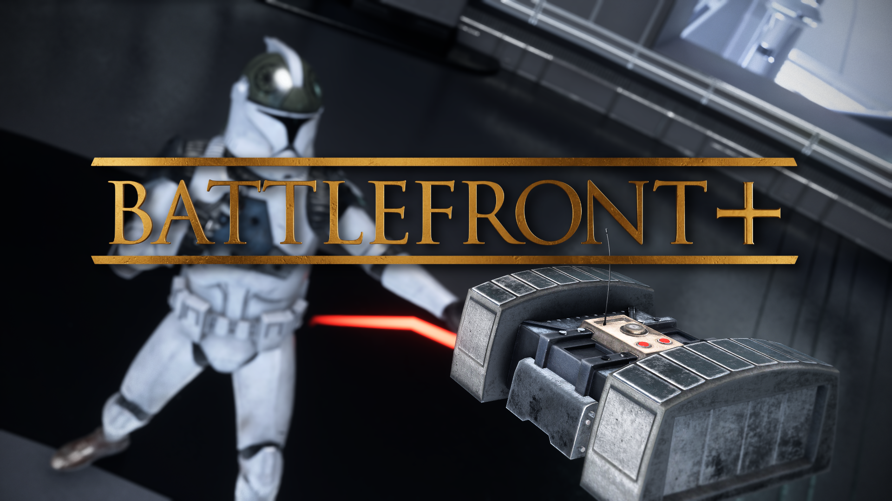
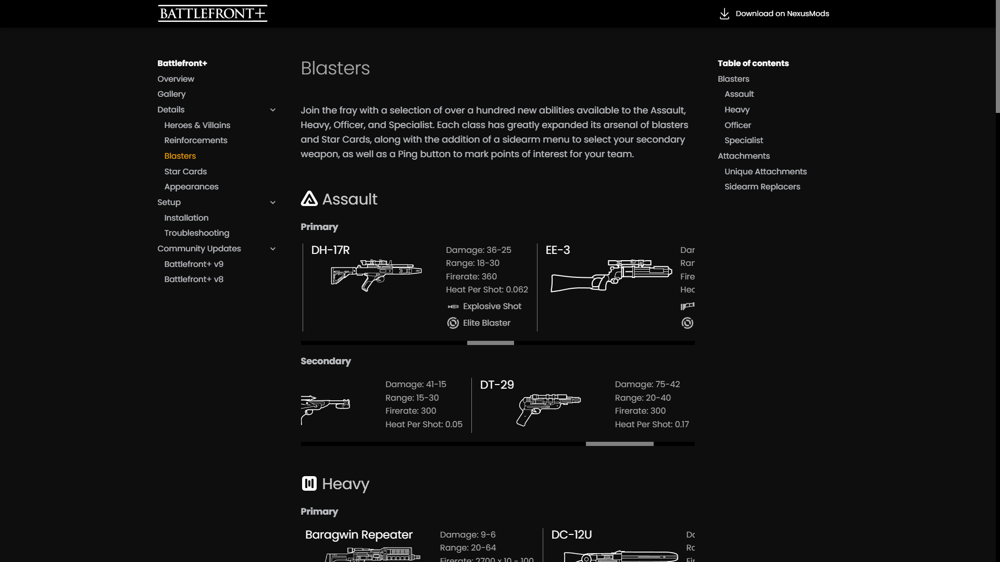
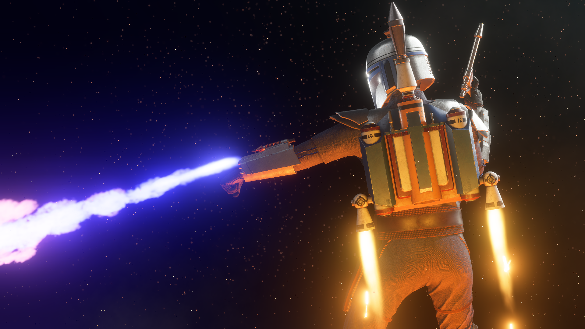
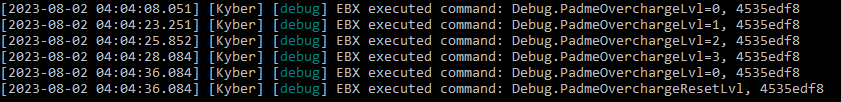

# Battlefront+ v9

Welcome everyone to another update for Battlefront+ and to the project's official website! As usual, we've been hard at work on the latest batch of content, but as classes began again, life got busy, and the mod tools got some very exciting developments, we decided to reshape our plans.  
Battlefront+ V9 will be focusing almost entirely on quality of life features and balance changes, with some small pieces of new content, as you'll soon discover. The majority of content originally intended for this update is instead being pushed to Battlefront+ V10, which will now be our largest release by far.

### New Website

- From here on out, battlefront.plus will be the place to browse through all of the project's content, check out weapon stats, and view Community Updates. Additionally, tutorials and guides are hosted on the site, making this a centralized place for information and support.   

### Frosty 1.0.6.3 and KyberBrowser

- Starting with V9, Battlefront+ will require Frosty Mod Manager 1.0.6.3 or later. This version significantly speeds up moddata generation, making it quicker than ever to launch your game with mods. It additionally enables us to utilize certain assets that significantly improve optimization of the mods.

[Frosty Mod Manager](https://github.com/CadeEvs/FrostyToolsuite/releases/latest/download/FrostyModManager.zip){ .md-button }

- For playing on Kyber, or even patching your invisibility issues, we highly recommend switching to the custom KyberBrowser. This brings all of Kyber V1's functions into one application, thus removing the need to utilize your browser to join and host servers. The KyberBrowser also includes a feature for automatically installing the initfs fix, which is essential for playing Battlefront Plus and has long been a source of trouble for new players.

[KyberBrowser](https://github.com/Dyvinia/KyberBrowser/releases/latest){ .md-button target="_blank" }

### Blasters

Two new blasters are making their way to the troopers with this update.

- Assault

    

    - Zersium Rifle: *Exceptionally rare antique blaster rifle, unreliable due to its age. Its stats will randomize with each trigger pull.*
        - Attachments: Gunslinger & Escape Artist

- Officer 
    
    
    
    - BG-38: *Basic, medium power blaster pistol wielded by smugglers operating from Batuu.*
        - Attachments: Light Shot & Focused Fire

### Reinforcements

The opportunity has been taken to give some of our oldest added Reinforcements another look.

- Blast From the Past
    - The Clone Engineer's standard DETONITE CHARGE has been replaced with the DETPACK, based on the original device from Battlefront II (2005). Its radius is more powerful and can be manually detonated while it is in the air.

- Honorably Discharged
    - Whenever the Honor Guard is nearby to friendly heroes, the HONORABLE DISCHARGE ability will increase its radius.

- Shocking Twist
    - Whenever the Shock Trooper is nearby to friendly heroes, the DISRUPTION ability will grant him supercooling.

- The Gunslinger
    - The Nikto Smuggler's Dual DT-29 blaster pistols are now semi-automatic and have a very slight zoom-in. The POWER SHOT ability has been replaced with DUAL SHOT, which will temporarily toggle the firing of both pistols at once.

### Appearances

- Cal Kestis
    - Purple Lightsaber: Scrapper appearance with purple-bladed sabers.

- Count Dooku
    - Duelist: Default appearance without cape.

- Luke Skywalker
    - Duel: Luke's default 2015 appearance.

- Jango Fett
    - Z-6 Jetpack: Jango’s original jetpack model, which was destroyed on Kamino during his duel with Kenobi.

### Release

That about sums up our new features for this update, but check below for our more detailed changelog. Battlefront+ V9 releases Sunday 8th October, so we hope to see you on Kyber servers then! As for V10, we'll have more to share in the coming weeks, but enjoy this sneak peak at what's to come.

### Changelog

- **Troopers**
    - Added toggleable “Alert Carry” feature.
        - Open the abilities preview menu while holding two-handed weapons to enter a ‘gun down’ animation. All actions except moving, sprinting, jumping, or crouching/standing will take the player out of “Alert Carry.”
    - New Assault blaster: Zersium Rifle
    - New Officer blaster: BG-38
    - 773-Firepuncher
        - Improved effects.
    - Sonic Blaster
        - Increased blast damage.
    - Acid Launcher and Barrage
        - Added zoom-in.
    - Ping
        - Sound effect plays as a UX sound instead of in-world.

- **Reinforcements**
    - Clone Flametrooper
        - Increased bonus health granted by PYROTECHNICS.

    - Clone Sharpshooter
        - Improved 773-FIREPUNCHER effects.
   
    - Combat Engineer
        - Decreased max health.
        - Reduced delay before health regeneration.
        - New DETPACK replaces DETONITE CHARGE.
            - A powerful explosive charge which can be manually detonated at any time.
            - Autoplayers using the DETPACK will randomize the amount of time (0.25 - 7.5 seconds) between throwing the device and it exploding.
   
    - Death Trooper
        - MARKSMAN RUSH
            - Increased damage.

    - Guavian Security
        - JND-41
            - Increased damage.
        - RESERVOIR
            - Improved recharge time.

    - Gungan Warrior
        - GUNGAN STAFF now correctly displays name and icon at the character selection menu.
        - Reworked ability/blueprint setup for the GUNGAN STAFF: functions and plays significantly better.
        - New and improved GUNGAN STAFF swing effects, now only play while attacking.
        - Added autoplayers to Naboo.

    - Honor Guard
        - Fixed several errors in the ability descriptions and tooltips.
        - In the abilities menu, the Honor Guard’s SENTINEL CLASS boost will now display.
        - Added UI tooltip for when the Honor Guard’s Sentinel boost is active, with a 60-second cooldown to prevent spam.
        - A280-CFE
            - Stats are equal to the standard A280-CFE with Ion Shot.
            - Swapped the crosshair.
        - HONORABLE DISCHARGE
            - Radius increases if friendly heroes are nearby.

    - MagnaGuard Protector
        - Increased max health.
        - New and improved ELECTROSTAFF swing effects, now only play while attacking.
        - New sounds for DROID RAGE and COMBAT ACCELERATION.
        - Fixed broken skin selection.
        - In the abilities menu, the SUPERIOR PROGRAMMING ability will now display.

    - Nikto Smuggler
        - DUAL DT-29S
            - Reduced base accuracy and increased recoil per shot.
            - Changed to semi-automatic fire mode.
        - New DUAL SHOT ability replaces POWER SHOT.
            - Temporarily fire both blasters at once, drastically increasing potential damage per second, at the cost of recoil and accuracy.

    - Rebel Pilot
        - Improved R5-D4 ability icon.

    - Shock Trooper
        - Fixed several errors in the ability descriptions and tooltips.
        - In the abilities menu, the Shock Trooper’s SENTINEL CLASS boost will now display.
        - Added UI tooltip for when the Shock Trooper’s Sentinel boost is active, with a 60-second cooldown to prevent spam.
        - SHOCK LAUNCHER
            - Added zoom-in.
        - DISRUPTION
            - Grants supercooling if friendly heroes are nearby.

    - Wookiee Warrior
        - Changed the melee animations and mobility state to Chewbacca’s.
        - SLAM
            - The radius of SLAM increases when taking damage, indicated by the “Wookiee Rage” meter. Using the ability will reset the meter’s progress.

- **Heroes**
    - Ahsoka
        - Fixed positioning of the left lightsaber.
        - Corrected the color of the Padawan skin’s left lightsaber blade to be green-yellow.

    - Cal Kestis
        - Increased max health.
        - Added purple lightsaber appearance.

    - Count Dooku
        - Added Duelist appearance.

    - Jango Fett
        - WRIST FLAMETHROWER
            - Reworked ability/blueprint setup for WRIST FLAMETHROWER, making it function significantly better.
            - New and improved WRIST FLAMETHROWER effects.
            - Autoplayers can now use WRIST FLAMETHROWER.
            - Increased recharge time.
        - SABERDART
            - Fixed an issue wherein firing the SABERDART generated heat for the DUAL WESTAR-34S.
        - Added Z-6 Jetpack appearance.
    - Luke Skywalker
        - Added Duel appearance.
        - Endor appearance left hand is now ungloved.

- **Supremacy**
    - For the duration of V9, the ship phase has been removed from Supremacy.
    
- **Ewok Hunt**
    - Resolved crashing issues in Ewok Hunt, making the gamemode finally playable in Battlefront Plus.

{ .round-corners }  