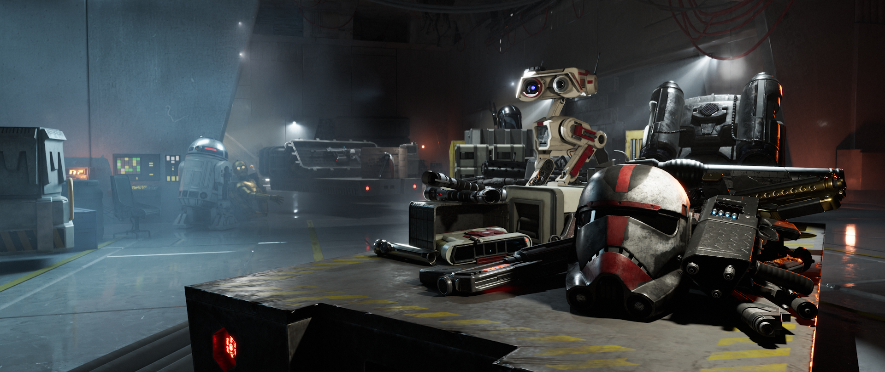

# Appearances

  <video class="round-corners" autoplay muted loop playsinline disablePictureInPicture>
    <source src="../../assets/videos/commup_appearances_preview_wide.mp4" type="video/mp4">
  </video>

With Battlefront Plus, cosmetics have been greatly expanded across the board with more Clone units, Imperial armor options, and First Order gear, along with unrestricted head and gender options for the Rebels and Resistance. Heroes also receive many new skin options, such as Maul's iconic Mandalore appearance, Battle Damaged Vader, Luke's Endor outfit, and even Bossk in a tuxedo, just to name a few.  

Hint: Click on images to zoom

## Troopers

### Galactic Republic

<h3 style="font-size: 1.05em; margin-top: -0.5em; "><b>Assault</b></h3>

<h3 style="font-size: 1.05em;"><b>Heavy</b></h3>

<h3 style="font-size: 1.05em;"><b>Officer</b></h3>

<h3 style="font-size: 1.05em;"><b>Specialist</b></h3>

<h3 style="font-size: 1.05em;"><b>Clone Jet Trooper</b></h3>

<h3 style="font-size: 1.05em;"><b>Combat Engineer</b></h3>

<h3 style="font-size: 1.05em;"><b>Clone Commando</b></h3>

<h3 style="font-size: 1.05em;"><b>Clone Flametrooper</b></h3>

<h3 style="font-size: 1.05em;"><b>Clone Sharpshooter</b></h3>

### Separatist Alliance

<h3 style="font-size: 1.05em; margin-top: -0.5em; "><b>Assault</b></h3>

<h3 style="font-size: 1.05em;"><b>Heavy</b></h3>

<h3 style="font-size: 1.05em;"><b>Officer</b></h3>

<h3 style="font-size: 1.05em;"><b>Specialist</b></h3>

<h3 style="font-size: 1.05em;"><b>B2 Super Battle Droid</b></h3>

<h3 style="font-size: 1.05em;"><b>Combat Magnaguard</b></h3>

<h3 style="font-size: 1.05em;"><b>Tactical Droid</b></h3>

### Rebels

<h3 style="font-size: 1.05em; margin-top: -0.5em;"><b>Rebel Commando</b></h3>

<h3 style="font-size: 1.05em;"><b>Rebel Pilot</b></h3>

<h3 style="font-size: 1.05em;"><b>Rebel Saboteur</b></h3>

### Galactic Empire

<h3 style="font-size: 1.05em; margin-top: -0.5em;"><b>Assault</b></h3>

<h3 style="font-size: 1.05em;"><b>Heavy</b></h3>

<h3 style="font-size: 1.05em;"><b>Officer</b></h3>

<h3 style="font-size: 1.05em;"><b>Specialist</b></h3>

<h3 style="font-size: 1.05em;"><b>Imperial Jumptrooper</b></h3>

<h3 style="font-size: 1.05em;"><b>Royal Guard</b></h3>

<h3 style="font-size: 1.05em;"><b>Purge Trooper Commander</b></h3>

<h3 style="font-size: 1.05em;"><b>Viper Probe Droid</b></h3>

### Resistance

<h3 style="font-size: 1.05em; margin-top: -0.5em;"><b>Combat Medic</b></h3>

<h3 style="font-size: 1.05em;"><b>Nikto Smuggler</b></h3>

### First Order

<h3 style="font-size: 1.05em; margin-top: -0.5em;"><b>Assault</b></h3>

<h3 style="font-size: 1.05em;"><b>Heavy</b></h3>

<h3 style="font-size: 1.05em;"><b>Officer</b></h3>

<h3 style="font-size: 1.05em;"><b>Specialist</b></h3>

<h3 style="font-size: 1.05em;"><b>First Order Jet Trooper</b></h3>

<h3 style="font-size: 1.05em;"><b>Guavian Security</b></h3>

<h3 style="font-size: 1.05em;"><b>Riot Control Trooper</b></h3>

<h3 style="font-size: 1.05em;"><b>Stormtrooper Commander</b></h3>

## Heroes

### **Ahsoka**

### **Anakin**

### **Cal Kestis**

### **Captain Rex**

### **Chewbacca**

### **Commander Cody**

### **Din Djarin**

### **Finn**

### **Han Solo**

### **Hunter**

### **Princess Leia**

### **Luke Skywalker**

### **Maz Kanata**

### **Merrin**

### **Nien Nunb**

### **Obi-Wan Kenobi**

### **Padme Amidala**

### **Shriv**

## Villains

### **Asajj Ventress**

### **Boba Fett**

### **Bossk**

### **Captain Cardinal**

### **Commander Pyre**

### **Count Dooku**

### **Dagan**

### **Darth Maul**

### **Darth Vader**

### **Emperor Palpatine**

### **General Grievous**

### **Grand Admiral Thrawn**

### **Gideon Hask**

### **Greedo**

### **Jango Fett**

### **Second Sister**

### **Zam Wesell**

___

{ .round-corners }

Hint: Click on images to zoom
