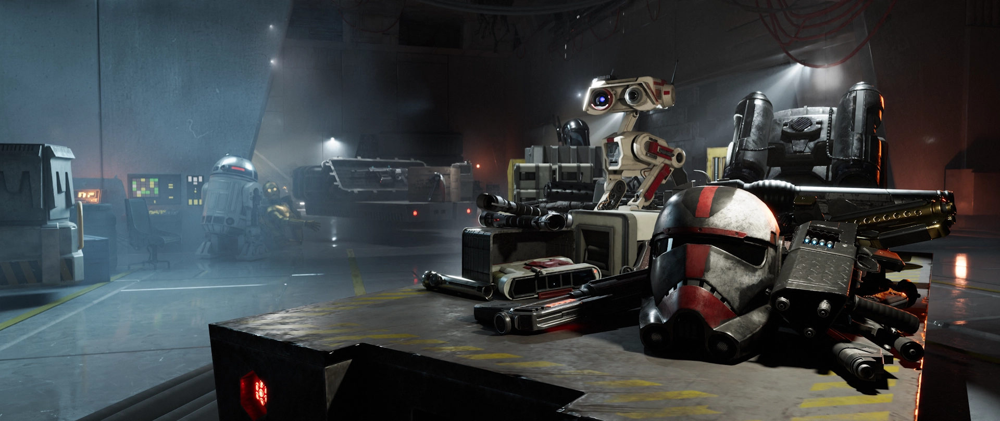

# Bug Fixes

Battlefront Plus fixes dozens of bugs leftover from the base game. Many of these former issues may be recognizable from [this infamous Reddit post](https://www.reddit.com/r/StarWarsBattlefront/comments/gcyh0r/these_are_all_the_broken_hero_star_cards/?rdt=43574).

## Reinforcements

- Caphex Spy
    - TRUNCHEON STRIKES
        - Fixed an issue with the missing attack animations.
- Death Trooper
    - E-11D
        - Fixed an issue with recoil increasing while crouching.
- Droideka
    - Fixed an issue with autoplayers appearing as the wrong class.
- Ovissian Gunner
    - MODIFIED Z-6B ROTARY CANNON
        - Fixed an issue with the weapon not receiving unlimited blaster cooling from the Officer's BLAST COMMAND or Finn's BIG DEAL.
    - ANTI-ARMOR MODE
        - Fixed an issue with the weapon not receiving unlimited blaster cooling from the Officer's BLAST COMMAND or Finn's BIG DEAL.

## Heroes

- Anakin Skywalker
    - Fixed an issue in the lightsaber attack sequence with the wrong animation playing after performing a lunge attack.
- Boba Fett
    - CONCUSSION ROCKET
        - Fixed an issue with the disruption and flash affectors applying to Boba Fett if he is very close to the impact.
- Bossk
    - SPREADING THE DISEASE Star Card
        - Fixed an issue with the Star Card not actually increasing the radius of DIOXIS GRENADE.
- Captain Phasma
    - STAFF STRIKES
        - Fixed an issue with sounds not playing for the second, third, and closer attacks.
    - ALL FOR MYSELF Star Card
        - Fixed an issue with the Star Card being misnamed LASER WALL DURABILITY.
- Darth Maul
    - SPIN ATTACK
        - Fixed an issue with missing logic that caused the user to get caught on the ground, especially small inclines, when using the ability.
    - THROWN TO SLOW Star Card
        - Fixed an issue with CHOKE HOLD receiving an incorrect amount of bonus damage.
- Emperor Palpatine
    - AMPLIFIED AURA Star Card
        - Fixed an issue with DARK AURA receiving the bonus damage without having to affect 3 enemies at a time like the description states.
- Finn
    - BIG DEAL
        - Fixed an issue enabling the player to have the AOE bonuses permanently active.
    - NO MORE RUNNING Star Card
        - Fixed an issue with DEADEYE receiving the bonus damage without having to obtain 3 kills with the ability like the description states.
        - Fixed an issue with the bonus end damage for DEADEYE being below that of lower card values.
- General Grievous
    - FLESH IS WEAK Star Card
        - Fixed an issue with the health regeneration penalty being negated when equipping the BEATING HEART Star Card.
    - JEDI KILLER
        - Fixed an issue with the increased targeting range of THRUST SURGE also increasing its damage radius, causing enemies straight behind the target but at a distance to also be affected.
    - LINE UP, WEAKLINGS Star Card
        - Fixed an issue with CLAW RUSH receiving the bonus damage without having to hit at least 1 enemy with the ability like the description states.
- Han Solo
    - SHOULDER CHARGE
        - Fixed an exploit that would enable perpetual use of the ability.
- Iden Versio
    - ACQUIRING TARGETS Star Card
        - Fixed an issue with the effects of this Star Card being swapped with SHOCKING REACH.
    - SHOCKING REACH Star Card
        - Fixed an issue with the effects of this Star Card being swapped with ACQUIRING TARGETS.
- Kylo Ren
    - FRENZY
        - Fixed an exploit that would execute a fourth attack.
    - SITH RESILIENCE
        - Fixed an issue with the damage reduction effect only applying when near Count Dooku, Darth Maul, Darth Vader, Emperor Palpatine, or General Grievous, as opposed to all villains like the description states.
        - Fixed an issue with neither effect applying near some autoplayer villains.
- Lando Calrissian
    - QUICK SHOCK Star Card
        - Fixed an issue with the shock duration of the DISABLER increasing after 5 seconds, as opposed to within 5 seconds like the description states.
    - WELCOME TO CLOUD CITY Star Card
        - Fixed an issue with the Star Card not actually increasing the radius of SMOKE GRENADE.
- Leia Organa
    - FEARLESS Star Card
        - Fixed an issue with the Star Card not actually increasing the radius of THERMAL DETONATORS.
- Luke Skywalker
    - DEFLECTION MASTERY Star Card
        - Fixed an issue with the Star Card not actually increasing lightsaber deflection accuracy.
    - EPICENTER Star Card
        - Fixed an issue with the bonus damage for REPULSE being unblockable.
- Obi-Wan Kenobi
    - Fixed an issue with the loadout not being shared with "Ben Kenobi." This has the consequence of making the portrait shared.
- Rey
    - DAMAGING STRIKE Star Card
        - Fixed an issue with DASH STRIKE receiving a flat damage increase, as opposed to increasing its damage for each enemy hit like the description states.
- Yoda
    - PRESENCE
        - Fixed an issue with the ability's area of effect not being where it is supposed to be.
    - EARNED IT I HAVE Star Card
        - Fixed an issue with the Star Card not actually increasing the growth speed of UNLEASH.

## Autoplayers

- Fixed an issue with Assault TOUGHEN UP not working correctly.
- Fixed an issue with Assault THERMAL DETONATOR not playing the throwing animation.
- Fixed an issue with Heavy IMPACT GRENADE not playing the throwing animation.
- Fixed an issue with Officer BATTLE COMMAND, BLAST COMMAND, and RECHARGE COMMAND not working correctly.
- Fixed an issue with Specialist SCRAMBLER INFILTRATION not working correctly.

___

{ .round-corners } 