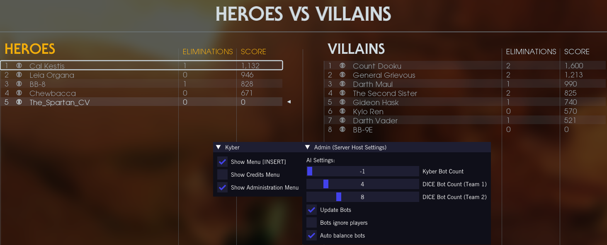
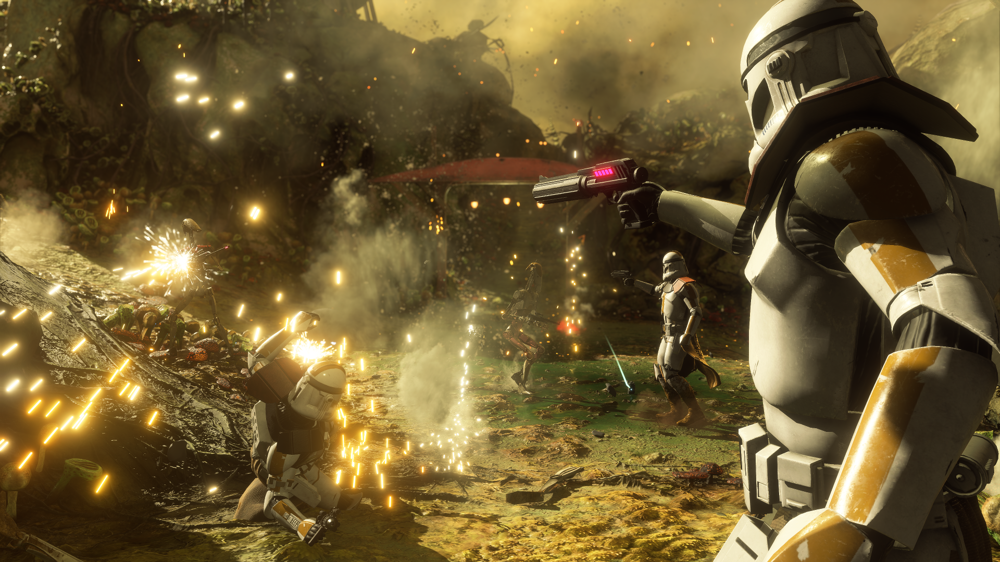
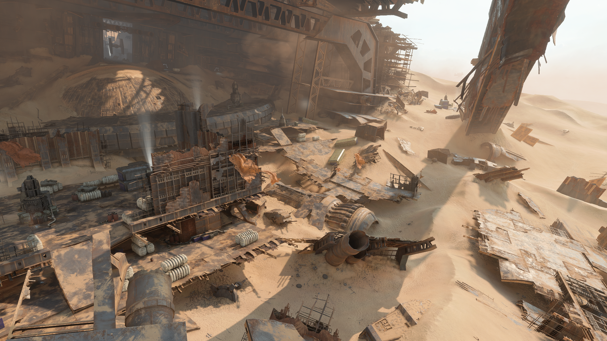

# Maps and Gamemodes

With Battlefront Plus, various tweaks, backend improvements, and a new gamemode result in a more diverse gameplay environment on some of the most fundamental levels. Experience a bit of old and new to shake things up and play in new ways.

## AI Enhanced

Battlefront Plus comes packaged with enhancements to the autoplayers, enabling them to play some objectives in Strike and Galactic Assault, spawn as special units, and come equipped with a wider selection of blasters, abilities, and skins as troopers.

To spawn autoplayers while hosting private matches on Kyber, press the 'Insert' key while at the pause menu and navigate to [Show Administration Menu]. Under the AI Settings window that opens, use the "DICE Bot Count" sliders to set the amount of autoplayers per team, with (Team 1) representing the Light Side and (Team 2) representing the Dark Side.

{ .round-corners }

## New Gamemodes

#### Bounty Hunt

   

Two teams face off in a skirmish to claim bounties by eliminating the other's mark. The first team to claim 10 bounties wins the match.  
(Replaces Hero Showdown)

{ .round-corners }

## Map Tweaks

#### Yavin IV - Heroes vs Villains

- Relocated from the Great Temple to the ruins.

{ .round-corners }

#### Kamino - Supremacy

Relocated objectives to place more emphasis on placing the battle across the middle of the map.

- B. Crashed LAAT  
- D. Bridges  

{ .round-corners }

#### Jakku - Supremacy

Near rotal overhaul to shift the battle to the open section of the downed Star Destroyer.

- A. Security Center  
- D. Scavenger Outpost  
- E. Pillaged Hideout

{ .round-corners }