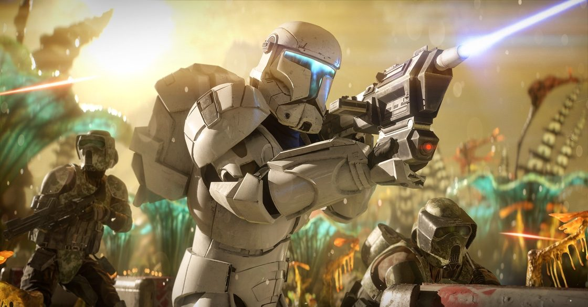

# Maps and Gamemodes

  <video class="round-corners" autoplay muted loop playsinline disablePictureInPicture>
    <source src="../../assets/videos/commup_zaddmospheric_preview_wide.mp4" type="video/mp4">
  </video>

With Battlefront Plus, various tweaks, backend improvements, and a new gamemode result in a more diverse gameplay environment on some of the most fundamental levels. Experience a bit of old and new to shake things up and play in new ways.

## New Weather and Daytime Variants

  

    
    

      <h3 class="card-title">Night Felucia</h3>
    

    

  

  

    
    

      <h3 class="card-title">idk</h3>
    

    

  

  

    
    

      <h3 class="card-title">idk but again</h3>
    

    

  

Experience the glowing ambience of a night on Felucia or one of Jakku's brutal sandstorms. Battlefront Plus adds many new daytime and weather variants, bringing a fresh feel when revisiting maps.

<h3><strong>Ajan Kloss</strong></h3>

- Foggy

<h3><strong>Crait</strong></h3> 

- Sunset
- Snow

<h3><strong>Felucia</strong></h3>

- Night

<h3><strong>Kamino</strong></h3> 

- Day
- Night

<h3><strong>Kashyyyk</strong></h3> 

- Cloudy
- Night (added to Supremacy)

<h3><strong>Hoth</strong></h3> 

- Added Night variant.

<h3><strong>Jakku</strong></h3>  

- Sunset (added to Supremacy)
- Sandstorm

<h3><strong>Naboo</strong></h3> 

- Day (added to Supremacy)
- Sunset (added to Supremacy)
- Night (added to Supremacy)

<h3><strong>Starkiller Base</strong></h3>

- Night

___

## AI Enhanced

{ .round-corners }

Battlefront Plus comes packaged with enhancements to the autoplayers, enabling them to play some objectives in Strike and Galactic Assault, spawn as special units, and come equipped with a wider selection of blasters, abilities, and skins as troopers.

___

## Instant Action Expanded

{ .round-corners }

Offline play sees the addition of gamemodes previously unavailable to Instant Action. Battle against AI players in Heroes vs. Villains, Galactic Assault, Blast, and more.

___

## New Gamemodes

#### Bounty Hunt

   

{ .round-corners }

Two teams face off in a skirmish to claim bounties by eliminating the other's mark. The first team to claim 10 bounties wins the match.  
(Replaces Hero Showdown)

___

## Map Tweaks

#### Yavin IV - Heroes vs Villains

{ .round-corners }

- Relocated from the Great Temple to the ruins.

#### Kamino - Supremacy

{ .round-corners }

- Relocated objectives to place more emphasis on placing the battle across the middle of the map.

    - B. Crashed LAAT  
    - D. Bridges  

#### Jakku - Supremacy

{ .round-corners }

- Near total overhaul to shift the battle to the open section of the downed Star Destroyer.

    - A. Security Center  
    - D. Scavenger Outpost  
    - E. Pillaged Hideout

___

{ .round-corners } 