# Maps and Gamemodes

  <video class="round-corners" autoplay muted loop playsinline disablePictureInPicture>
    <source src="../../assets/videos/commup_zaddmospheric_preview_wide.mp4" type="video/mp4">
  </video>

With Battlefront Plus, various tweaks, backend improvements, and a new gamemode result in a more diverse gameplay environment on some of the most fundamental levels. Experience a bit of old and new to shake things up and play in new ways.

## New Weather and Daytime Variants

  

    
    

      

        <h3><strong> Felucia</strong></h3>
        
Night

      

    

    

  

  

    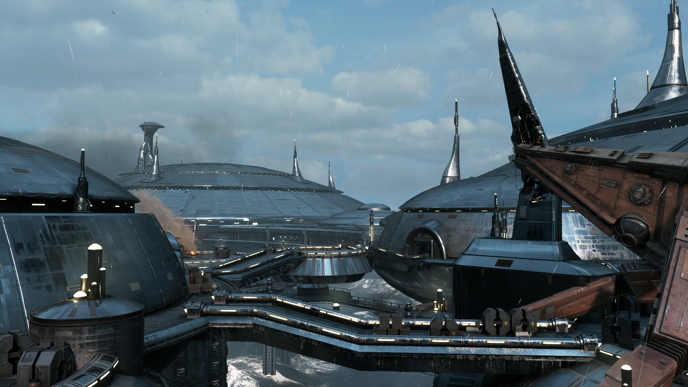
    

      

        <h3><strong> Kamino</strong></h3>
        
Day

      

    

    

  

  

    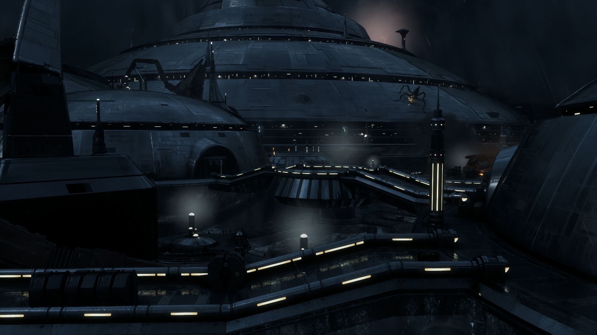
    

      

        <h3><strong> Kamino</strong></h3>
        
Night

      

    

    

  

  

    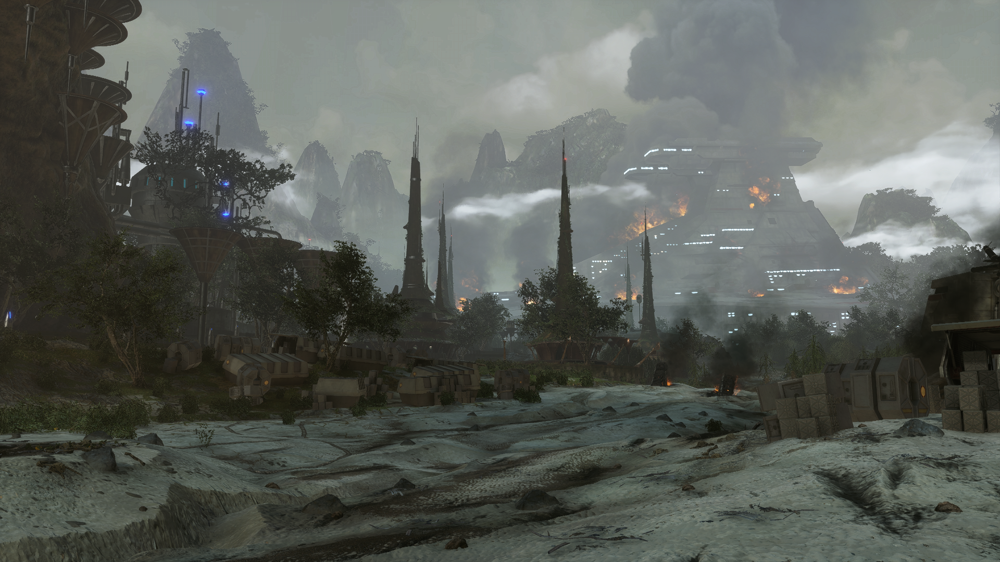
    

      

        <h3><strong> Kashyyyk</strong></h3>
        
Cloudy

      

    

    

  

  

    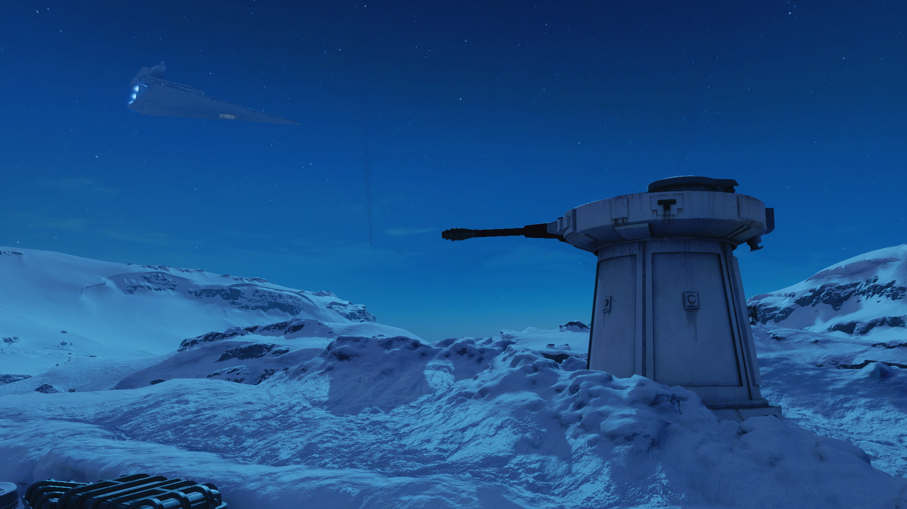
    

      

        <h3><strong> Hoth</strong></h3>
        
Night

      

    

    

  

  

    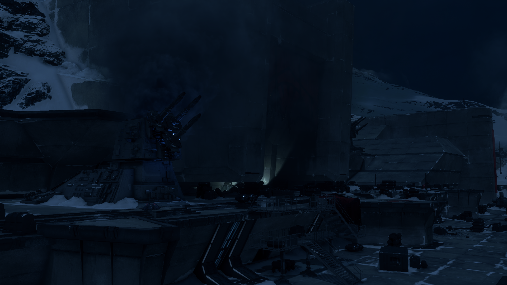
    

      

        <h3><strong> Starkiller</strong></h3>
        
Night

      

    

    

  

  

    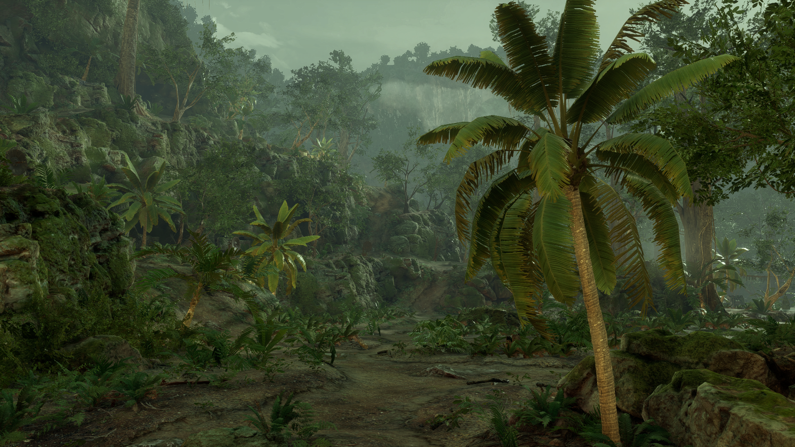
    

      

        <h3><strong> Ajan Kloss</strong></h3>
        
Foggy

      

    

    

  

  

    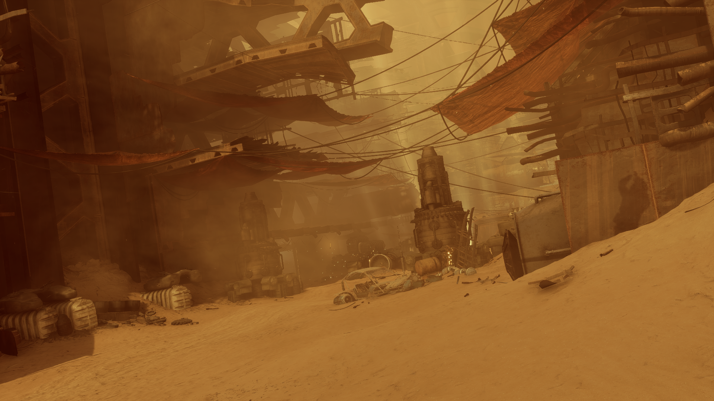
    

      

        <h3><strong> Jakku</strong></h3>
        
Sandstorm

      

    

    

  

Experience the glowing ambience of a night on Felucia or one of Jakku's brutal sandstorms. Battlefront Plus adds many new daytime and weather variants, bringing a fresh feel when revisiting maps.

<h3><strong>Ajan Kloss</strong></h3>

 Foggy

<h3><strong>Crait</strong></h3> 

 Sunset

 Snow

<h3><strong>Felucia</strong></h3>

 Night

<h3><strong>Kamino</strong></h3> 

 Day

 Night

<h3><strong>Kashyyyk</strong></h3> 

 Cloudy

 Night (added to Supremacy)

<h3><strong>Hoth</strong></h3> 

 Night

<h3><strong>Jakku</strong></h3>  

 Sunset (added to Supremacy)

 Sandstorm

<h3><strong>Naboo</strong></h3> 

 Day (added to Supremacy)

 Sunset (added to Supremacy)

 Night (added to Supremacy)

<h3><strong>Starkiller Base</strong></h3>

 Night

___

## AI Enhanced

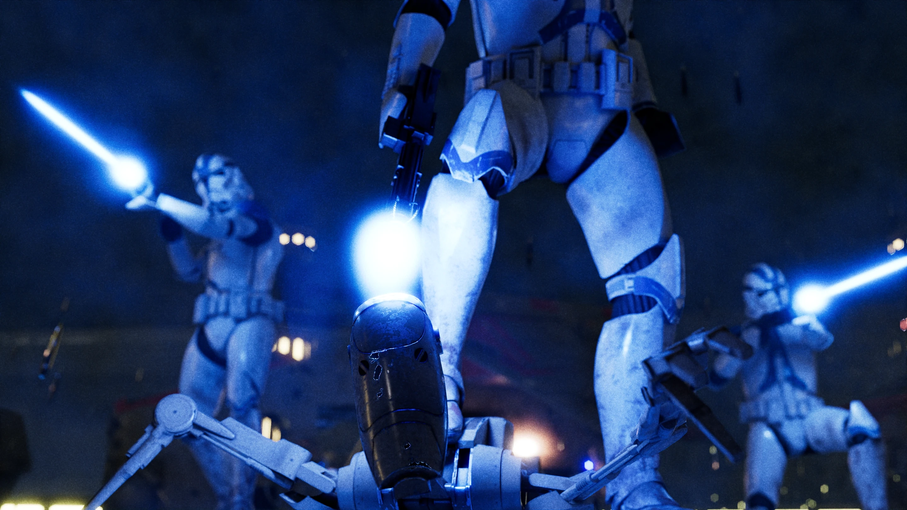{ .round-corners }

Battlefront Plus comes packaged with enhancements to the autoplayers, enabling them to play some objectives in Strike and Galactic Assault, spawn as special units, and come equipped with a wider selection of blasters, abilities, and skins as troopers.

___

## New Gamemodes

#### Bounty Hunt

   

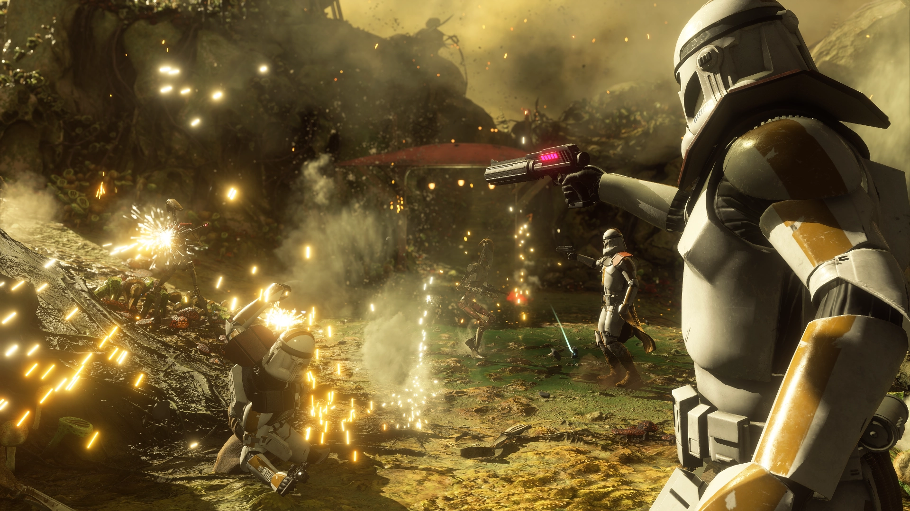{ .round-corners }

Two teams face off in a skirmish to claim bounties by eliminating the other's mark. The first team to claim 10 bounties wins the match.  
(Replaces Hero Showdown)

___

## Arcade Upgrades

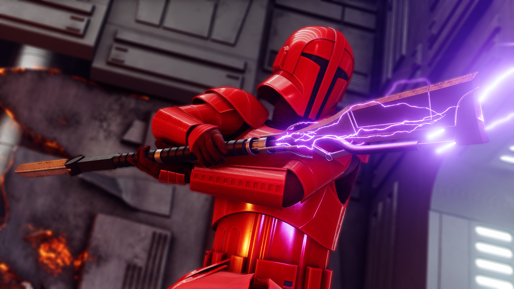{ .round-corners }

Arcade has received substantial improvements to its gameplay and stability, creating more interesting ways to play fully offline and in split-screen coop.

#### Autoplayers

Arcade's BattleAI have been replaced with Autoplayers, greatly improving the capabilities of the bots. They now have the ability to spawn as Reinforcements and Heroes as time progresses in Team Blast and Onslaught.

#### Onslaught Survival

- Survive as long as you can against increasingly strong enemy forces in this overhaul to the Onslaught gamemode. As time goes on, the enemy will continuously bolster their forces with greater numbers and stronger units.
- In this mode, Troopers have increased health.
- Use the INTENSITY setting to adjust the speed at which the enemy gains extra units. 

#### Heroes Versus Villains

Whether it's Team Blast or the newly reworked Onslaught, select the "Play As: Heroes Versus Villains" option to clash with iconic characters across the history of the galaxy.

___

## Map Tweaks

#### Yavin IV - Heroes vs Villains

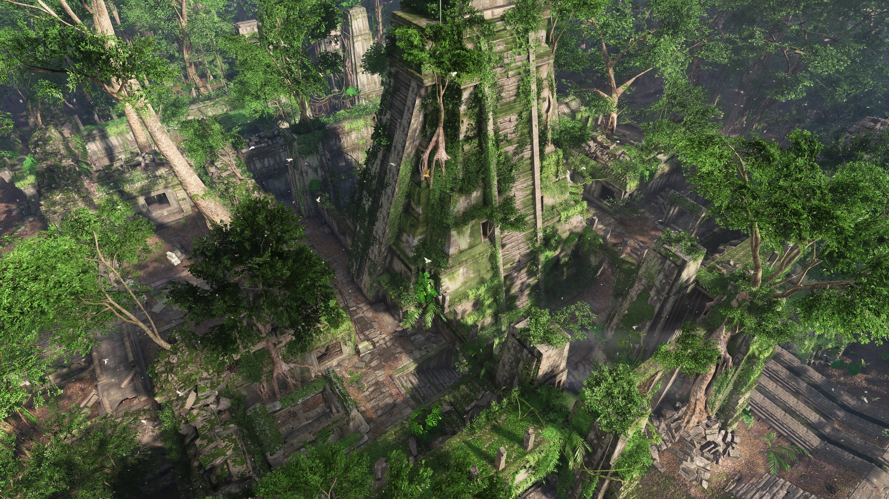{ .round-corners }

Relocated from the Great Temple to the ruins.

#### Jakku - Supremacy

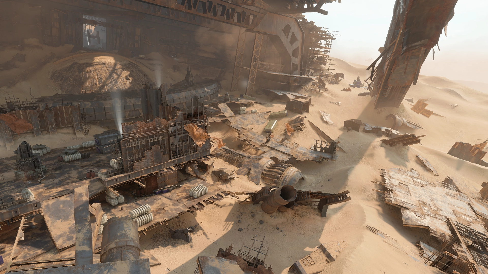{ .round-corners }

Near total overhaul to shift the battle to the open section of the downed Star Destroyer.

 - A. Security Center  
 - D. Scavenger Outpost  
 - E. Pillaged Hideout

___

{ .round-corners } 