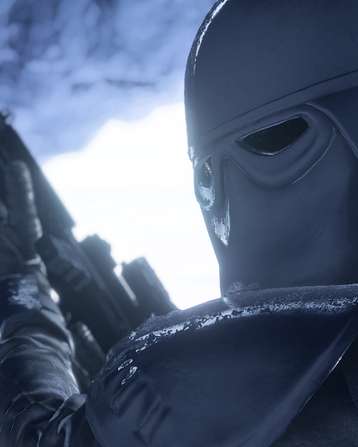

# Star Cards

In addition to a plethora of new blasters, each of the four Trooper classes also have access to a variety of new Boost and Ability Star Cards.

## Troopers

### All Classes

    <!-- Item Start -->
    

        

            

                
            

            

                <h4><b>Tough Fighter</b></h4>
                <a>Defeating enemies will briefly grant damage resistance.</a>
            

        

    

    <!-- Item End -->
    

        

            

                
            

            

                <h4><b>Radio</b></h4>
                <a>Deploys a radio to play some nice tunes.</a>
            

        

    

### Assault

    <!-- Item Start -->
    

        

            

                
            

            

                <h4><b>Dead Man's Switch</b></h4>
                <a>Drop a live Thermal Detonator when killed.</a>
            

        

    

    <!-- Item End -->
    

        

            

                
            

            

                <h4><b>Demolition Droid</b></h4>
                <a>Deploys a heavily modified LIN demolitionmech to launch timed explosives into the air.</a>
            

        

    

    

        

            

                
            

            

                <h4><b>Instigator</b></h4>
                <a>The first blaster shot on an enemy deals extra damage. This effect can be applied again to the same enemy after a short duration.</a>
            

        

    

    

        

            

                
            

            

                <h4><b>Thermal Imploder</b></h4>
                <a>The THERMAL IMPLODER's compressed heat wave creates a massive implosion, dealing damage in a large radius.</a>
            

        

    

### Heavy

    <!-- Item Start -->
    

        

            

                
            

            

                <h4><b>Withstanding</b></h4>
                <a>You have increased maximum health, but your health regeneration is slower.</a>
            

        

    

    <!-- Item End -->
    

        

            

                
            

            

                <h4><b>Gonk Droid</b></h4>
                <a>Deploys a GNK-series power droid to grant bonus recharge speed and to nearby allies.</a>
            

        

    

    

        

            

                
            

            

                <h4><b>Flamethrower</b></h4>
                <a>Burn out the enemy with the BT X-42 Heavy Flame Projector. While deployed, you passively regenerate health and take reduced damage.</a>
            

        

    

    

        

            

                
            

            

                <h4><b>Rocket Launcher</b></h4>
                <a>The ROCKET LAUNCHER fires an explosive projectile.</a>
            

        

    

### Officer

    <!-- Item Start -->
    

        

            

                
            

            

                <h4><b>Revenge</b></h4>
                <a>Enemies who have defeated you will be temporarily revealed to you and your team for retaliation.</a>
            

        

    

    <!-- Item End -->
    

        

            

                
            

            

                <h4><b>Medical Droid</b></h4>
                <a>Deploys an FX-7 medical assistant to periodically spray bacta mist, healing nearby allies.</a>
            

        

    

    

        

            

                
            

            

                <h4><b>Stim Shot</b></h4>
                <a>Fires a projectile to provide healing and bonus health to allies within a small radius of impact. Holding the cooling button will use the Stim Shot to boost its user.</a>
            

        

    

    

        

            

                
            

            

                <h4><b>Stun Grenade</b></h4>
                <a>Grenade that stuns enemies, freezing them in place for a short duration.</a>
            

        

    

### Specialist

    <!-- Item Start -->
    

        

            

                
            

            

                <h4><b>Quickdraw</b></h4>
                <a>Upon successful shots with your primary weapon, your secondary blaster will become momentarily empowered, causing it to deal more damage to enemies. This effect cannot be applied to the same enemy for a short duration.</a>
            

        

    

    <!-- Item End -->
    

        

            

                
            

            

                <h4><b>Ion Neutralizer</b></h4>
                <a>Finely tuned variant of the T-7 Disruptor Rifle that is capable of delivering heavy ion damage to vehicles at long range, but is ineffective against infantry. Must be fully charged and aiming down sights in order to fire.</a>
            

        

    

    

        

            

                
            

            

                <h4><b>Smoke Grenade</b></h4>
                <a>Grenade that deploys a cloud of smoke, obscuring vision in its area.</a>
            

        

    

    

        

            

                
            

            

                <h4><b>Time Bomb</b></h4>
                <a>Deploy a highly explosive device set to detonate after a short time.</a>
            

        

    

## Heroes

### Ahsoker

    <!-- Item Start -->
    

        

            

                
            

            

                <h4><b>Yippee</b></h4>
                <a>Death is Reborn in Apex Legends: Resurrection. Revenant has been twisted into something even more sinister and his new reign of terror has begun. Experience his killer new look and deadly new abilities as he is unlocked for all players all season long. Complete challenges to unlock him permanently.</a>
            

        

    

    <!-- Item End -->

