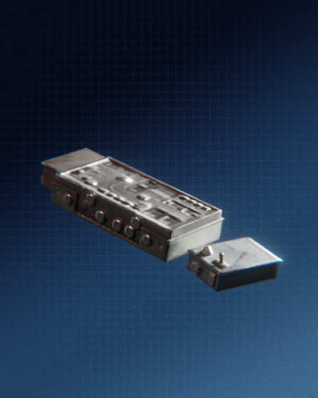

# Star Cards

star cards :nerd:

## Troopers

### Assault

    <!-- Item Start -->
    

        

            

                
            

            

                <h4><b>Yippee</b></h4>
                <a>Death is Reborn in Apex Legends: Resurrection. Revenant has been twisted into something even more sinister and his new reign of terror has begun. Experience his killer new look and deadly new abilities as he is unlocked for all players all season long. Complete challenges to unlock him permanently.</a>
            

        

    

    <!-- Item End -->

## Heroes

### Ahsoker

    <!-- Item Start -->
    

        

            

                
            

            

                <h4><b>Yippee</b></h4>
                <a>Death is Reborn in Apex Legends: Resurrection. Revenant has been twisted into something even more sinister and his new reign of terror has begun. Experience his killer new look and deadly new abilities as he is unlocked for all players all season long. Complete challenges to unlock him permanently.</a>
            

        

    

    <!-- Item End -->

