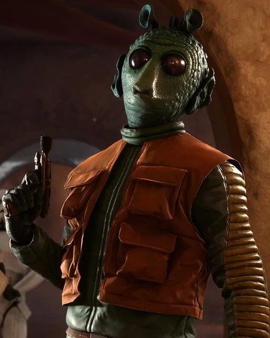
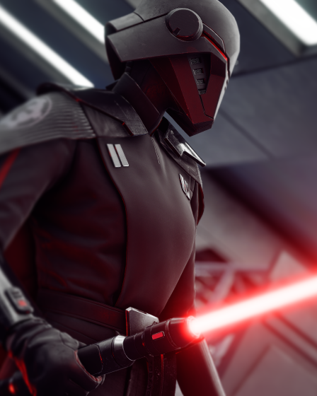

# Star Cards

Each of the four base classes boasts an array of new Star Cards, from the dreadful Dead Man's Switch to a heavy Flamethrower, creating new ways to play as the Troopers. Every hero featured in Battlefront Plus also has their own set of Star Cards, allowing players to enhance their playstyles with improved stats and ability combos.

## Troopers

### All Classes

    <!-- Item Start -->
    

        

            

                
            

            

                <h4><b>Tough Fighter</b></h4>
                <a>Defeating enemies will briefly grant damage resistance.</a>
            

        

    

    <!-- Item End -->
    

        

            

                
            

            

                <h4><b>Radio</b></h4>
                <a>Deploys a radio to play some nice tunes.</a>
            

        

    

### Assault

    <!-- Item Start -->
    

        

            

                
            

            

                <h4><b>Dead Man's Switch</b></h4>
                <a>Drop a live Thermal Detonator when killed.</a>
            

        

    

    <!-- Item End -->
    

        

            

                
            

            

                <h4><b>Demolition Droid</b></h4>
                <a>Deploys a heavily modified LIN demolitionmech to launch timed explosives into the air.</a>
            

        

    

    

        

            

                
            

            

                <h4><b>Instigator</b></h4>
                <a>The first blaster shot on an enemy deals extra damage. This effect can be applied again to the same enemy after a short duration.</a>
            

        

    

    

        

            

                
            

            

                <h4><b>Thermal Imploder</b></h4>
                <a>The THERMAL IMPLODER's compressed heat wave creates a massive implosion, dealing damage in a large radius.</a>
            

        

    

### Heavy

    <!-- Item Start -->
    

        

            

                
            

            

                <h4><b>Withstanding</b></h4>
                <a>You have increased maximum health, but your health regeneration is slower.</a>
            

        

    

    <!-- Item End -->
    

        

            

                
            

            

                <h4><b>Gonk Droid</b></h4>
                <a>Deploys a GNK-series power droid to grant bonus recharge speed and to nearby allies.</a>
            

        

    

    

        

            

                
            

            

                <h4><b>Flamethrower</b></h4>
                <a>Burn out the enemy with the BT X-42 Heavy Flame Projector. While deployed, you passively regenerate health and take reduced damage.</a>
            

        

    

    

        

            

                
            

            

                <h4><b>Rocket Launcher</b></h4>
                <a>The ROCKET LAUNCHER fires an explosive projectile.</a>
            

        

    

### Officer

    <!-- Item Start -->
    

        

            

                
            

            

                <h4><b>Revenge</b></h4>
                <a>Enemies who have defeated you will be temporarily revealed to you and your team for retaliation.</a>
            

        

    

    <!-- Item End -->
    

        

            

                
            

            

                <h4><b>Medical Droid</b></h4>
                <a>Deploys an FX-7 medical assistant to periodically spray bacta mist, healing nearby allies.</a>
            

        

    

    

        

            

                
            

            

                <h4><b>Stim Shot</b></h4>
                <a>Fires a projectile to provide healing and bonus health to allies within a small radius of impact. Holding the cooling button will use the Stim Shot to boost its user.</a>
            

        

    

    

        

            

                
            

            

                <h4><b>Stun Grenade</b></h4>
                <a>Grenade that stuns enemies, freezing them in place for a short duration.</a>
            

        

    

### Specialist

    <!-- Item Start -->
    

        

            

                
            

            

                <h4><b>Quickdraw</b></h4>
                <a>Upon successful shots with your primary weapon, your secondary blaster will become momentarily empowered, causing it to deal more damage to enemies. This effect cannot be applied to the same enemy for a short duration.</a>
            

        

    

    <!-- Item End -->
    

        

            

                
            

            

                <h4><b>Ion Neutralizer</b></h4>
                <a>Finely tuned variant of the T-7 Disruptor Rifle that is capable of delivering heavy ion damage to vehicles at long range, but is ineffective against infantry. Must be fully charged and aiming down sights in order to fire.</a>
            

        

    

    

        

            

                
            

            

                <h4><b>Smoke Grenade</b></h4>
                <a>Grenade that deploys a cloud of smoke, obscuring vision in its area.</a>
            

        

    

    

        

            

                
            

            

                <h4><b>Time Bomb</b></h4>
                <a>Deploy a highly explosive device set to detonate after a short time.</a>
            

        

    

## Heroes

### Ahsoka

    <!-- Item Start -->
    

        

            

                
            

            

                <h4><b>Jar'Kai Mastery</b></h4>
                <a>Ahsoka will deal extra damage with SABER FLURRY if it is performed immediately after a successful SABER THROW attack.</a>
            

        

    

    <!-- Item End -->
    

        

            

                
            

            

                <h4><b>Great Stride</b></h4>
                <a>The active time of MORAL SPIRIT is extended.</a>
            

        

    

    

        

            

                
            

            

                <h4><b>Fearless</b></h4>
                <a>SABER FLURRY has increased range, enabling Ahsoka to lunge toward more distant enemies, but the recharge time of the ability is slower.</a>
            

        

    

    

        

            

                
            

            

                <h4><b>I'm No Jedi</b></h4>
                <a>Ahsoka's basic lightsaber attacks, after being used to defeat an enemy, will deal bonus damage for a brief period. This effect cannot be applied to the same enemy for a short duration. Her maximum health is also decreased.</a>
            

        

    

    

        

            

                
            

            

                <h4><b>Skywalker's Student</b></h4>
                <a>The recharge time of SABER THROW is reduced.</a>
            

        

    

### Cal Kestis

    <!-- Item Start -->
    

        

            

                
            

            

                <h4><b>Persistence</b></h4>
                <a>Cal takes even less damage while using FORCE STASIS.</a>
            

        

    

    <!-- Item End -->
    

        

            

                
            

            

                <h4><b>Reforged</b></h4>
                <a>SINGLE-BLADED lightsaber attacks deal more damage if they immediately follow successful attacks with the DOUBLE-BLADED lightsaber. This effect cannot be applied to the same enemy for a short duration.</a>
            

        

    

    

        

            

                
            

            

                <h4><b>Stim Frequency</b></h4>
                <a>The recharge time of STIM CANISTER is shorter, enabling Cal to heal himself more often.</a>
            

        

    

    

        

            

                
            

            

                <h4><b>Peacekeeper</b></h4>
                <a>The charge-up time of FORCE STASIS is slightly shorter.</a>
            

        

    

    

        

            

                
            

            

                <h4><b>SURVIVOR</b></h4>
                <a>Cal takes reduced damage from explosions and toxins, as well as recovers from blinding effects more quickly.</a>
            

        

    

### Captain Rex

    <!-- Item Start -->
    

        

            

                
            

            

                <h4><b>Blaster Inspection</b></h4>
                <a>Every time he kills an enemy, Captain Rex and friendly troopers around him gain a permanent 3% decrease to their blaster overheat per bolt to a maximum. This effect resets when Captain Rex is defeated.</a>
            

        

    

    <!-- Item End -->
    

        

            

                
            

            

                <h4><b>Still Holds Up</b></h4>
                <a>The bonus health Captain Rex gains from GENERATION ONE is increased and has a slightly longer duration.</a>
            

        

    

    

        

            

                
            

            

                <h4><b>Outranking Experience</b></h4>
                <a>Increases the radius of UNCONVENTIONAL TACTICS.</a>
            

        

    

    

        

            

                
            

            

                <h4><b>I'm No Jedi</b></h4>
                <a>Captain Rex's Dual DC-17 pistols deal extra damage while he is above 90% health.</a>
            

        

    

    

        

            

                
            

            

                <h4><b>Fry Their Circuits</b></h4>
                <a>DROID POPPERS inflict lingering damage for a short period, but have a longer recharge time.</a>
            

        

    

### Commander Cody

    <!-- Item Start -->
    

        

            

                
            

            

                <h4><b>Ion Capacitors</b></h4>
                <a>The radius of ION FIELD is increased.</a>
            

        

    

    <!-- Item End -->
    

        

            

                
            

            

                <h4><b>You'll Be Needing This</b></h4>
                <a>The cooldown of ENERGY WALL is reduced.</a>
            

        

    

    

        

            

                
            

            

                <h4><b>Always a Way</b></h4>
                <a>Defeating enemies with the BATTLE RIFLE will replenish its active time.</a>
            

        

    

    

        

            

                
            

            

                <h4><b>You Can Count On Us</b></h4>
                <a>When allied Reinforcements or Heroes are standing nearer to Cody, he will regenerate even more health.</a>
            

        

    

    

        

            

                
            

            

                <h4><b>Armored Up</b></h4>
                <a>Commander Cody spawns with extra bonus health.</a>
            

        

    

### Din Djarin

    <!-- Item Start -->
    

        

            

                
            

            

                <h4><b>Evasion</b></h4>
                <a>Din Djarin gains an extra Dodge ability charge, but the recharge time of his abilities is increased.</a>
            

        

    

    <!-- Item End -->
    

        

            

                
            

            

                <h4><b>This Is The Way</b></h4>
                <a>While the AMBAN PHASE-PULSE BLASTER is equipped, replenish its active time by defeating enemies with WHISTLING BIRDS or the DARKSABER.</a>
            

        

    

    

        

            

                
            

            

                <h4><b>Phalanx</b></h4>
                <a>Din Djarin takes less damage while using WHISTLING BIRDS.</a>
            

        

    

    

        

            

                
            

            

                <h4><b>Warm or Cold</b></h4>
                <a>When Din Djarin defeats an enemy with a headshot, his abilities receive a short boost to recharge speed.</a>
            

        

    

    

        

            

                
            

            

                <h4><b>One Defeats Twenty</b></h4>
                <a>Din Djarin inflicts more damage when striking an enemy with the DARKSABER.</a>
            

        

    

### Maz Kanata

    <!-- Item Start -->
    

        

            

                
            

            

                <h4><b>An Acquired Taste</b></h4>
                <a>Damage can be reflected back on Maz Kanata's attackers from CHANGE IN FORTUNE more frequently.</a>
            

        

    

    <!-- Item End -->
    

        

            

                
            

            

                <h4><b>We Must Face Them</b></h4>
                <a>The fire rate of the DH-17R is faster than normal while Maz Kanata is above 90% health, but slower when she falls below that percentage.</a>
            

        

    

    

        

            

                
            

            

                <h4><b>Fuel Reserves</b></h4>
                <a>The cooldown time of BURN DASH is reduced.</a>
            

        

    

    

        

            

                
            

            

                <h4><b>Evasion</b></h4>
                <a>Maz Kanata has +1 Evade, but slower Evade recharge time.</a>
            

        

    

    

        

            

                
            

            

                <h4><b>Live Long Enough</b></h4>
                <a>Maz Kanata takes reduced damage while CHANGE IN FORTUNE is active, but the ability's active time is shorter.</a>
            

        

    

### Nien Nunb

    <!-- Item Start -->
    

        

            

                
            

            

                <h4><b>Bomb Arming Speed</b></h4>
                <a>The PROXIMITY BOMB will arm and activate faster when deployed, but its recharge time is increased.</a>
            

        

    

    <!-- Item End -->
    

        

            

                
            

            

                <h4><b>Brave Sullustan</b></h4>
                <a>Nien Nunb's maximum health is increased.</a>
            

        

    

    

        

            

                
            

            

                <h4><b>Sullustan Sharpshooter</b></h4>
                <a>When Nien Nunb defeats an enemy with a headshot using his RAPID PULSE CANNON, his abilities are taken out of recharge and granted a cooldown bonus.</a>
            

        

    

    

        

            

                
            

            

                <h4><b>Expert Weapons Handling</b></h4>
                <a>The cooling success states on Nien Nunb's DH-17 are longer.</a>
            

        

    

    

        

            

                
            

            

                <h4><b>Buddy Turret</b></h4>
                <a>Nien Nunb will receive damage reduction when attacking enemies with his DH-17 while the AUGMENTED TURRET is deployed, but the recharge time of the ability is twice as long.</a>
            

        

    

### Shriv Suurgav

    <!-- Item Start -->
    

        

            

                
            

            

                <h4><b>Wartender</b></h4>
                <a>BACTA COCKTAIL provides additional healing, but its recharge time is increased.</a>
            

        

    

    <!-- Item End -->
    

        

            

                
            

            

                <h4><b>Got a Bad Idea</b></h4>
                <a>After Shriv defeats 4 enemies with the REPULSOR CANNON, the recharge rate of all of his abilities is increased.</a>
            

        

    

    

        

            

                
            

            

                <h4><b>Taking Risks</b></h4>
                <a>For every enemy Shriv defeats with the E-5C, its heat will be reduced.</a>
            

        

    

    

        

            

                
            

            

                <h4><b>Personal Space</b></h4>
                <a>Shriv's REPULSOR CANNON fires additional projectiles.</a>
            

        

    

    

        

            

                
            

            

                <h4><b>Danger Leader</b></h4>
                <a>If Shriv is within 10 meters of two friendly units, his E-5C will fire faster and his nearby allies will begin regenerating a small amount of health.</a>
            

        

    

## Villains

### Captain Cardinal

    <!-- Item Start -->
    

        

            

                
            

            

                <h4><b>Color of Power</b></h4>
                <a>All of Captain Cardinal's abilities have a slightly extended duration.</a>
            

        

    

    <!-- Item End -->
    

        

            

                
            

            

                <h4><b>Still Standing</b></h4>
                <a>Captain Cardinal takes reduced damage while STEADFAST is active.</a>
            

        

    

    

        

            

                
            

            

                <h4><b>Finalized</b></h4>
                <a>Captain Cardinal deals more melee damage while FINALIZER is active.</a>
            

        

    

    

        

            

                
            

            

                <h4><b>Ensuring Progress</b></h4>
                <a>Lessens the vulnerability penalty from ABSOLUTION.</a>
            

        

    

    

        

            

                
            

            

                <h4><b>Effecting Change</b></h4>
                <a>Whenever Captain Cardinal defeats an enemy with the F-11D, his abilities recharge faster for a very brief moment.</a>
            

        

    

### Commander Pyre

    <!-- Item Start -->
    

        

            

                
            

            

                <h4><b>All Your Efforts</b></h4>
                <a>Defeating enemies with THUNDERER LEGION will restore its active time.</a>
            

        

    

    <!-- Item End -->
    

        

            

                
            

            

                <h4><b>Commanding Shine</b></h4>
                <a>The bonus health awarded by GOLD ZONE is increased.</a>
            

        

    

    

        

            

                
            

            

                <h4><b>Maintaining Order</b></h4>
                <a>The recharge time of SEIZE THIS MOMENT is reduced.</a>
            

        

    

    

        

            

                
            

            

                <h4><b>Complementary</b></h4>
                <a>When Commander Pyre defeats an enemy, he will gain a small amount of damage resistance for a short duration. Maintaining quick killstreaks will stack this value.</a>
            

        

    

    

        

            

                
            

            

                <h4><b>None of Your Concern</b></h4>
                <a>Commander Pyre's health regeneration is faster and starts sooner.</a>
            

        

    

### Dengar

    <!-- Item Start -->
    

        

            

                
            

            

                <h4><b>More Toys</b></h4>
                <a>Dengar throws an additional, lighter grenade with EXPLOSIVE ARRAY, but the ability has a slightly longer recharge time.</a>
            

        

    

    <!-- Item End -->
    

        

            

                
            

            

                <h4><b>Job Ready</b></h4>
                <a>Dengar has increased maximum health.</a>
            

        

    

    

        

            

                
            

            

                <h4><b>Take a Dirt Nap</b></h4>
                <a>BASHING SKULLS deals more damage, but has increased recharge time.</a>
            

        

    

    

        

            

                
            

            

                <h4><b>Spraying Bolts</b></h4>
                <a>Extends the duration of FRENZIED BLAST.</a>
            

        

    

    

        

            

                
            

            

                <h4><b>You're Next</b></h4>
                <a>The damage resistance Dengar gains from defeating an enemy is increased.</a>
            

        

    

### Gideon Hask

    <!-- Item Start -->
    

        

            

                
            

            

                <h4><b>Lingering Embers</b></h4>
                <a>Enemies damaged by the flames of INFERNO BLAST will be afflicted with lingering damage for several seconds.</a>
            

        

    

    <!-- Item End -->
    

        

            

                
            

            

                <h4><b>Imperial Valor</b></h4>
                <a>While Hask is using BLAST CANNON, his nearby allies will receive damage reduction, which increases in strength with every 5 troopers defeated or 500 damage dealt to heroes to a maximum. This bonus stays for the next use of the ability but resets when Hask is defeated.</a>
            

        

    

    

        

            

                
            

            

                <h4><b>Crimson Star</b></h4>
                <a>The duration of ROUTING TRAITORS is extended, as is its range.</a>
            

        

    

    

        

            

                
            

            

                <h4><b>Special Forces</b></h4>
                <a>If he is within 15 meters of two friendly units, Hask and his close allies will take reduced damage.</a>
            

        

    

    

        

            

                
            

            

                <h4><b>Returned Favor</b></h4>
                <a>Hask regains slightly more health when defeating an enemy, but his ability cooldowns are slightly longer.</a>
            

        

    

### Greedo

    <!-- Item Start -->
    

        

            

                
            

            

                <h4><b>Who Shot First</b></h4>
                <a>The fire rate of the DT-12 is faster than normal while Greedo is above 90% health, but slower when he falls below that percentage.</a>
            

        

    

    <!-- Item End -->
    

        

            

                
            

            

                <h4><b>Koon T'chuta</b></h4>
                <a>The THERMAL DETONATOR from Greedo's BRASH BLAST deals increased damage.</a>
            

        

    

    

        

            

                
            

            

                <h4><b>Lucky I Found You</b></h4>
                <a>Enemies revealed by Greedo's HIGH SENSES will restore extra health to him upon being defeated.</a>
            

        

    

    

        

            

                
            

            

                <h4><b>Measured Confidence</b></h4>
                <a>Greedo's CONFIDENCE BOOST has a shorter duration and recharge time.</a>
            

        

    

    

        

            

                
            

            

                <h4><b>Ma Klounkee</b></h4>
                <a>Greedo's DT-12 builds less heat when firing.</a>
            

        

    

### Jango Fett

    <!-- Item Start -->
    

        

            

                
            

            

                <h4><b>No Mistakes This Time</b></h4>
                <a>When Jango Fett defeats an enemy with a SABERDART, his abilities get an extensive recharge bonus.</a>
            

        

    

    <!-- Item End -->
    

        

            

                
            

            

                <h4><b>Always a Pleasure</b></h4>
                <a>Whenever enemy Heroes are nearby, Jango Fett receives damage reduction. This effect is amplified if Jedi are present.</a>
            

        

    

    

        

            

                
            

            

                <h4><b>Discretion is My Specialty</b></h4>
                <a>Damaging enemies with the WRIST FLAMETHROWER will restore a portion of Jango Fett's health, but its recharge time is doubled.</a>
            

        

    

    

        

            

                
            

            

                <h4><b>Evasion</b></h4>
                <a>Maz Kanata has +1 Evade, but slower Evade recharge time.</a>
            

        

    

    

        

            

                
            

            

                <h4><b>Just a Simple Man</b></h4>
                <a>COLLECTING BOUNTIES has an extended duration.</a>
            

        

    

### Second Sister

    <!-- Item Start -->
    

        

            

                
            

            

                <h4><b>Like All the Others</b></h4>
                <a>The Second Sister replenishes even more health from FORCE DRAIN.</a>
            

        

    

    <!-- Item End -->
    

        

            

                
            

            

                <h4><b>Enduring the Pain</b></h4>
                <a>Trilla's torturous transformation into the Second Sister has taught her to embrace the pain. She will briefly gain increased damage resistance upon taking any hits.</a>
            

        

    

    

        

            

                
            

            

                <h4><b>Perfected Technique</b></h4>
                <a>SINGLE-BLADED lightsaber attacks deal more damage if they immediately follow successful attacks with the DOUBLE-BLADED lightsaber. This effect cannot be applied to the same enemy for a short duration.</a>
            

        

    

    

        

            

                
            

            

                <h4><b>Let's Finish This</b></h4>
                <a>After one enemy has been struck by CUNNING SLASH, the attack will inflict weakness on follow-up hits..</a>
            

        

    

    

        

            

                
            

            

                <h4><b>I Expected More</b></h4>
                <a>The Second Sister's maximum health is increased.</a>
            

        

    

